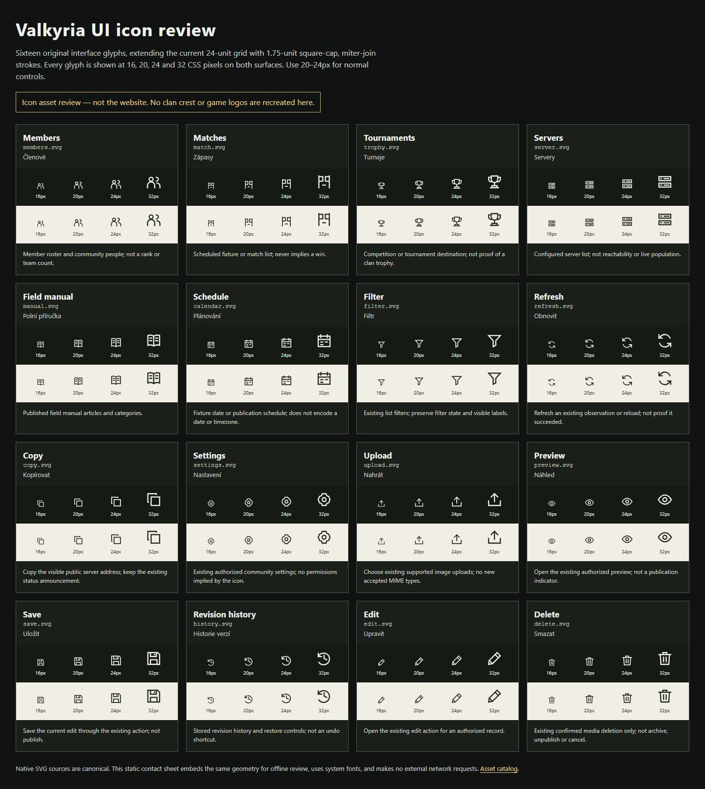

# Icon contact-sheet evidence

Captured locally on 2026-09-29 with Chromium 153 / Playwright 1.63.0 at device scale 1.
These are actual browser captures of the static contact sheet, not mocked app
screens or production proof. Its English names and Czech glossary do not establish
bilingual-route acceptance.

The [verification report](verification.json) records the base Git revision,
working-tree source/catalog digests, browser version, checks and PNG metadata.
The [catalog](../catalog.json) binds originals and captures to their hashes.
The base revision excludes the new icon files; source digests identify the
inspected working-tree delivery.

## Desktop

1440 × 1000 viewport; full-page image 1440 × 1614. Sixteen original glyphs at
16/20/24/32px on dark and light surfaces. Glyphs and labels were visually inspected;
no blank icon, clipping or horizontal overflow was found.

## Mobile

390 × 844 viewport; full-page image 390 × 5467. The same glyphs use a single-column
layout; all four sample sizes and both surfaces remain available.

[Actual local narrow contact-sheet capture](contact-sheet-mobile.png)

Checks cover XML safety, exact source/preview geometry, source/capture hashes,
positive viewBox bounds, 128 rendered samples, no page errors, no external HTTP
requests, no horizontal overflow and PNGs smaller than 5 MiB. Stroke joins still
require visual review; geometric bounds alone do not prove raster clipping.
Normal use is 20–24px, paired with localized control text.

Run the [validator](../verify.mjs) using the
[integration handoff](../../../../docs/assets/icon-handoff.md). It regenerates
captures/report; review and update catalog metadata after a browser/platform
change. App integration, behavior tests and live deployment remain unverified here.
