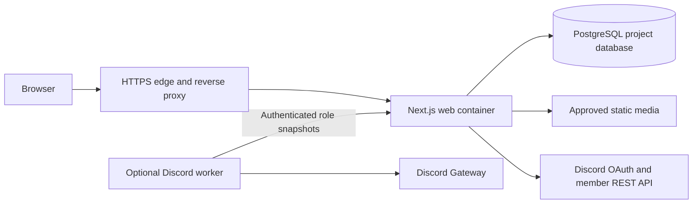

# Architecture

## Decision

Use a modular TypeScript monolith: Next.js App Router, React, PostgreSQL, Drizzle ORM
and Better Auth. Build a bespoke CSS-variable/CSS-module interface. Use pnpm
workspaces for the web app, database package and integration contracts. A Discord
worker is a later independent runtime only if gateway role events are needed.
See [ADR 0001](decisions/0001-modular-web.md).

Version policy: Node 24 LTS; resolve a supported stable Next.js/React/Better Auth/
Drizzle combination when implementation begins, consult official documentation and
pin exact dependencies and lockfile. Do not use prerelease auth packages or assume
an old tutorial's API is current. The foundation has no application dependencies.

## Boundaries

| Location | Responsibility |
|---|---|
| `apps/web/src/app` | Route composition, metadata, layouts and route handlers |
| `apps/web/src/components` | Reusable visual primitives and game-menu shell |
| `apps/web/src/modules/content` | Editorial content and publication rules |
| `apps/web/src/modules/members` | Public profiles distinct from private user identities |
| `apps/web/src/modules/matches` | Match/result use cases and later roster coordination |
| `apps/web/src/modules/auth` | Better Auth integration and session handling |
| `apps/web/src/modules/access` | Central policy engine and Discord-role adapter |
| `packages/db` | Schema, reviewed migrations and server-side repositories |
| `packages/contracts` | Runtime-validated integration messages and public DTO schemas |
| `apps/discord-worker` | Reserved role-event adapter; no bot functionality in this scaffold |
| `infra` | Example deployment configuration and runbooks, never live credentials |

These module paths are the planned implementation layout, not existing implementations.
Route files remain thin. UI does not query tables directly. Database, tokens and
private DTOs must stay out of client bundles. Share a package only when another
consumer actually needs it; do not add a generic abstraction framework.

## Rendering and data

Public pages use server rendering with explicit publication filters; cache only
public projections and invalidate after publish/unpublish. Authenticated and admin
responses are private/no-store. Never cache a permission decision across identities.
The persistent shell preserves the video element across normal route navigation,
while the URL, title, accessible heading, focus and history remain real web navigation.
Prefer server components; use client components for interactive menu, filters, forms
and video preferences. Do not fetch all members or private rosters into the browser.

Use PostgreSQL in development and integration tests; SQLite is not a substitute for
authorization/migration testing. A Docker Compose development database is disposable
and isolated. Production uses a dedicated database and role on the existing PostgreSQL
service, not a new shared superuser. No Redis, queue platform or search service in v1.
Use PostgreSQL-backed session, replay and rate-limit state when durability is needed.

## Media and content

Small reviewed brand assets are committed. Large background media is delivered through
an approved media origin or read-only deployment mount, with content hashes and provenance.
Never require a video download before displaying navigation. No production hotlinking
to the old site. Store media references and metadata, not video bytes, in PostgreSQL.
Use a WordPress-like visual editor based on Tiptap/ProseMirror with schema-versioned
JSON as canonical content. Validate the node/mark/attribute allowlist server-side and
render safe public HTML without loading the editor bundle. No arbitrary MDX/JavaScript
or raw HTML execution. Separate draft/published revisions; autosave never changes live content.
Provide a scoped image media library with validated uploads and private draft delivery;
store runtime bytes in persistent media storage, not Git or the app image. Implement
a durable idempotent scheduled-publication CLI backed by PostgreSQL and an operator
minute timer. See [editorial and match requirements](../product/editorial-and-matches.md).

## Integration and delivery

Discord OAuth establishes identity. Guild membership and configured role IDs establish
capabilities through the [access policy](../security/auth-rbac.md). The bot is not
required to render public content. Handle 429, outages, departure and out-of-order events.
The worker contract can later be implemented by the clan's existing bot without
coupling to any private legacy project.

Publish images from protected GitHub main only after quality checks. Use an immutable
`sha-<commit>` tag and digest; the operator promotes a verified image to production.
The deployment topology is outbound tunnel → reverse proxy → application container;
the app has no public host port and no Docker socket. See the
[deployment runbook](../operations/deployment.md). Production access is not part of a cloud coding task.

## Operational targets

- Desktop and mobile current Chrome, Firefox, Safari and Edge; keyboard-only operation.
- Public LCP <= 2.5 s and CLS <= 0.1 in an agreed reproducible mobile test; report environment.
- Home initial compressed JS budget <= 200 KiB excluding optional media; justify any exception.
- No initial video fetch with reduced-motion/save-data policy; background media failure harmless.
- Liveness separate from database readiness; structured redacted logs and request IDs.
- UTC storage for all dates; display match time with an explicit time zone.
- Backups + restore verification before first production schema migration.
