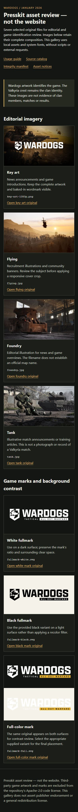

# Presskit review evidence

Actual local Chromium screenshots of the committed asset review. These are **not**
the finished website, a live Discord client or proof of implemented bot embeds.

Environment: Windows, Node v24.21.0, Chromium 153.0.8010.12.
Run: 2026-09-26T14:43:56.673Z to 2026-09-26T14:43:59.918Z.
The [raw proof](preview-proof.json) records catalog/HTML/harness SHA-256, every served
input, all 7 original asset fingerprints, viewport dimensions and capture hashes.
PR evidence pins the commit containing those tested bytes and matching hosted CI.

```sh
node scripts/preview-presskit.mjs /path/to/node_modules/@playwright/test/package.json .local/presskit-proof-new
```

Use an installed Playwright package and its Chromium runtime. The command starts a
read-only loopback fixture, permits only local catalog paths, checks rendering and
closes the browser/server. It records running/failed state before accepting captures.
Outputs belong outside Git until reviewed. No external services or credentials are used.

Passed: original image hashes before/after rendering, all intended image decodes,
no horizontal overflow at either viewport, zero page errors and zero external requests.
All eight placements of the seven originals decoded, including the full-color wordmark on contrasting backgrounds. The light-surface comparison deliberately demonstrates poor contrast; use a dark surface for the white/full-color marks.


1440 × 1100 viewport, full-page capture. Original file bytes rendered through the
review gallery; layouts/captions are review aids, not product integration.



390 × 844 viewport, full-page capture. Complete artwork/wordmarks remain visible and
the page does not scroll horizontally. This is local responsive-gallery evidence.

Application integration, native Discord rendering and production deployment are untested.
The source rights and intended usage remain documented in the asset catalog and notice.
