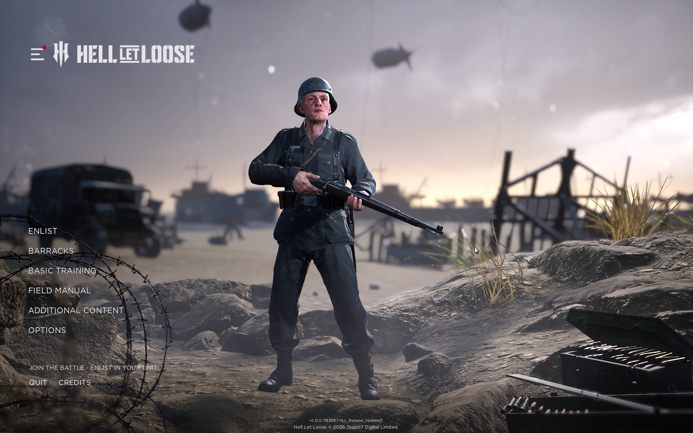
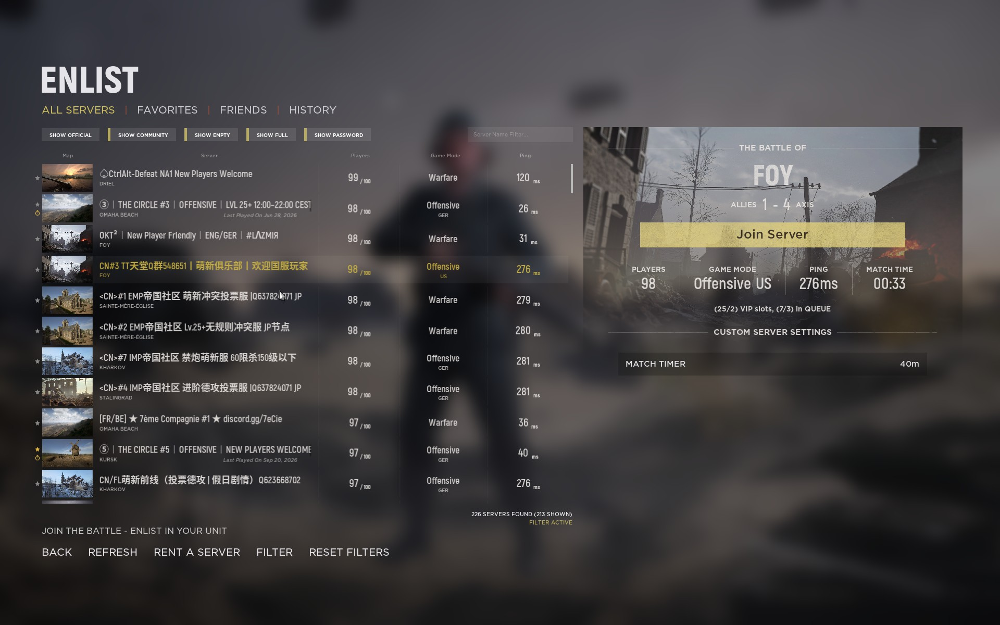
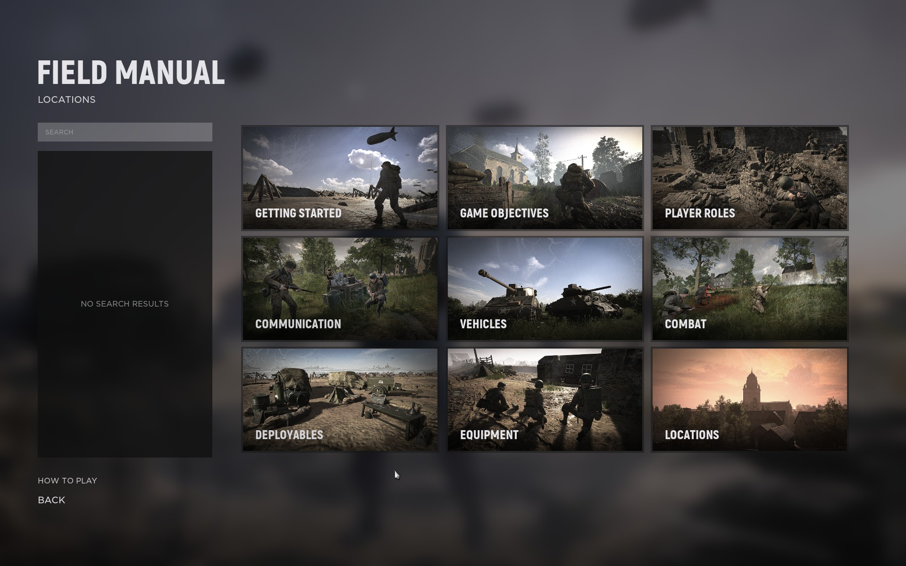

# HLL design references

Thirteen owner-supplied original captures, inspected 2026-09-28. These are **design inputs, not screenshots of an implemented website**. Preserve exact source bytes; sizes, dimensions and SHA-256 are registered in [the asset manifest](../../../../assets/manifest.json). The cloud agent can open all files in this directory without local Steam access.

Use [the HLL visual specification](../../hll/visual-spec.md) for the web adaptation. Incidental names, Steam identifiers, ranks, rosters, scores and server endpoints are not production fixtures, clan statistics or integration configuration. These captures are excluded from the application build/runtime and the code license.

| Capture | UI reference | Web use |
|---|---|---|
| [20260920205625_1.jpg](20260920205625_1.jpg) | Scoreboard | Result hierarchy and dense team comparison; never seed captured players/statistics. |
| [20260928153014_1.jpg](20260928153014_1.jpg) | Main menu | Left navigation, open cinematic stage, title/brand anchor; replace soldier with clan battle footage. |
| [20260928153017_1.jpg](20260928153017_1.jpg) | Barracks | Categorized member/role browsing and selected-row treatment, not copied rank progression. |
| [20260928153022_1.jpg](20260928153022_1.jpg) | Basic training | Image-led guide category tiles with restrained borders. |
| [20260928153028_1.jpg](20260928153028_1.jpg) | Deployment overview | Secondary reference for tactical/manual layouts; no live private tactical map. |
| [20260928153031_1.jpg](20260928153031_1.jpg) | Role selection | Hierarchy and selection feedback; not an instruction to copy faction weapons or account stats. |
| [20260928153035_1.jpg](20260928153035_1.jpg) | Selected deployment | List/detail panel structure and clear active state. |
| [20260928153038_1.jpg](20260928153038_1.jpg) | Gameplay | Environmental mood only; not final background media. |
| [20260928153041_1.jpg](20260928153041_1.jpg) | Map overlay | Manual map/legend readability; no implied permission to publish private tactics. |
| [20260928153050_1.jpg](20260928153050_1.jpg) | Field Manual | Search/sidebar and image category grid for the editable clan manual. |
| [20260928153107_1.jpg](20260928153107_1.jpg) | Options | Settings grouping and alignment; incidental account identifiers stay reference-only. |
| [20260928153234_1.jpg](20260928153234_1.jpg) | Server browser empty selection | Filter/search/list structure and honest unselected detail state. |
| [20260928153237_1.jpg](20260928153237_1.jpg) | Server browser selection | Selected row plus map/detail panel; adapt separately for servers and competitive results. |

## Key references

Original game reference: left menu and cinematic stage, 1920 x 1200. No web implementation is shown.

Original game reference: filterable rows and selected detail, 1920 x 1200. Displayed server values are not our live data.

Original game reference: searchable category grid, 1920 x 1200. Website manual text comes from reviewed clan content.
