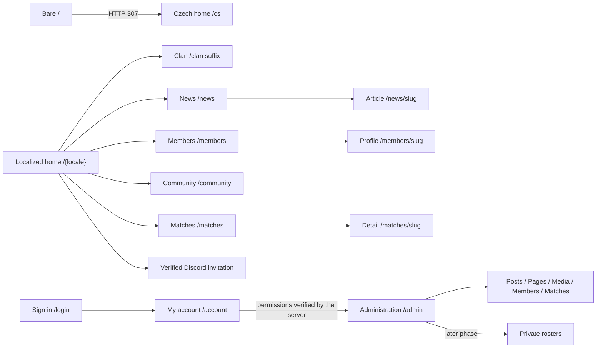

# Valkyria screen and interaction map

## Implemented Wardogs server addition (2026-10-03)

Under the unified canonical `valkyria.cz` platform, `/{locale}/wardogs/servers`
exposes a public list and `?server=<publicId>` detail. Desktop and mobile Wardogs
menus include the active Servers entry. The game homepage keeps the open scene and
bottom-left actions, with a compact server overview and next-match strip on the
right (stacked on phones). Observations show map, population, named team scores,
freshness and timestamp; the detail adds approved join/statistics links. Polling
can be paused. Missing/stale observations do not invent scores or players. See the
[source and activation contract](../integrations/logi/wardogs-servers.md).

The historical initial screen proposal below is superseded by the unified-platform
ADR and current implementation for game-scoped routes and canonical hostnames.

Status: proposed implementation contract for the cloud agent. The website is Czech-first and bilingual (`cs` / `en`), including account/admin UI, validation and accessible labels. Code identifiers, system route segments, documentation, AI prompts and GitHub descriptions remain English. The production domain is `valkyriawdg.cz`. Follow the canonical [localization contract](../product/localization.md). English labels below are logical label examples with Czech/English translations, not a requirement to display English on Czech pages.

All public/account/admin UI routes carry `/cs` or `/en`. Except for explicit `/{locale}` or bare-root entries, unprefixed routes below are logical suffixes: `/news` means `/cs/news` and `/en/news`, and `/admin/news/new` means `/cs/admin/news/new` and `/en/admin/news/new`. The URL determines the locale; do not translate English system segments. `/api/auth`, health and static-asset routes stay unprefixed. Bare `/` always returns HTTP 307 to `/cs`, without browser-language detection or a locale cookie. Unprefixed known UI suffixes return HTTP 307 to their Czech counterpart, retaining only safe supported query parameters; unsupported explicit locales return 404.

The site has three zones: public clan presentation, the signed-in member's account, and restricted administration. News/blog is a primary public and administrative requirement. First-release M2 administration includes visual post authoring and creating, scheduling and managing matches. Only private lineup, availability and squad coordination remains later M4 scope. Authentication and authorization are real security boundaries, not just different navigation menus. Follow [Editorial and match management](../product/editorial-and-matches.md) as the canonical feature contract.

## 1. Primary route map

| Route or logical suffix | English label reference | Audience | Purpose and initial priority |
| --- | --- | --- | --- |
| `/` | Root redirect | Everyone | Deterministic HTTP 307 to `/cs`; no browser-language negotiation |
| `/{locale}` | Main menu | Everyone | `/cs` or `/en`; cinematic entry and Discord CTA; first priority |
| `/clan` | Clan | Everyone | Verified clan story, Wardogs direction, HLL heritage, values and recruitment summary |
| `/members` | Members | Everyone | Published member directory; game/role filters where justified by real data |
| `/members/[slug]` | Member profile | Everyone | Public profile projection; meaningful direct URL |
| `/matches` | Matches | Everyone | Upcoming fixtures and published results, clearly separated by game and status |
| `/matches/[slug]` | Match details | Everyone | Public fixture/result detail and public recap |
| `/community` | Community | Everyone | Discord, verified community links, recruitment guidance and rules entry points |
| `/news` | News | Everyone | Primary navigation destination for all published news/blog posts; one collection, no separate `/blog` route |
| `/news/[slug]` | News article | Everyone | Individual published post with title, date, game/category, cover and readable rich-text body |
| `/login` | Sign in | Signed-out users | Discord sign-in; clear failure and return path |
| `/account` | My account | Authenticated user | Own profile/account information, membership/authorization state, sign-out |
| `/privacy` | Privacy | Everyone | Privacy information corresponding to actual processing before production launch |
| `/admin` | Administration | Authorized staff | Small functional overview and authorized content tools |
| `/admin/content` | Website pages | Content-authorized staff | M2: edit and publish static clan/community pages; posts use the dedicated news workspace |
| `/admin/news` | Posts | Editorial-authorized staff | M2: search/filter/manage posts and create new news/blog entries |
| `/admin/news/new` | New post | Editorial-authorized staff | M2: visual rich-text authoring, media, draft/autosave, preview and publication |
| `/admin/news/[id]` | Edit post | Editorial-authorized staff | M2: edit, revisions, preview, publish/update/unpublish and scheduling |
| `/admin/taxonomy` | Categories and tags | Editorial-authorized staff | Field Manual categories per game scope; news categories/tags for platform-wide editors; counts, archive state and edit links |
| `/admin/taxonomy/manual/[game]/[id]` | Field Manual category | Editorial staff of that game | Create/edit labels, descriptions and order; archive/restore; delete only when unreferenced |
| `/admin/taxonomy/[scope]/[id]` | News category or tag | Platform-wide editorial staff | `news-category` / `news-tag`; same form, publication note and archive/delete policy |
| `/admin/media` | Media library | Staff with media capabilities | M2: validated editorial image upload, metadata and approved asset selection; permissions follow the security matrix |
| `/admin/members` | Members | Member-content-authorized staff | Manage public profile publication and approved profile fields |
| `/admin/matches` | Matches | Match-authorized staff | M2: overview, creation, scheduling and management of fixtures/results |
| `/admin/matches/new` | New match | Match-authorized staff | M2: create a fixture, set start time/timezone, preview and publish |
| `/admin/matches/[id]` | Edit match | Match-authorized staff | A single match editor, audit-aware save/publication behavior |
| `/admin/matches/[id]/roster` | Roster | Organizer-authorized staff | Later phase: private lineup, slots, attendance and substitutes |
| `/admin/settings` | Site settings | Administrator or owner | M2: validated public links and approved background media, with preview before saving |
| `/admin/access` | Access | Highest permitted administrator | Later phase: controlled role mapping/status; not a casual toggle granting self-access |
| `/admin/audit` | Audit history | Administrator or owner | M2: scoped, redacted change history with bounded filters and pagination |

Do not create nonfunctional menu entries simply because this map includes a later-phase route. A route is exposed when its scope is implemented and tested. Privacy copy must be reviewed against actual operation; do not present a generic template as a legal assessment. The legacy administrator credential fallback belongs to a separate controlled sign-in flow defined by the security architecture; it does not imply public password registration or password login for all members.

## 2. Navigation and URL behavior

- Top navigation uses five localized public anchors: English `MAIN MENU`, `NEWS`, `CLAN`, `MEMBERS`, `MATCHES`; Czech `HLAVNÍ MENU`, `NOVINKY`, `KLAN`, `ČLENOVÉ`, `ZÁPASY`. News is primary navigation on desktop and in the mobile navigation menu; a utility icon alone is insufficient. The account action is `PŘIHLÁSIT SE` / `SIGN IN`. Community/Discord remains prominent in the home CTA and utility area.
- Brand mark links to the active localized home (`/cs` or `/en`), preserving English visitors' explicit choice. Subpages show a localized breadcrumb/back control with a meaningful destination; do not rely only on browser history because a visitor may arrive directly.
- Keep a Czech-flag/UK-flag language switcher visible in desktop and mobile navigation with `Čeština` / `English`, `CS` / `EN`, current-language indication, descriptive accessible names and keyboard/focus support. Flags alone are insufficient; see the [visual switcher contract](visual-spec.md#bilingual-navigation-and-language-switcher).
- `/members?game=wardogs&role=...&q=...` and `/matches?game=wardogs&status=...` may hold non-sensitive shareable filter state. Use a small validated enum set. Do not put secret tokens, internal notes or private role IDs in URLs.
- Browser back restores route/filter selection and sensible scroll position. Refreshing any detail URL returns the same meaningful page; static mocks must not be the only way to reach it.
- In desktop list/detail layouts, selecting a row may update the canonical detail URL while retaining list context, or use an explicit accessible detail link. The implementation must choose one consistent pattern. Direct detail visits always render a standalone useful detail page, and mobile selection navigates to that page.
- Do not model all public pages as dialogs. A modal is for a bounded action such as confirmation or a filter panel, not the clan article, full directory or result history.
- External Discord navigation uses a validated HTTPS invitation. If opening a new tab, indicate it appropriately and use safe link attributes. Discord joining is independent from website sign-in.
- The former HLL website (`valkyriahll.cz`) is neither linked nor mentioned publicly (owner decision, 2026-09-30); the HLL division lives in the on-site HLL section.
- A successful sign-in returns to a validated same-origin intended path. An arbitrary `returnTo` query string must not become an open redirect.
- Language switching preserves a safe logical route/entity and compatible filters. Resolve published localized slugs from entity identity. If a requested article translation is missing/unpublished, switch to the target localized news list with a localized notice and safe link to the source-language published article; never reveal a draft, silently serve the wrong language or auto-translate. A direct missing-translation route follows the canonical localization contract.
- Guard UI-locale changes and content-locale changes when a form/editor has unsaved work. Saving or discarding must target the correct translation. UI locale does not change identity, grants, event time or content publication state. Date/number formatting is `cs-CZ` / `en-GB`, with `Europe/Prague` display time.

## 3. Screen: main menu

Reference: [09 Main menu](references/09-main-menu.jpg), adapted according to [visual specification](visual-spec.md).

**Hierarchy:** persistent landscape video/poster → top chrome → faded central Valkyria emblem → bottom-left Discord action → two secondary links → small utility controls.

**Content:** one compact clan identity caption; `JOIN DISCORD`, `ABOUT THE CLAN`, `MATCHES`; no fabricated counters or statistics. If real data exists, a modest bottom-center next-match strip links to the public match detail. No published upcoming fixture means no strip.

**Entry state:** useful text/navigation appears before video playback. Poster transitions into muted video only when permitted. Central emblem is decorative and never blocks controls.

**Actions:** join Discord, navigate to news/clan/matches, sign in, pause/resume background. The only actionable icons are controls that have an implementation.

**Alternate states:** static poster due to reduced motion/data saving; rejected autoplay; media missing; Discord invite unavailable; authenticated account menu. All preserve the public menu.

**Mobile:** scene/poster remains visible behind compact controls; actions become part of normal flow; hamburger/disclosure replaces overcrowded top navigation; no requirement to swipe or rotate the device.

**Acceptance:** reference-like composition at 2560 × 1440, readable Czech and English at 1920 × 1080, no cut-off controls or flag-only switcher at 390 × 844 or 320 × 568, pause preference persists across public navigation. Czech home remains the deterministic bare-root destination even for an English browser.

## 4. Screen: clan / about

**Layout:** darkened scene and an editorial `SectionFrame` with a modest width; optional narrow section rail on desktop. This remains a readable web article within the game shell.

**Information order:** who Valkyria is → current Wardogs focus → HLL history → values/how the clan plays → how to join → verified community links. Date historical milestones if the source supports them. Separate historical HLL facts from current Wardogs facts. Do not silently update legacy claims to refer to the new game.

**Content modules:** introduction, history/timeline only when factual milestones exist, games, recruitment requirements only if supplied, original/approved clan media with captions. No invented win rate, membership total, competitive title or founding date.

**Actions:** Discord join, member directory, match history, relevant news and the on-site HLL section. Avoid every paragraph becoming a large panel; maintain a readable line length.

**States:** draft content stays private; missing verified subsection is omitted rather than filled with generic assertions; unavailable decorative image does not hide text.

**Translations:** both Czech and English versions of core static pages are required for launch. Language switching opens the approved counterpart; no silent source-language fallback substitutes for a missing launch translation.

**Mobile:** a single column with natural heading anchors and normal page scroll.

## 5. Screens: members and member detail

Reference: [12 Scoreboard](references/12-scoreboard.jpg) for the directory's data alignment, adapted without in-game cash, kill/death columns or imported player records.

### Directory

**Layout:** title strip, search and relevant game/role filters, published member rows; optional preview/detail pane on sufficiently wide screens. Start with a purposeful compact roster rather than an unrelated card gallery.

**Visible fields:** public display name, approved avatar, public clan role label, game category, optionally a short approved specialization. Only include join date or social links where publication is intended. Public role labels are curated presentation fields; they do not disclose the application's RBAC rules.

**Interactions:** search with clear/reset control; filter; sort by an explicit field; open profile through a real link. Preserve active filters in a shareable URL. Do not provide meaningless score/rank sorts when no such data exists.

**List states:** loading, no public profiles, no filter matches, read error with retry, missing avatar, very long name, one item, many items with server-side pagination. Search and pagination announce restrained result changes without forcing focus.

**Mobile row:** avatar/initials, name, public role and game tags, profile link. Secondary fields move into detail rather than shrinking below readable type sizes.

### Member detail

**Layout:** header with avatar and name; restrained game/public-role labels; approved biography or clan description; optional public social links. A side panel can show approved public participation if backed by genuine match data.

**Actions:** back to member directory with retained filters when appropriate; external approved profile links. No private-message action that has no integration.

**Privacy:** never expose Discord access tokens, numeric identity details used for authorization, full raw Discord role lists, email, attendance, notes or administrative flags. Hiding an unpublished member in the directory is insufficient; its direct URL and API response also must not expose it.

**Not found:** removed, private or unknown profiles use a consistent not-found response without confirming private membership.

**Translations:** the member entity, approved name and shared game/role facts remain stable across locale changes. A missing biography translation has an explicit localized absence state under the canonical localization rules; never turn the other language's unpublished biography into fallback content.

## 6. Screens: matches and match detail

Reference: [13 Server browser](references/13-server-browser.jpg). Preserve its functional filter/list/detail arrangement; replace server-specific semantics with real clan fixtures and results. Use the old website's public match overview as a content and information-order reference, as detailed in [Editorial and match management](../product/editorial-and-matches.md). This does not claim access to its private administration interface.

### Match browser

**Desktop layout:** title and compact toolbar above approximately two-thirds-width list and one-third-width detail. Clear selection uses the thin amber outline, not a glowing card. On medium/small screens, stack or navigate to detail instead of squeezing columns.

**Filters:** game (`All`, `Wardogs`, `Hell Let Loose`), status (`Upcoming`, `Results`, optionally `All`), search opponent/event when useful. Current Wardogs focus can be a documented default, while HLL remains accessible. Paginate long history; distinguish archived history from ongoing activity.

**Rows:** start time/date, opponent/event name, game, state, published score. Use tabular numerals and stable column widths. Map/mode appears only if known and relevant. A `LIVE` state requires a trustworthy source, not merely a timestamp in the past.

**Selected detail preview:** opponent, game, date/time, status, published score, approved cover/map image if available, short context, `MATCH DETAILS` link. Upcoming rows can show a community link; public visitors never receive an internal roster management button.

**Empty/error behavior:** differentiate no planned fixtures from no matches for active filters and source failure. Unknown score is unavailable, not 0:0. Postponed/cancelled fixtures have explicit labels and do not count as wins/losses.

### Public detail

**Information order:** event/opponent → game/date/status → published result → public description/recap → maps/rounds if actually modeled → published participating members only if that publication is intentional. Internal tentative lineup and attendance remain private.

**Actions:** back to match browser, approved event/community link. Staff may see an `Edit` convenience link only when permitted, while server authorization remains mandatory on the target route.

**Data semantics:** distinguish draft from published content and provisional from confirmed result. HLL and Wardogs scoring must not be assumed identical. Model game-specific result data separately from shared fixture identity; show only valid fields for that game.

**Unavailable/private match:** return an appropriate public not-found page, not an internal draft leak.

**Translations:** game/fixture identity, start instant and result stay shared. Localized recaps/description may be absent with an explicit localized message; do not hide the real fixture or fabricate/auto-translate a recap. Preserve filters/entity on a valid locale switch.

## 7. Screen: community

Reference: [11 Deploy](references/11-deploy.jpg) supports two large, square choices, but the content must be useful rather than imitating `OFFICIAL / COMMUNITY` labels.

**Suggested choices:** `DISCORD` with a brief join explanation; `HOW TO JOIN` with verified recruitment guidance. Additional legacy links can appear below as a compact list when current and approved. Do not present another community's server as Valkyria's official server.

**Actions:** actual Discord invitation; anchors to joining/rules content; verified public links; the on-site HLL section. The site must explain the difference between joining Discord and signing into the website when both controls are present.

**States:** missing/invalid invitation becomes a clear unavailable message; a third-party link failure does not cause an app crash. Do not fetch and disclose unapproved live member counts simply for decorative activity.

## 8. Screens: news and article

News/blog is a primary public section, reached directly through the `NEWS` tab and mobile navigation. `/news` is the single collection for announcements, updates and blog-style articles; do not build a duplicate `/blog` collection or routing hierarchy. The cinematic main menu remains intact, with a restrained latest-post teaser when real published content exists. Follow [Editorial and match management](../product/editorial-and-matches.md) for the canonical authoring and publication contract.

**List:** title, cover/thumbnail, excerpt, publication date, approved author label and category/tags/game context from the canonical post model. Preserve a restrained row or image-panel treatment; avoid an infinite-scroll feed. Provide pagination and useful category/game/search filters. No posts means `No news has been published yet.` rather than generated filler.

**Article:** ordinary localized deep link, semantic heading, publication/update metadata, readable rich content in that published translation, approved cover/inline images with localized alternative text/captions, and a back link. Supported tables and formatting follow the canonical editor schema. Long-form content scrolls naturally in a dark editorial frame. Show the approved public author label; do not expose internal account records. Related posts are useful only when genuine published content exists in the active locale.

**Publishing states:** draft, scheduled, published and archived according to the canonical CMS data model. Drafts, future-scheduled posts and previews must not leak through public URLs, metadata, feeds, API responses or search. Preview is authenticated/authorized and visibly marked. Public content is rendered through the approved rich-content schema and sanitization contract, external links are handled consistently, and missing media does not remove the article text. Failed publication scheduling is an admin-visible recoverable state, not a publicly visible half-published article.

Each post has independently managed Czech/English translations and publication evidence. Public lists and metadata use published active-locale revisions only. The language switcher opens the other translation only when published; otherwise it opens the localized news list, explains that the translation is unavailable and offers an explicit source-language link to the published article. Do not publish another translation as a side effect, use draft titles/slugs as alternate links, or generate automatic translations.

## 9. Screens: sign-in and account

### Sign-in

**Layout:** centered compact charcoal panel over the darkened scene; primary `CONTINUE WITH DISCORD` action; brief explanation of the purpose of authentication and access to privacy information. Keep the flow free of video dependence.

**States:** ready, redirecting, callback processing, cancelled consent, invalid/expired callback, provider unavailable and signed in. Use a specific understandable message in the active UI locale and a retry path. Never display raw OAuth parameters or provider error payloads containing sensitive details. Preserve the validated localized return route while the auth callback/API path remains unprefixed.

**Flow:** public presentation needs no login. Signing in identifies the user; it does not by itself grant staff privileges or publish their profile. Membership and permissions are validated by the server according to the architecture.

**Legacy administrator login:** a separately provisioned local administrator fallback with mandatory MFA, not a prominent second consumer auth product. It needs the security controls specified by the architecture, honest rate-limit/error states, no seeded public credentials and no public self-registration. Discord sign-in uses the selected Better Auth integration. The local fallback's exceptional authority is explicitly defined by the architecture and must not grant unintended privileges or bypass MFA because provider availability changes.

### Account

**Content:** own identity, current membership/access state, available permitted actions, sign out. Distinguish `Signed in`, `Membership not verified`, `You do not have administrative access` and a temporary verification failure. Do not imply permissions are current during an unresolved verification failure.

**Actions:** refresh membership status where implemented, edit allowed public-profile fields if that phase exists, open permitted administration, sign out. Public-profile publication requires an explicit product rule; a Discord login alone is not opt-in publication.

**Access loss:** current protected actions fail server-side; UI reports that permissions changed and offers safe navigation. Preserve an unsent draft locally only if the privacy/architecture policy allows it; never continue saving with stale authority.

## 10. Screens: administration

Administration is implemented after the public visual foundation. It uses the same brand but a static dark backdrop and clear forms. Its navigation only lists tools the user can actually use; direct requests remain independently checked.

All administration chrome, editor tools, validation/errors, confirmation dialogs and save/publication status labels support Czech and English. Interface language is separate from the content translation being edited. Prefix every admin UI suffix with the active locale; never localize server capability identifiers or API/auth routes.

### Overview

Show actionable real information: own permitted modules, relevant unpublished content or upcoming fixtures if available. Do not invent dashboard charts or performance metrics. Loading and lack of data are explicit.

### Posts workspace and visual editor — M2

Routes: `/admin/news`, `/admin/news/new`, `/admin/news/[id]`. The first route is a real post-management list with `New post`, search, publication-state filters, last-saved/publication metadata and clear edit/preview actions. The editor resembles WordPress in workflow: title, visual rich-text canvas, formatting toolbar, document metadata and a publication panel. This does not require WordPress itself. A raw Markdown textarea, JSON editor or file-based workflow does not satisfy the requirement.

Use the exact rich-content, autosave, revision and publication rules in [Editorial and match management](../product/editorial-and-matches.md). The visual toolbar exposes supported headings, emphasis, lists, quotes, links, images, tables and undo/redo; keyboard users can reach and use its controls, with visible selected-format states. Paste handling is safe and predictable. Title, slug, excerpt, category/tags/game, approved author label, cover, optional SEO metadata and article body have persistent labels and useful inline validation.

Cover selection and inline-image insertion open the media picker. Show the distinction between a cover and body content, and support alternative text and captions without opening source markup. The image picker can upload or select media only when the actor has the corresponding capability. Never treat access to the editor as an implicit grant to manage global media settings.

Show real save state: dirty, autosaving, draft saved, failure, expired session and revision conflict. An autosave cannot publish content accidentally; editing a live post must not silently replace the published version. Support visible revision history and restoring a revision into an editable draft, authenticated preview, immediate publication/update, scheduled publication with explicit timezone, cancellation of a schedule and unpublishing according to the canonical contract. Never silently overwrite another editor's changes. Pending actions prevent duplicate submissions and keep labels understandable.

Provide separate Czech/English content tabs with per-translation draft/published/scheduled state. Title, slug, body, excerpt, metadata, alt text/captions, revisions, preview and publishing follow the selected content translation. Display both the interface locale and edited locale clearly. A Czech interface may edit English content without switching the chrome. Guard tab/interface switches with unsaved changes, never cross-save translations, and keep live revisions and schedules independent.

Desktop uses a wide writing canvas and a narrower document/publication panel. Mobile stacks these regions or exposes an accessible document-panel disclosure without hiding save/preview controls. A sticky toolbar cannot obscure selected text, focused fields or error messages. Preview uses the real public article renderer and a prominent unpublished-preview indication.

### Editable pages — M2

Route: `/admin/content`. Keep static clan/community pages distinct from the posts collection. Provide visual content editing, validation, draft/preview and explicit publish/unpublish behavior appropriate to pages, reusing the canonical editor primitives. Post-specific scheduling, categories and list management remain in the dedicated news workspace unless the canonical page contract explicitly supports them. Do not expose arbitrary raw HTML or script execution.

### Media library — M2

Route: `/admin/media`. Provide a searchable/paginated grid or list with thumbnails, filenames, type/dimensions and in-use status, plus an `Upload image` action for actors with upload permission. The detail panel edits permitted alt text/caption/provenance metadata and lets an editor select an approved asset for a cover or inline image. Validation, upload progress, processing, ready, failed, unavailable and referenced-asset removal states are explicit; failed uploads preserve the article draft.

Apply the canonical asset allowlist, upload limits and publication/rights policy. Public rendering must not reveal private or unapproved media merely because it exists in the library. Global cinematic video/poster configuration stays in `/admin/settings`, with its separate administrator/owner requirement. Media upload/selection authority follows the capability matrix and is not automatically granted by a content or match route being visible.

### Member publication editor

Edit the public projection, not raw Discord authorization data. Fields may include display name, bio, avatar/approved media, public game/role labels and publication state. Show what will become public. Private source identity, permission mappings and operational notes are separate concerns.

### Match overview, creation and management — M2

Routes: `/admin/matches`, `/admin/matches/new`, `/admin/matches/[id]`. Creating, scheduling and managing fixtures/results is a first-release requirement; it must not be deferred with roster coordination. The overview provides `New match`, game/status/date filters, clear start times and opponents, publication/result status and edit/preview actions. Use the old public website's match information as research input, without assuming its private admin UI exists in the evidence.

The create/edit form collects the canonical match fields, including game, opponent/event, start date/time with explicit timezone, supported match format/map context, approved cover/opponent logo and public preview/recap using the same visual rich-text editor. Keep internal notes separate and never include them in a public preview. A draft can be saved, reviewed and published; changing a match's scheduled start time is distinct from scheduling a blog article's publication. Match status and publication status must remain understandable independently.

Result entry supports verified game-specific scores/outcomes, unknown scores, cancellation/postponement and approved recaps according to [Editorial and match management](../product/editorial-and-matches.md). Validations prevent a meaningless completed result or fields invalid for the selected game. Save and publish are explicit, capability-checked and audited, and concurrent edit conflicts preserve entered data rather than silently overwriting changes. Basic creation/publication requires no squad, attendance or roster setup; those tools remain M4.

### Site settings — M2

Route: `/admin/settings`. Only administrator and owner capabilities can read or change this screen's privileged configuration. A content editor's permission to publish pages/news/profiles and a match manager's permission to publish matches do not grant settings access. Enforce these distinctions on direct server requests as well as navigation visibility, following the security capability matrix.

Group the form into public community links and background-media configuration. Expose only schema-allowlisted keys: verified Discord/community URLs and approved poster/video asset references with supported variants and focal-point settings where implemented. Credentials, guild role mapping, local grants and arbitrary infrastructure settings do not belong in this form. Role mappings/local grants remain owner-only with reauthentication through their separately defined workflow.

Use persistent labels, current values, inline URL/type/size or metadata validation, and a clear unsaved-change state. Validate link protocols and allowed media origins server-side; reject arbitrary remote fetching, unsupported media, missing provenance or unapproved assets. An empty optional field removes the feature deliberately; a required invalid value cannot be saved.

Provide an explicitly labelled preview of the proposed poster, video/crop and fallback behavior without changing the live site. Preview has the same pause/reduced-motion controls as the public shell and cannot bypass asset policy. Media loading failure remains distinguishable from validation failure. Show the current published configuration beside or clearly distinct from unsaved preview values.

The `Save settings` action validates and authorizes the change, records a redacted audit event, updates the public configuration atomically and invalidates its relevant cache. Communicate that saving makes these settings live; require a separate explicit publish action only if the implemented settings model supports drafts. Failed or conflicting saves retain entered values and do not report success. Include ready, dirty, preview-loading, preview-failed, pending, saved, validation-error and permission-revoked states.

### Audit history — M2

Route: `/admin/audit`. Administrator and owner capabilities may read a paginated, redacted history of privileged changes and relevant denied actions. Show time, approved actor label, action/capability, entity, outcome and a safe change summary. Provide bounded date/action/outcome filters with readable loading, empty and error states; no secrets, raw session IDs, private role payloads or unredacted tokens appear in table cells, detail views or exports. Read access does not imply permission to alter/delete audit records. Ordinary content editors and match managers cannot access this screen or its backing query.

### Later: lineup organization

Route: `/admin/matches/[id]/roster`. The staff view includes assigned player, position/slot, availability/confirmation, substitutes and internal notes with clear visibility. Do not fabricate Wardogs slot structure from HLL conventions. Use a game-specific configuration agreed in that phase.

Provide add/remove/reassign buttons and select controls. Drag and drop is optional enhancement; keyboard and touch actions always exist. Prevent duplicate assignment and unintended over-capacity; surface optimistic/concurrent edit conflicts. Publication of a public lineup is a separate deliberate operation from organizing an internal lineup.

This phase does not implicitly include Discord messaging, calendar invitations, automatic roster publishing, server administration or game telemetry ingestion. Implement those only when their integration contracts and authorization are explicitly part of the task.

## 11. Shared functional state matrix

| Condition | Public route response | Account/admin response |
| --- | --- | --- |
| Anonymous visitor | All published content available | Sign-in path; preserve safe intended route |
| Signed in, no privileged role | Same public access; account link | Account works; restricted routes deny access |
| Authorized staff | Public content plus optional edit convenience link | Only permitted modules/actions work |
| Role removed/revoked | Public content remains available | Server rejects further privileged actions; clear access-change message |
| Discord verification unavailable | Public content unaffected | Show verification issue; do not grant new privilege or conceal stale status |
| Content loading failed | Page chrome retained, retryable message | Form state retained where safe; no false saved notice |
| Background failed | Poster/CSS fallback; no content interruption | Static backdrop; no impact on operations |
| Object missing or unpublished | Consistent public not-found response | Appropriate not-found/forbidden result for actual authority |
| Permission changed during form edit | Public behavior unaffected | Save rejected clearly, no optimistic success; safe recovery path |
| Session expired | Public content unaffected | Reauthenticate before mutation; never silently retry a destructive action |

## 12. Implementation and acceptance order

### Implemented Logi read-only extension (2026-10-03)

- `/[game]/team`: authorized game members see membership, published line-ups,
  attendance responses and collected-session statistics. Entry is on the account
  page. No roster/attendance mutation controls; source state and observation time
  are visible. Missing metrics use a dash, not zero. Registration/confirmation is
  explicitly distinguished from played participation.
- `/admin/members/logi`: editors with publication authority associate an existing
  profile to a verified native identity. Stats and roster publication are separate
  opt-ins. The page explains that profile consent/publication is still required and
  login accounts are unaffected. Conflicts/revocation do not show a saved state.
- Public profile and connected match detail: only approved consented associations
  enrich the existing screen. No individual attendance or internal membership
  status/groups. Reuse rectangular panels, restrained type and accessible tables
  from scoreboard reference 12; screen-reader labels and CS/EN copy are required.

Operational editing stays in Logi/Discord; this is not the previously proposed
second writable roster engine. Details: [people contract](../integrations/logi/people.md).

1. Build the public shell, route skeleton and deterministic preview state; compare the home composition against reference 09 before extending components across every page.
2. Implement clan/community/news content and member/match list/detail views with verified fixtures or unmistakably labelled development fixtures. Validate all public routes without authentication.
3. Verify both locales' routing, translation boundaries, Czech font glyphs, desktop/mobile switcher, unsaved-draft guard, responsive layouts, keyboard behavior, background fallback and reduced motion with real browser screenshots described in [visual-spec.md](visual-spec.md).
4. Add persistent content and Discord authentication/RBAC according to the repository architecture. Replace all preview facts with verified publication-ready data or honest empty states.
5. Complete M2 visual news/page editing, media management, autosave/revisions/preview/publication scheduling and match creation/scheduling/results administration, plus the permitted member/settings/audit screens. Test direct endpoint/route requests as well as UI navigation; editor capabilities do not imply match or global-settings authority.
6. Implement the secondary private lineup workflow only after the preceding delivery is useful and accepted against its requirements.

Track implementation evidence per stage. Do not claim the product is complete because the menu looks finished, and do not delay the public presentation until optional roster tools are complete. The handoff defines both the immediate visual target and the later management scope.
