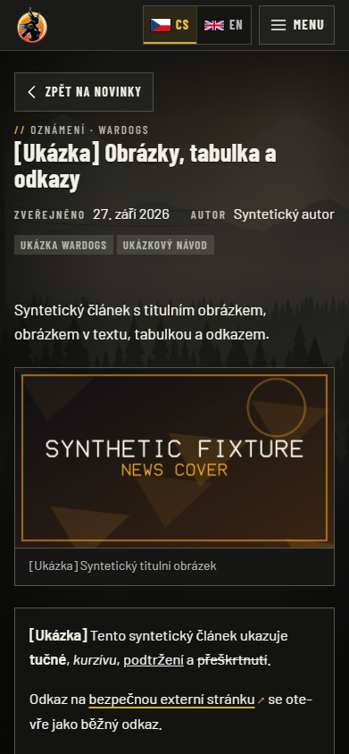
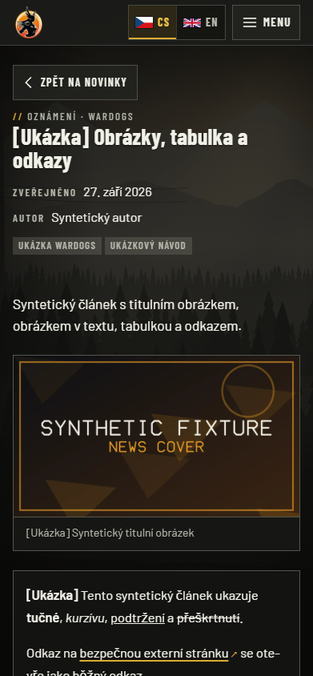
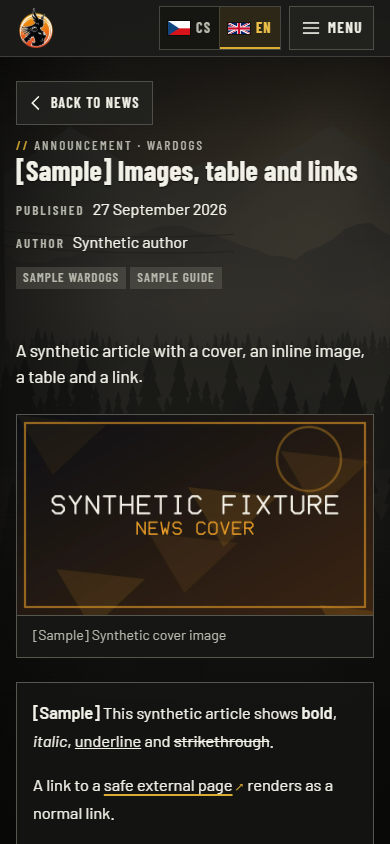
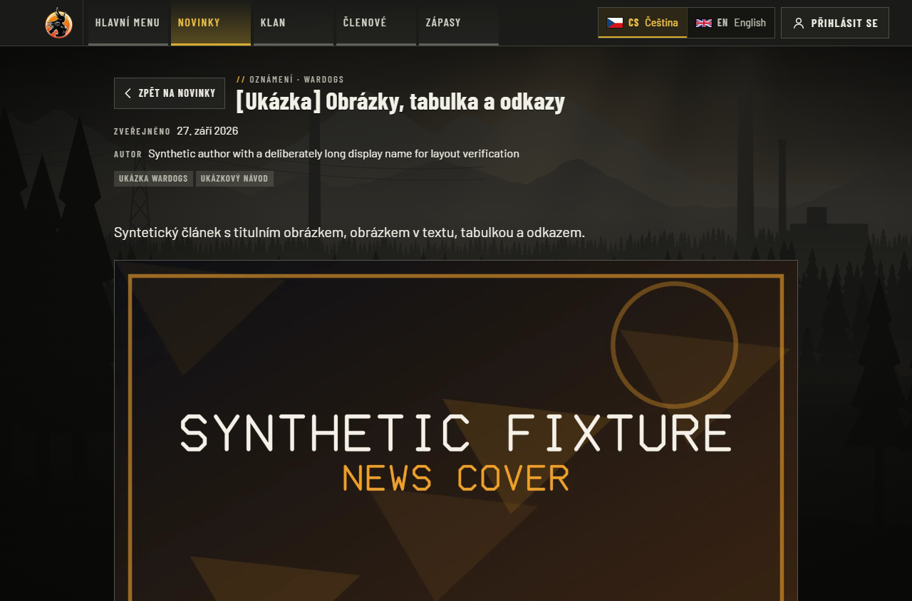
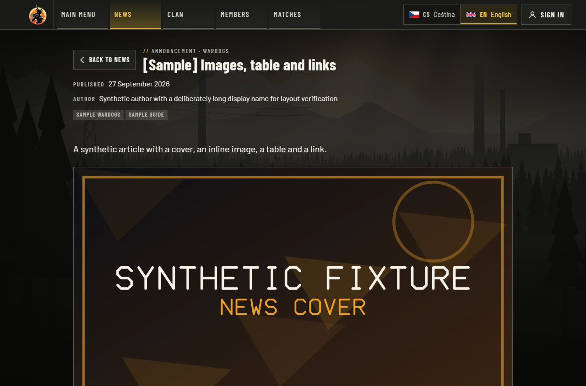

# Article metadata font-loading regression

Issue: [#43](https://github.com/ValkyriaWDG/www/issues/43).
Base application: `df48609e384aca679fb5b72073ea9188ee4785b5`.
This folder records a local candidate; acceptance of the final commit requires its GitHub CI run.

## Failure and cause

[Main CI run 36447034783](https://github.com/ValkyriaWDG/www/actions/runs/36447034783)
failed the article CLS budget: **0.292026**, above the unchanged **0.1** limit.
Its other two article samples were 0.005071. The failure was investigated rather
than discarded as a flaky sample. [ci-failure.json](ci-failure.json) preserves the
original downloaded report, including all three samples and layout-shift sources.
The downloaded `page-budgets-df48609e384aca679fb5b72073ea9188ee4785b5` archive
was 1,179,504 bytes, SHA-256
`ab4839f8a24b69d628b8d27f96fa46644439793618941d865dac78c0fac56eca`.

At 2451 ms, the author moved from the second metadata row onto the date row;
the excerpt, tags, cover and article body moved up **32.796875 px**. At 2480.6 ms,
they moved back down by the same amount. Those two shifts contributed 0.144234
and 0.142767. The cover remained **358 × 244.25 px** throughout. This was a
font-dependent flex-wrap change, rather than an unreserved image dimension.

Condensed label fonts and the Latin/Latin Extended body font subsets arrive
independently. Their intermediate combined width briefly fits on one row. The
fix makes metadata a single-column grid below 720 px. Each existing semantic
`dl` field keeps its own row. At 720 px and above, the existing wrapping flex
layout is preserved. No font, loading policy, image, budget or fixture was
changed in the application.

## Deterministic red/green proof

The production build was served against a dedicated loopback PostgreSQL
database containing only synthetic fixtures. Chrome for Testing **154.0.8037.57**
ran on Windows. The regression holds real WOFF2 responses, releases condensed
600 first, then Barlow 400 Latin, then Latin Extended. Assertions verify that
the intended fonts are actually held/loaded at each stage.

The test uses Arial as the fallback to model Linux hosts without Arial Narrow.
The equivalent width boundary is **391 px on this Windows browser**, versus
390 px in the failed Linux CI sample. Both widths are checked. The first red
reproduction used the untouched relative-date fixture; its measurements are
preserved in [red-original-fixture.json](red-original-fixture.json). The durable
regression normalizes only the synthetic publication time's displayed text to
27 September 2026 before collecting its baseline, so later test dates do not
move the wrap boundary. It leaves markup/styles intact and resets shift
collection after that normalization settles.

| Case | Original staged metadata height | Fixed staged metadata height | Font-swap shift sum |
| --- | --- | --- | --- |
| Czech, 391 px, original application | 57.59375 → 24.796875 → 57.59375 | — | 0.292901 |
| Czech, 391 px, fixed application | — | 57.59375 throughout | 0.004595 |
| Czech, 390 px, fixed application | — | 57.59375 throughout | 0.004621 |
| English, 390 px, fixed application | — | 57.59375 throughout | 0.004778 |

[red-regression.json](red-regression.json) records one intended failing test
against the original application (32.796875 px geometry change).
[green-regression.json](green-regression.json) records **17 passed, zero skipped,
zero retries**: five new article tests, two existing news filter font tests, and
ten public news tests. The new cases also check a long author name at 320 px and
1280 px without horizontal overflow or clipping.

These are actual browser captures of the synthetic public article. The partial
font capture uses Chromium's screenshot command because Playwright's regular
screenshot helper waits for all fonts, which would defeat the held-font stage.
Dimensions and hashes are in [captures.json](captures.json).

| Original, Latin Extended held | Original, all fonts loaded |
| --- | --- |
|  |  |

| Fixed, Latin Extended held | Fixed, all fonts loaded |
| --- | --- |
|  |  |

Additional loaded-font captures cover the English mobile article and long-author
desktop layout in both locales. Desktop text is deliberately synthetic test
content; no production article or member data is used.



| Czech desktop, 1280 px | English desktop, 1280 px |
| --- | --- |
|  |  |

## Unmodified page-budget gate

After the fix, the original `scripts/release/measure-pages.mjs` ran once with
its original policy: three cold navigations per route, 390 × 844 px, 4× CPU
slowdown, 150 ms latency, 200,000 B/s download, 10-second observation. This run
does **not** modify dates or fallback fonts and does not gate font requests.
[green-page-budgets.json](green-page-budgets.json) records **all nine samples
passing**, zero page errors and zero failed resources. Maximum CLS: home
0.032223; news list 0.000757; article **0.002693** in each of its three samples.
Article median LCP was 1120 ms. Original harness capture hashes remain in the
raw reports; this folder includes the seven separate regression captures above.

Reproduce on a disposable local database using the repository's browser-test
environment. `DATABASE_URL` must name a loopback `_test` database for the budget
tool; its derived `_e2e` database is reset. Build before either command:

```sh
pnpm build
pnpm --filter @valkyria/web exec playwright test article-font-stability.spec.ts news-font-stability.spec.ts public-news.spec.ts --project=chromium --workers=1
node scripts/release/measure-pages.mjs
```

Production build and targeted ESLint also passed. Candidate file hashes, using
LF normalization for cross-platform comparison, are in [source.json](source.json).
This is bounded lab evidence on Windows Chromium, not production field Core
Web Vitals, Safari/Firefox qualification, or acceptance of a future commit.
The normal Linux CI gate remains required before merging/deploying.
