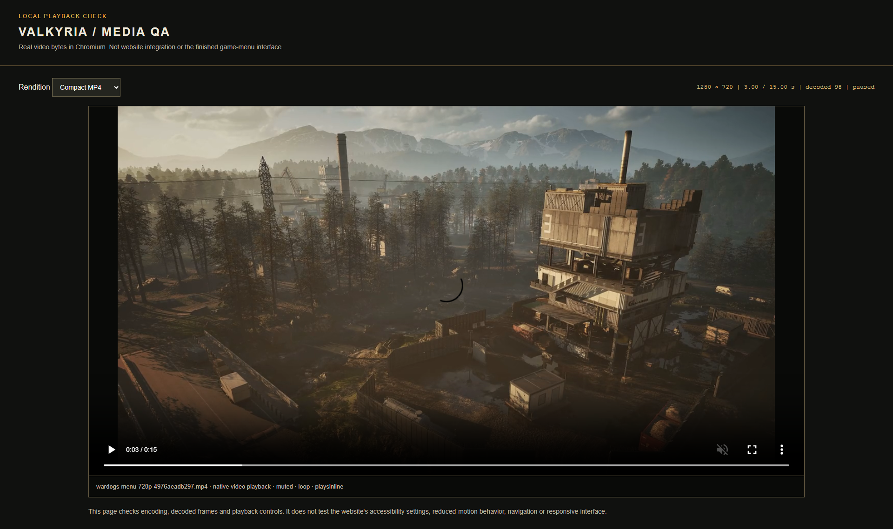
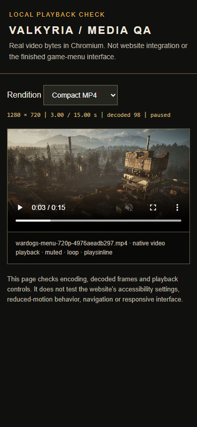
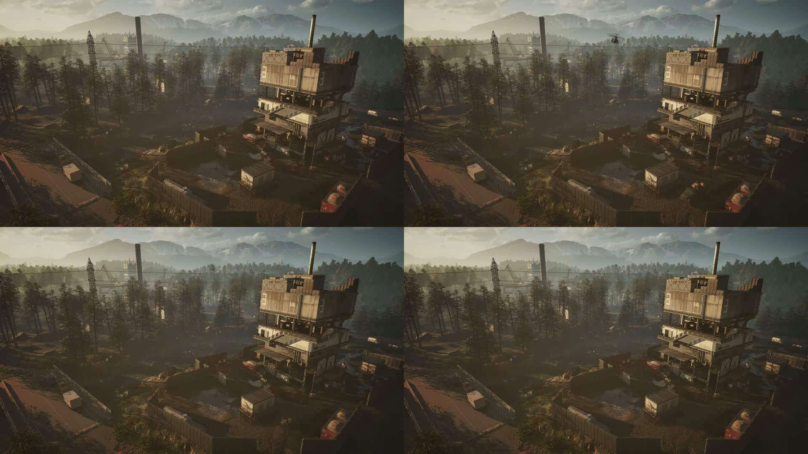

# Background media evidence

> Historical evidence for the rejected 15-second edited candidate, superseded by the
> [full-length delivery](../../assets/background-media-full-2026-09-26.md). None of the
> results or screenshots below verifies the full-length files.

This evidence validates prepared video bytes and a standalone native HTML video
viewer. It is **not** the website, a design mockup or application integration proof.
The [delivery report](../../assets/background-media-2026-09-26.md) explains the source,
loop edit, measured budgets and remaining cloud work.

## Reproduce

Use an isolated checkout of revision `2dc63e58e34a6d103778d1bff5b66ddd12c02d30` for
historical short-clip reproduction. The current verifier trusts the full-length
manifest and must reject the old bundle; do not weaken it or replace its trust anchor.
The archived short [manifest](../../../assets/history/background-media-short-2026-09-26.json)
and [transfer record](../../../assets/history/background-media-short-delivery-2026-09-26.json)
identify these historical bytes.

1. Obtain and unzip the package described by
   [the archived transfer record](../../../assets/history/background-media-short-delivery-2026-09-26.json).
2. Verify against the checked-in manifest:

   ```sh
   node scripts/media/verify-bundle.mjs /path/to/unpacked-bundle
   ```

3. With an installed Playwright package and Chromium, run the portable native
   playback check. Pass the actual package.json path; no dependency on the owner's
   other projects or machine is built into the script.

   ```sh
   node scripts/media/playback-smoke.mjs /path/to/unpacked-bundle /path/to/node_modules/@playwright/test/package.json .local/media-proof
   ```

   It starts a loopback-only server, checks actual bytes/metadata, native playback,
   pause/resume, three normal-speed loops, HTTP range handling and captures the
   viewer. By default it closes the browser and server. `--serve` retains the
   loopback viewer for inspection. Existing application Playwright tooling can be
   reused; this does not add a production dependency to the foundation.

4. For independent complete decoding, use ffprobe `-count_frames -show_streams
   -show_format -of json` and `ffmpeg -v error -xerror -i FILE -f null /dev/null`
   for each video (`NUL` on Windows). Compare with [core validation](core-validation.json).

## Recorded results

- Environment: Windows, Node 24.21.0, FFmpeg 9.0.2 and Chromium 153.0.8010.12.
- Every derivative is identified by full SHA-256, not a mutable filename alone.
  [Core validation](core-validation.json) records decoded frame counts and MP4 atom
  offsets. [Browser proof](media-qa.json) records exact manifest/harness fingerprints,
  native video measurements, requests, screenshots and execution time.
- Four asset hashes/sizes passed before and after browser checks. All three
  renditions decoded, advanced time/frames, paused and resumed without media errors.
  The primary MP4 completed three natural 15-second wraps at playback rate 1.
- The standalone server returned correct media MIME types, `206` for byte ranges
  and `416` for an invalid range. This proves only this local server, not a future CDN.
- [Source fingerprint](source-fingerprint.json) confirms stable size/mtime during
  read-only hashing. [Source structure](source-structure-summary.json) records the
  incomplete AVI index separately from successful derivative playback.

## Captures



Desktop, 1920 × 1080 viewport (full-page capture): the verified compact 720p MP4 decoded in Chromium. The
viewer labels itself as media QA; visible native time/frame counters and video
frame are playback evidence. This is not the application shell or its branding.
The capture includes Chromium's transient native spinner immediately after seeking
and pausing at 3 seconds; the measured state was `readyState=4`, with no media error.
The separate normal-speed playback and loop measurements establish continuous decoding.



Narrow viewport, 390 × 844: the compact MP4 retains its 16:9 picture. This capture
does not prove the website's mobile default, touch UX, reduced motion or navigation.



Contact sheet from the final primary MP4, in reading order: frame 0 (0.000 s),
420 (14.000 s), 435 (14.500 s), 449 (14.967 s). It shows the static camera and
the one-second end-to-start dissolve. [Seam metrics](seam-metrics.json) compare
grayscale frame deltas as supplemental evidence; they are not a perceptual score.

The cloud application still needs real-media compositing/readability, reduced-motion,
save-data, mobile defaults, navigation persistence, pause preference and failure-mode
acceptance. Safari/iOS, Firefox and production hosting were not tested here.
