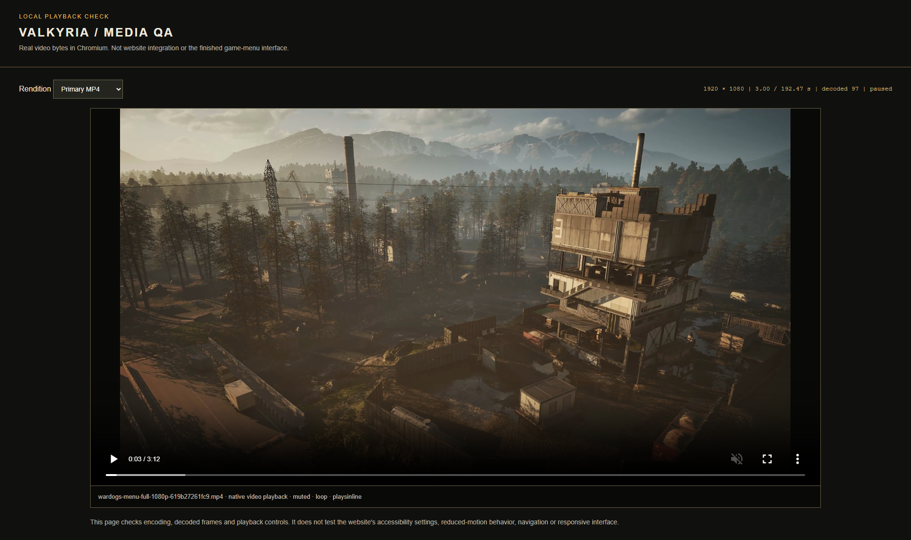
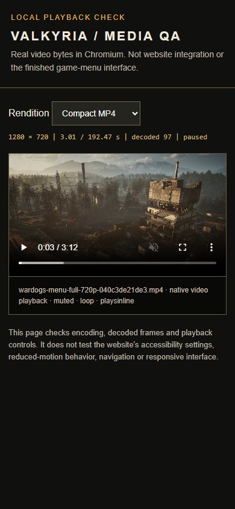
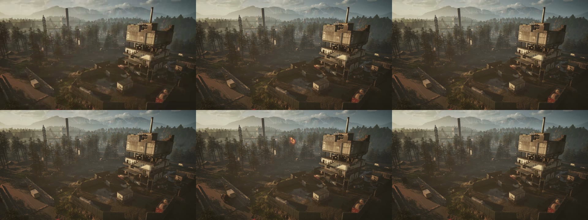

# Full background media evidence

This validates the entire available AVI sequence in three prepared web renditions,
approximately **192.47 seconds** each. It supersedes the earlier 15-second candidate.
The captures show a standalone native HTML video viewer, not the website or application
integration. See the [delivery report](../../assets/background-media-full-2026-09-26.md).

## Reproduce

Obtain the full ZIP using the [transfer record](../../../assets/background-media-delivery.json)
and extract it outside Git. Use a fresh evidence directory per attempt; an older
report is not evidence for a command that failed during preflight.

```sh
node scripts/media/verify-bundle.mjs /path/to/full-bundle
node scripts/media/playback-smoke.mjs /path/to/full-bundle /path/to/node_modules/@playwright/test/package.json .local/full-media-proof --loops 1
```

The portable harness requires an installed Playwright package and Chromium. It starts
a loopback-only HTTP server, checks actual file bytes and native browser playback,
then closes browser/server. One natural wrap takes about 193 seconds at rate 1;
the whole check took about 216 seconds. `--loops 3` is optional and was **not run**.
Invalid `--loops 0` and `--loops 4` were rejected with exit 2 before creating output.

For each video, independently run `ffprobe -v error -count_frames -show_streams
-show_format -of json FILE` and `ffmpeg -v error -xerror -i FILE -f null NUL` (`/dev/null`
on POSIX). [The pipeline](../../assets/video-pipeline.md) records exact encoding commands.
Match newly produced byte hashes before relying on the captured proof.

## Observed results

Environment: Windows, Node 24.21.0, FFmpeg 9.0.2, Chromium 153.0.8010.12. The browser
run was 2026-09-26 14:13:28–14:17:04 UTC. No media methods or media responses were mocked.

| Criterion | Expected and observed | Evidence |
| --- | --- | --- |
| Complete source sequence | 11,547 physical raw frames; native decoder read all 11,547 without errors, including the last 152 unindexed frames | [Source decode](source-decode.json), [source fingerprint](source-fingerprint.json) |
| Valid derivatives | All three complete output decodes passed; 5,774 frames, 30 fps, YUV420P/BT.709, no audio; both MP4s faststart | [Core validation](core-validation.json) |
| Playback and seeking | All three variants advanced time/decoded frames, paused/resumed and played after middle/near-end seeks without media errors | [Browser proof](media-qa.json) |
| Continuous full playback | Primary played from zero through one natural wrap at rate 1 in 192.5042 s; zero dropped frames during the loop phase | [Browser proof](media-qa.json) |
| Integrity | Asset bytes/hashes stable before and after browser checks; altered same-size derivative and altered bundle manifest rejected | [Negative checks](bundle-negative-checks.json) |
| Local HTTP | Correct MIME types, valid `206` ranges and invalid-range `416`; zero off-origin requests or page errors | [Browser proof](media-qa.json) |
| Transfer | ZIP extract/reverify and authenticated GitHub download matched the recorded SHA-256; release remains draft with no public tag | [Transfer proof](transfer-validation.json) |

The browser report fingerprints the exact manifest and harness, so the tested content
is identifiable independently of a mutable branch. Commit-specific proof and matching
hosted CI are recorded on [PR #20](https://github.com/ValkyriaWDG/www/pull/20).

The source AVI has unfinished header/index fields, but its physical tail is complete.
The final output frame compared to the physically last raw AVI frame after orientation/
downscale measured SSIM 0.982111. Both comparison inputs were normalized with
`settb=AVTB,setpts=PTS-STARTPTS`; this is lossy similarity, not byte identity.
The similarly named installed Bink has a different [header/frame index](bink-source-structure.json).
Exact Bink-to-AVI identity is unverified; this delivery covers the supplied AVI.

## Inspected captures



1920 × 1080 viewport, full-page capture: actual primary 1080p MP4 paused after three
seconds of natural playback. Visible 3:12 duration and decoded-frame count; no loading
spinner. The viewer is media QA and does not contain the application shell or clan logo.



390 × 844 viewport: actual compact 720p MP4 paused after three seconds, keeping 16:9
framing. This does not prove website mobile autoplay defaults or responsive navigation.



Primary MP4 frames in reading order: 0 (0 s), 1440 (48 s), 2880 (96 s), 4320 (144 s),
5700 (190 s), 5773 (192.433 s). The camera remains fixed; particles, effects and lighting
change naturally. No artificial fade was added at the wrap, and a seamless boundary
is not claimed.

The application must still verify real-media compositing, readable overlays, poster-only
zero-request states, reduced motion/save-data/mobile behavior, route persistence and
failure recovery. Safari/iOS, Firefox, the Claude session's download access and
production delivery were not tested here. Issues #2 and #6 remain open.
