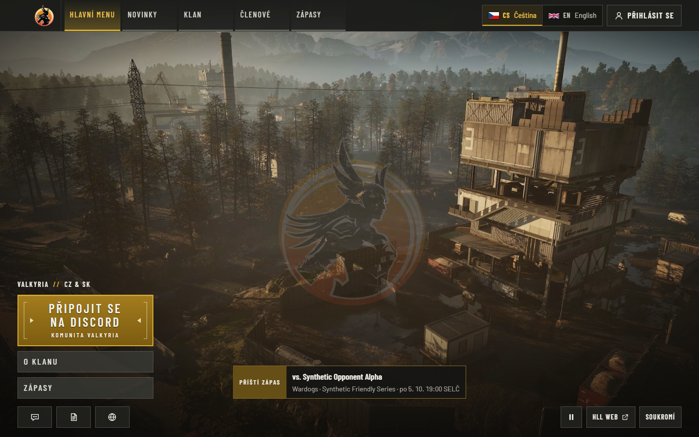
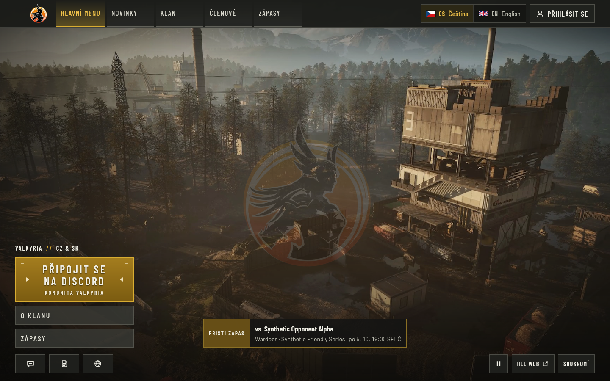

# Chrome and Firefox full-length media qualification

Partial acceptance evidence for [issue #25](https://github.com/ValkyriaWDG/www/issues/25), recorded on
2026-09-28. The actual standalone application completed a natural full-length WebM loop and a separate
MP4 loop in **Google Chrome for Testing 154.0.8037.57** and **Playwright-patched Firefox 155.0** on Windows
x64, headless. All **46 executed tests passed**, with zero failed or skipped tests. Two Firefox mobile
emulation cases were deliberately excluded because Playwright does not support `isMobile` for Firefox.

Firefox MP4 playback recorded **61 dropped frames out of 5,774** at wrap (about 1.06%) and a maximum
frame-callback gap of **597 ms**. Functional playback passed; smooth playback and device performance
are not fully accepted. This run does not close issue #25: Safari/macOS, Safari/iOS, physical mobile
devices, retail Firefox and production delivery remain outside this evidence.

## Revision and environment

- Tested clean source: `e8f19d7b3f664e82d545a58a97a9e215469e62c5`.
- `pnpm install --frozen-lockfile` and `pnpm build` passed before execution. Standalone build ID:
  `8DSJ2nuszlSK6bD-VN1gT`; Node `v24.21.0`; pnpm `10.34.5`.
- The eight tracked player/configuration/test paths in [provenance](provenance.json) have an empty
  `git diff` against later main `425fb5f`. The tested revision remains the earlier one; this does not
  claim all files at the two revisions are identical.
- Chrome for Testing Stable, revision `1689415`, was extracted from the official Windows x64 archive
  into an ignored directory. It is the full Chrome for Testing executable, not Chromium headless shell.
- Firefox build revision `1543`, application build `20260902192955`, was installed into an ignored
  directory with the existing Playwright CLI. It is the **Playwright-patched Gecko browser**, not a
  retail Firefox installation. [Playwright documents this distinction](https://playwright.dev/docs/browsers).
- Both projects launch explicit executable paths. Actual executable hashes, versions and download
  URLs are in [provenance](provenance.json). No system browser installation was changed.
- PostgreSQL 18.4 and the application used loopback interfaces. Data and administrator fixtures were
  synthetic; Discord was the local test double. No production database or real Discord access occurred.
  The app, mock server and portable PostgreSQL were stopped after the runs; local data was preserved.

## Results

| Browser | Default WebM-first | MP4-only | Original order and failed-WebM fallback | Total |
| --- | ---: | ---: | ---: | ---: |
| Chrome for Testing 154.0.8037.57 | 11 passed | 11 passed | 2 passed | 24 |
| Playwright-patched Firefox 155.0 | 10 passed | 10 passed | 2 passed | 22 |

[Run results](run-results.json) include per-case status/duration for the six matrix invocations. The
first Chrome default run used the list reporter, so its summary was recorded from the completed
command output and exit code; no JSON case report was generated for that first invocation.

The natural playback test starts at the beginning and observes a wrap without seeking or accelerating
the first pass. These values are from the snapshot at the first observed wrap, before later seek captures:

| Browser / selected source | Wall time to wrap | Frames / dropped | First-pass callbacks | Callback gap median / p95 / max | Raw metrics |
| --- | ---: | ---: | ---: | --- | --- |
| Chrome / 1080p WebM | 192.4655 s | 5,778 / 0 | 5,774 | 34 / 34.1 / 42 ms | [WebM](metrics/chrome-for-testing/default/playback-natural-wrap.json) |
| Chrome / 1080p H.264 MP4 | 192.4711 s | 5,778 / 0 | 5,774 | 34 / 34.1 / 38 ms | [MP4](metrics/chrome-for-testing/mp4-only/playback-natural-wrap.json) |
| Firefox / 1080p WebM | 192.509 s | 5,775 / 1 | 4,802 | 40.18 / 40.58 / 88 ms | [WebM](metrics/playwright-firefox/default/playback-natural-wrap.json) |
| Firefox / 1080p H.264 MP4 | 192.526 s | 5,774 / 61 | 4,721 | 40.18 / 43.08 / 597 ms | [MP4](metrics/playwright-firefox/mp4-only/playback-natural-wrap.json) |

All four full passes used playback rate 1, a native 1920×1080 video element and an approximately
192.466-second file. No full-pass snapshot recorded `stalled`, `error`, `pause`, `ended`, or hiding of
the video layer. Chrome recorded two `waiting` and two `playing` events; Firefox recorded one of each.
Each recorded one `seeking`/`seeked` pair at the native loop. Individual waiting-event timestamps were
not recorded, so their causes are not established. Absence of a `stalled` event is not proof of zero
rendering interruption: Firefox MP4's dropped frames and long callback gap remain an open performance
observation. This run does not determine whether browser instrumentation or another local condition
contributed. Frame callbacks can coalesce and are not interchangeable with decoded frame counts.

The same suites also verified:

- **Pause and resume:** manual pause persists across routes and reload; paused reload makes zero video
  requests, and explicit resume plays the selected source.
- **Navigation:** one persistent video element is reused on public pages; administration pauses it,
  and direct administration loads request no video.
- **Poster policy:** reduced motion and simulated Save-Data make zero video requests before opt-in;
  rejected video requests retain the actual poster. Chrome also passed a narrow/coarse Pixel 7 viewport
  emulation. Firefox's corresponding emulation case was excluded, not marked passed.
- **Hidden tab:** the existing test simulates visibility state/events and observes the real player
  pause/resume. This is not an operating-system tab-backgrounding measurement.
- **Renditions:** primary MP4, compact 720p MP4 and WebM decode at midpoint and near the end in both
  browsers. Full continuous first-loop timing covers primary MP4 and WebM; compact MP4 has seek proof only.
- **Fallback:** unchanged two-source order selects WebM without fetching MP4. Deliberately aborting
  only WebM network requests selects the full MP4, which advances more than three seconds without a
  media error. [Chrome fallback](metrics/chrome-for-testing/fallback/controlled-webm-network-failure.json)
  and [Firefox fallback](metrics/playwright-firefox/fallback/controlled-webm-network-failure.json)
  retain both actual source elements and request/failure records. This is one network-failure path,
  not every possible codec or delivery failure.

No application runtime code or native media API was replaced. MP4-only mode changes only the local
test-server `BACKGROUND_VIDEO_WEBM_URL` to an empty string. The generated tests adapt import/output
paths, assert the selected source, and use native frame-quality counters where Firefox does not expose
WebKit decoded-byte counters. The original policy tests deliberately simulate Save-Data and visibility.
The approved media files were hash-verified before every invocation; [delivery metrics](metrics/chrome-for-testing/default/delivery.json)
record sizes, digests, MIME types, byte ranges and cache responses. Rights/source provenance remains
in the [media manifest](../../../assets/background-media.json).

## Inspected application captures

These four images are unmodified screenshots, inspected after the tests. Content is synthetic. A
still image demonstrates layout and state; the linked metrics establish temporal playback behavior.
Other screenshot-metadata records are retained under `metrics/`, but their image files remain local.
Wardogs imagery is excluded from the repository code license; these are verification evidence, not
general-purpose assets.



**Chrome for Testing, Czech home, 1440×900:** full H.264 MP4 selected in MP4-only configuration. The menu,
faded logo, synthetic next-match strip and pause control are visible.
[Capture metadata](metrics/chrome-for-testing/mp4-only/screenshot-cs-desktop-home-playing.json).


**Playwright-patched Firefox, Czech home, 1440×900:** default WebM-first configuration selects VP9.
[Capture metadata](metrics/playwright-firefox/default/screenshot-cs-desktop-home-playing.json).


**Playwright-patched Firefox, Czech home, 1440×900:** reduced-motion poster state before opting in,
with the play control available. This image is the desktop poster capture, not a mobile capture.
[Capture metadata](metrics/playwright-firefox/mp4-only/screenshot-cs-desktop-home-poster.json).



**Playwright-patched Firefox, Czech home, 1440×900:** WebM requests were deliberately failed; the native
player selected MP4 and advanced from approximately 0 to 4 seconds.
[Scenario metrics](metrics/playwright-firefox/fallback/controlled-webm-network-failure.json).

## Reproduction

Supply the approved media bundle out of band. Verify it with
`node scripts/media/verify-bundle.mjs <approved-bundle-directory>` and place the verified derivatives
in ignored `apps/web/public/media/background/`. Video bytes are intentionally not committed here.

Obtain the exact browser from the recorded official URL, or record a newer version as a separate run.
[Chrome for Testing](https://googlechromelabs.github.io/chrome-for-testing/) provides isolated archives.
For Firefox, the recorded installation command, run from `apps/web`, was:

```sh
node node_modules/@playwright/test/cli.js install firefox --no-remove
```

Set `PLAYWRIGHT_BROWSERS_PATH` to an ignored directory before that command. Do not interpret the
result as a retail browser install. Then, from the repository root:

```sh
pnpm install --frozen-lockfile
pnpm build
node docs/evidence/browser-media-2026-09-28/harness/prepare.mjs
```

The preparation script writes the tested specs/configuration into ignored
`apps/web/.local/browser-qualification/`, refusing changed source anchors. It was verified to regenerate
byte-identical specs/configuration after these runs. Use only a disposable loopback PostgreSQL instance;
the harness creates, migrates and resets its test database. Set these variables privately:

| Variable | Required value |
| --- | --- |
| `DATABASE_URL` | Disposable loopback PostgreSQL administrative connection |
| `E2E_DATABASE_URL` | Separate disposable target ending `_e2e`; recorded name `valkyria_browser_qualification_20260928_media_e2e` |
| `E2E_MEDIA_PORT` | Available loopback port; recorded `3318`, with local Discord mock on `4318` |
| `BROWSER_PROOF_PRODUCT` | `chrome-for-testing` or `playwright-firefox` |
| `BROWSER_PROOF_MODE` | `default`, `mp4-only` or `fallback`; run each separately |
| `BROWSER_PROOF_EXECUTABLE` | Explicit absolute path to that exact browser executable; mandatory for reproducible product identification |
| `PLAYWRIGHT_BROWSERS_PATH` | Ignored browser cache used for acquisition |
| `PLAYWRIGHT_JSON_OUTPUT_NAME` | Ignored absolute report filename, if the JSON reporter is enabled |

Unset `PLAYWRIGHT_CHROMIUM_EXECUTABLE` to avoid carrying an unrelated executable override into the
baseline. From `apps/web`, execute each product/mode pair sequentially:

```sh
node node_modules/@playwright/test/cli.js test -c .local/browser-qualification/playwright.config.ts --reporter=list,json
```

The recorded commands used an ignored local `run.mjs <product> <mode>` wrapper to set those variables
and invoke this CLI; its machine-specific credential-file adapter is deliberately omitted. The first
Chrome/default invocation used only the list reporter. New metrics/images land in ignored
`.local/evidence/browser-qualification-2026-09-28/<product>/<mode>/`. Never publish raw traces, session
cookies, database URLs or unsanitized JSON reporter output. Rebuild on the revision being reviewed and
record fresh provenance rather than presenting these historical artifacts as a new run.

## Remaining acceptance

The evidence advances issue #25 with native Chrome and patched Gecko coverage, and supplements the
[earlier native Edge proof](../native-media-2026-09-28/README.md). It does not establish Safari coverage,
retail Firefox qualification, physical Android/iOS behavior, background battery use, constrained-network
performance or production delivery. Investigate the Firefox MP4 frame-drop observation on a dedicated
device/browser run before asserting smoothness across supported platforms. No repeated benchmark or
runtime change was attempted in this bounded qualification.
