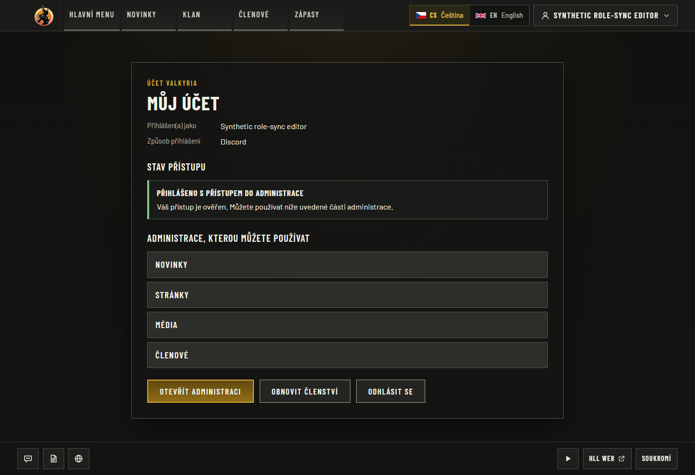
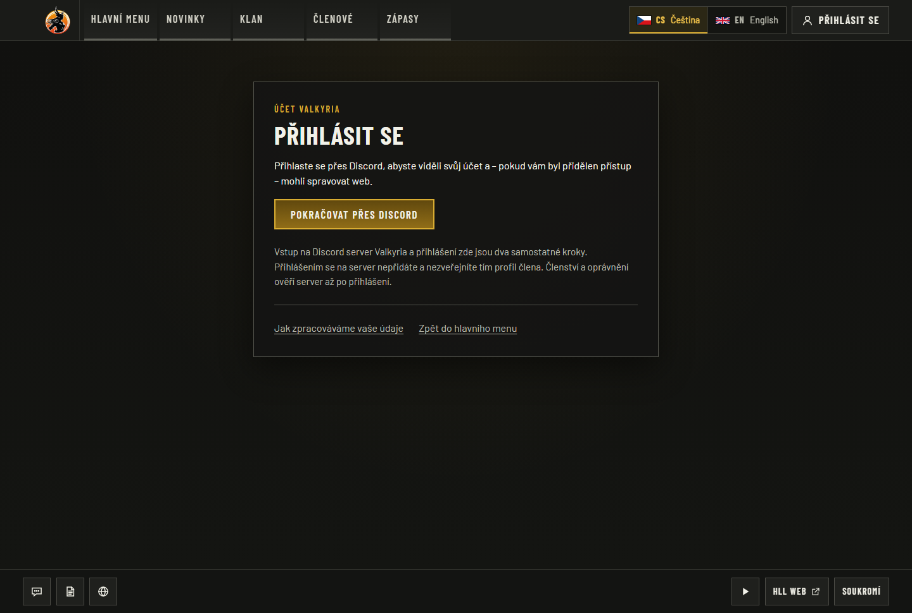
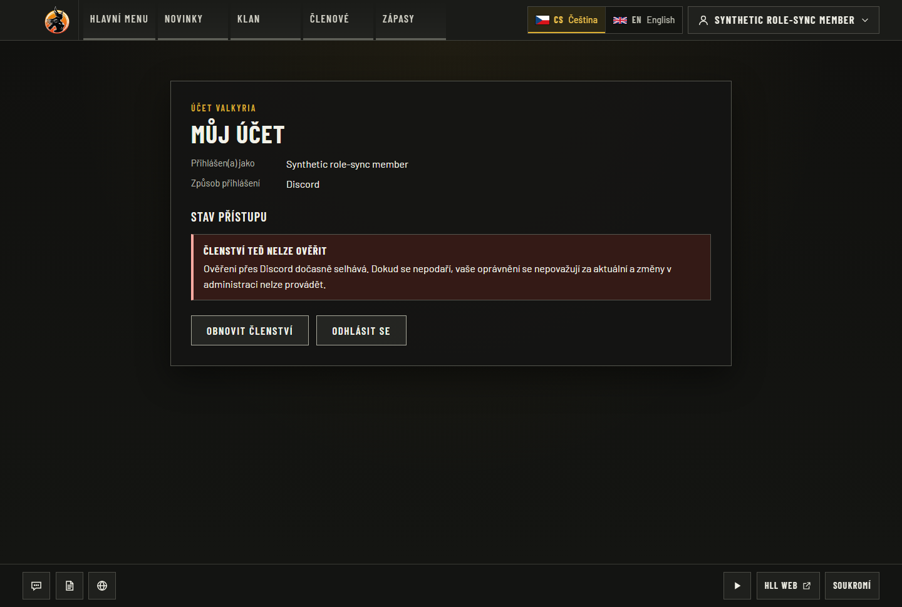
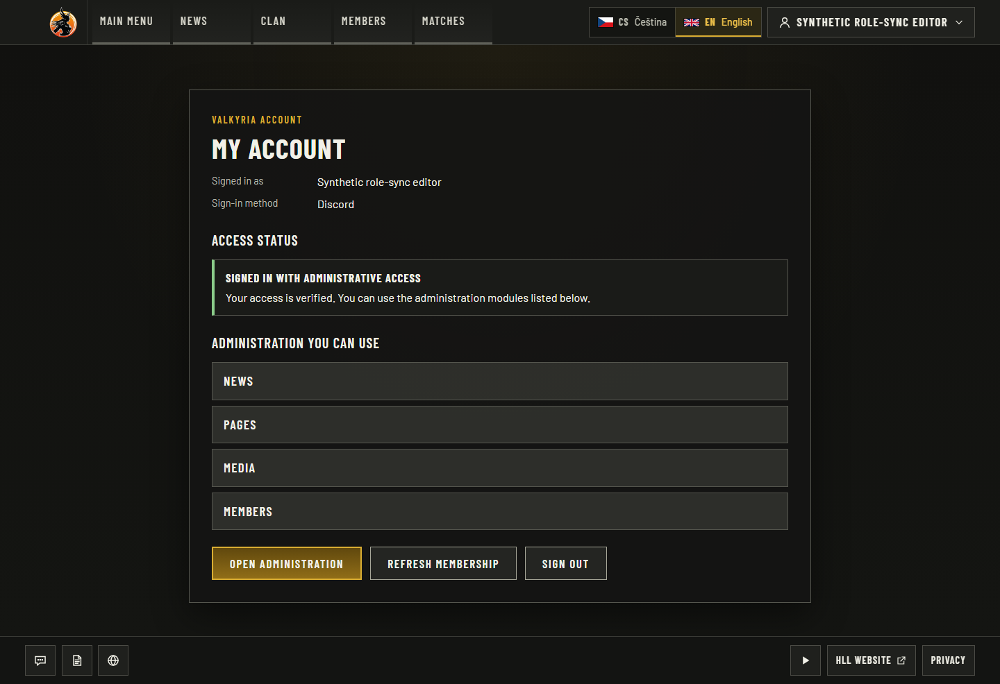
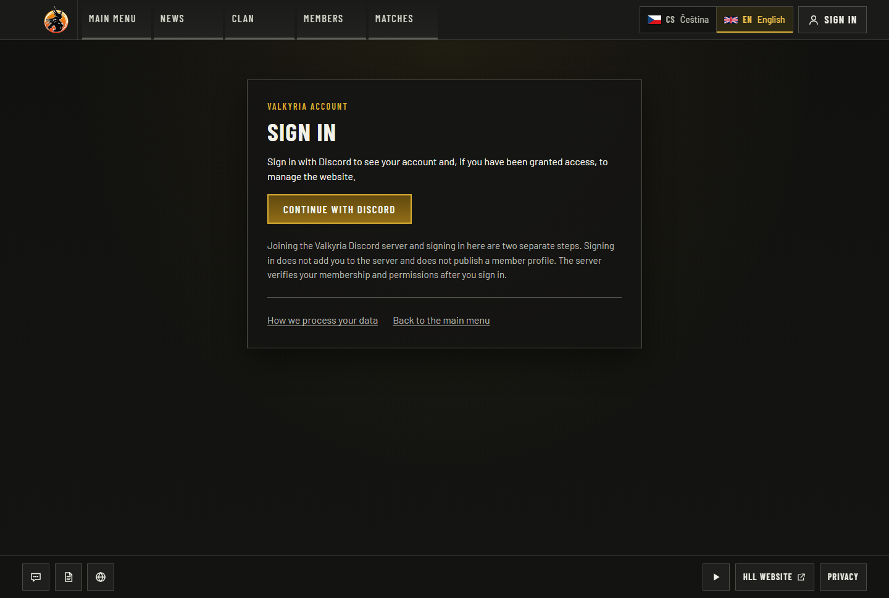
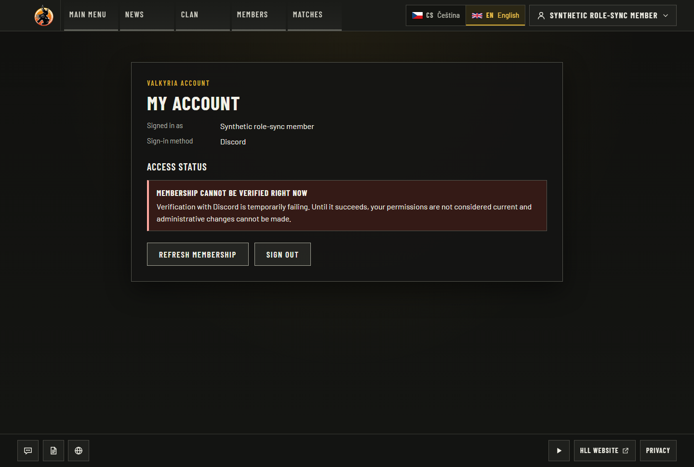

# Discord role-sync offline acceptance

Actual website behavior with synthetic identities and a local Discord REST fixture.
This evidence does not establish live Discord or production integration acceptance.
See the [contract and reproduction commands](../../integrations/discord-role-sync.md)
and the [machine-readable report](report.json).

## Source and environment

Website base `507e704d288cd93d7baa0d1ab22ba8347fd67b0a` plus the uncommitted
implementation recorded by SHA-256 per changed source/test/config file in `report.json`.
Captures were made on 2026-09-26 from that production build; they are explicitly
pre-commit evidence, not a claim that the base commit contains this feature. The actual
bot sender checkout was clean at `4f3db011ec0aa96eaaa96bfb7b71cd4bffd804ac`.

Node 24.21.0, pnpm 10.34.5, PostgreSQL 18.4 on a disposable loopback fixture,
Next.js 16.3.6 standalone build, Playwright 1.63.0 bundled Chromium (build 1243),
Windows. The six full-page images use a 1440 × 900 viewport, Europe/Prague timezone
and reduced motion. Their image dimensions, capture times, routes, captions and hashes
are in the report. Every image was inspected; no redaction was needed.

## Acceptance results

| Criterion | Observed proof |
|---|---|
| Exact signed wire contract, bounded input, disabled default | 15 protocol/config/receiver unit tests passed. |
| Durable receipts before ACK, replay/order/tombstone safety, concurrent events, atomic failure rollback | Actual PostgreSQL receiver tests passed; event role lists never create a positive grant. |
| In-flight REST, cached actor and scheduled-publication races | Real PostgreSQL lock barriers reproduced the original failures, then passed with generation/session and transaction fences. An advancing clock also proves rollback if freshness expires during the final audit write. |
| Local MFA recovery remains independent | Real local grant publication succeeds; a grant revoked during the content lock wait blocks publication. |
| Additive migration and old-row preservation | Fresh/upgrade/concurrent/idempotent migration checks passed. The focused PostgreSQL run totals 77 passed across five files. |
| Real bot sender interoperability | Seven cross-repo tests passed using the actual bot signer, outbox, relay and migrations over loopback HTTP into the actual receiver. Covers lost ACK, restart-style reconstruction, expired leases, rotation, stale events, 429 and outage quarantine. |
| Visible CS/EN revocation and outage states | Four production-build browser journeys passed, with the six captioned captures below. |
| Repository checks | Build with TypeScript/CLI bundles, lint, foundation validation and 19 foundation tests passed. |

Broader earlier local runs remain qualified: unit 380/384 and PostgreSQL 235/237 passed.
Failures were Windows path/symlink/file-lock behavior and the disposable PostgreSQL
C-locale Czech case-folding fixture; details are retained in `report.json`. Final
applicable Linux CI must still pass at the delivered PR revision.

## Captured account states

**CS before invalidation — `/cs/account`.** A synthetic editor has a fresh server-side
Discord REST observation. The account exposes the permitted administration modules.

**CS after committed departure — `/cs/login?returnTo=...`.** The actual signed HTTP
receiver deletes the Discord-assured session. Reload redirects to sign-in; the browser
test independently asserts zero remaining sessions. The image alone is not DB proof.

**CS during REST outage — `/cs/account`.** A signed event advertised an administrator
role, but only invalidated the cache. REST verification fails, no administration modules
are displayed, and a subsequent `/cs/admin` request is denied by the browser test.

**EN before invalidation — `/en/account`.** The equivalent fresh synthetic editor
observation exposes the permitted administration modules in English.

**EN after committed departure — `/en/login?returnTo=...`.** The signed departure
revokes the session and reload redirects to localized sign-in.

**EN during REST outage — `/en/account`.** Administrator roles from the event cannot
grant authority. The account shows failed verification and omits administrative controls.

## Remaining paired acceptance

The receiver stays disabled by default. No real guild, OAuth callback, production
credential, public ingress, deployment, live key rotation or live revocation interval was
tested. Sender reconstruction proves durable lease/replay recovery without claiming an
OS crash experiment. Keep [bot #5](https://github.com/ValkyriaWDG/bot/issues/5) open for
its live acceptance. Add current PR-head CI and these accessible, captioned artifacts
to the PR and related issue before considering any closure.
