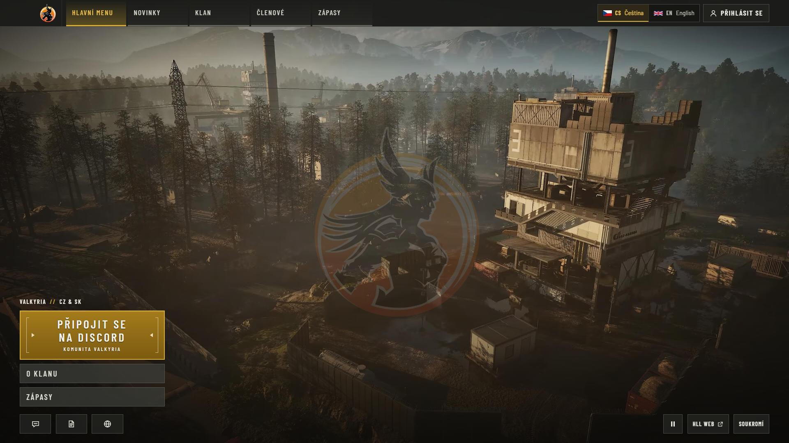
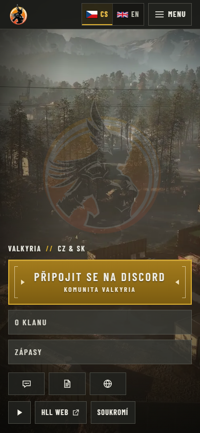

# First public website deployment

Date: 2026-09-26. Public origin: **https://valkyriawdg.cz**.
Scope: public Czech/English website with the full background sequence. Discord OAuth,
local recovery login and bot integration remain disabled pending operator configuration.

## Immutable release identity

- Source: `d0f98b0475e7dfb07add2a679c49acce23259684` (1.0.0 application plus
  [publication provenance fix #28](https://github.com/ValkyriaWDG/www/pull/28)).
- Public image: `majorluk/valkyria-www@sha256:2ceb72d0b67fd462fa93733c752b60cdc708f36584bcffb5537be31bb5c360d4`.
- [Exact main CI](https://github.com/ValkyriaWDG/www/actions/runs/36258249223): passed
  application lint/types, unit/integration/browser checks, container migration/startup,
  fixable HIGH/CRITICAL image scan and SBOM generation.
- [Guarded publication](https://github.com/ValkyriaWDG/www/actions/runs/36258266441):
  passed its independent CI, protected environment review, publication, digest pull and
  OCI source-revision assertion. No mutable production tag or automatic deployment.
- [Runtime readback](runtime.json) independently confirms the deployed digest/revision,
  UID 10001, read-only root filesystem, dropped capabilities and no host application ports.

The owner explicitly approved public image visibility. Runtime secrets, database contents,
editorial uploads and background media are not embedded in the image. Registry credentials
are scoped to the protected publication environment. The generated runtime configuration
is held in an operator-only file on the host; no Discord credentials were copied or invented.

## Host acceptance

The dedicated PostgreSQL 15.17 database/role was created without superuser, role-creation,
database-creation, replication or RLS-bypass privileges. The reviewed
`0000_initial_schema.sql` migration applied once; repeated migration runs applied zero.
The production seed inserted three core pages in both locales and four categories;
its second run inserted nothing. No fixture accounts, posts, players or matches were loaded.

The website starts with a read-only image and separate writable editorial/cache mounts.
Actual UID 10001 file writes and background reads were verified. Public readiness returns
200 with `config`, `database`, `schema` and `media` all `ok`. A controlled website-only restart
recovered internal and public readiness. Existing application containers were not restarted.

An empty-database backup preceded migration. A seeded database dump was restored into a
new disposable database; all **25 tables** matched row counts and canonical row-content
checksums, including the migration journal ([restore report](db-restore.json)). Only that
disposable database was removed. This proves database restoration, not a full restored-app
or cross-release rollback rehearsal. The editorial volume was empty at this point.

Host-owned systemd timers are enabled: daily database/editorial-media backups and a
minute publication pass with overlap protection. Both first runs exited successfully.
Backups are currently protected on-host; encrypted off-host replication, retention and
alert delivery remain launch follow-ups. Scheduled publication has no content to publish.

The existing tunnel and reverse proxy now route only the two new website hostnames;
all prior tunnel entries/settings were preserved and verified by semantic comparison.
TLS is valid. `www` redirects to the canonical apex while preserving path/query.
The site-specific proxy trusts only the tunnel connector, overwrites forwarded client IP
with one validated address, and preserves application cache rules. Actual origin probes
verified valid-tunnel 200s, missing-client-header 400, direct-origin spoofing 403, and
HTTPS/canonical redirects. `nginx -t` passed before DNS publication.

## Full background delivery

All four files were verified against [the manifest](../../../assets/background-media.json)
on the host, then mounted read-only at startup. All three background URL variables use
the same public origin. No short-lived asset URLs or database override are used.

| Derivative | Bytes | SHA-256 |
|---|---:|---|
| 1080p MP4 | 51032923 | `619b27261fc903b26fcef14ee42a1a7bbd58953140568e1803f7a6c25f26455b` |
| 1080p WebM | 19561104 | `b7aa9380dd06f3d7e638bb9d45a63ef646a9517ea8dd0a4b1abb6b0206b0a309` |
| 720p MP4 | 13654192 | `040c3de21de316f2360aa6fdc50ca67ea32e621bce17599e2942acb6ede41b4e` |
| WebP poster | 181198 | `f31f6824f25971d4e70660b4e6834e533af1e13f8a458c4e6fd4b577abd3ce8c` |

Independent [public HTTP checks](http-smoke.json) verified MIME, manifest byte length,
`Accept-Ranges: bytes`, actual 1024-byte 206 responses and
`public, max-age=31536000, immutable` for every derivative.

## Public verification

[HTTP harness](http-smoke.mjs) and [unaltered results](http-smoke.json): **29/31 passed**.
The two failures are missing canonical metadata on `/cs` and `/en`, tracked in
[#29](https://github.com/ValkyriaWDG/www/issues/29). Other checked redirects, health,
localized public metadata, private-route no-store and media delivery passed.

[Browser harness](browser-smoke.cjs) and [results](browser-smoke.json): **10/10 passed**
in Edge 154.0.4258.37 using fresh anonymous desktop/mobile contexts. Real full-length
media decoded and advanced in time, Czech/English switching worked, pause survived
reload, reduced-motion/mobile loaded the poster without video bytes, public routes
rendered, Discord login stayed disabled and anonymous administration redirected to login.
There were no uncaught page errors, failed network requests or write attempts.

The original harness was stopped after an unbounded hidden-image decoding wait; the
revised harness checks visible image readiness with explicit deadlines. This was a proof
harness issue, not a production application restart or a fabricated passing run.

| Capture | Observed state |
|---|---|
| [Czech desktop](01-home-cs-desktop.png) | Live main menu during measured video playback |
| [English desktop](02-home-en-desktop.png) | Actual language-switch result |
| [Paused desktop](03-paused-cs-desktop.png) | User pause preserved after reload |
| [Reduced motion](04-reduced-motion-cs-desktop.png) | Poster visible, no video download before opt-in |
| [Czech login](05-login-cs-disabled.png) | Explicit localized unavailable state, disabled Discord action |
| [English login](05-login-en-disabled.png) | Same disabled-provider behavior in English |
| [Czech mobile](06-home-cs-mobile.png) | 390×844 viewport, poster and readable controls without horizontal overflow |
| [English mobile](06-home-en-mobile.png) | Localized mobile layout and poster |





Reproduce from a checkout with application dependencies installed:

```sh
node docs/evidence/first-deployment-2026-09-26/http-smoke.mjs
node docs/evidence/first-deployment-2026-09-26/browser-smoke.cjs --revision d0f98b0475e7dfb07add2a679c49acce23259684
```

Browser automation resolves the application's Playwright dependency or an explicitly
provided `PLAYWRIGHT_MODULE`. It uses fresh anonymous contexts, performs no authentication
or content writes, and records the observed browser, harness hash and deployment identity.

## Remaining scope

- [#23](https://github.com/ValkyriaWDG/www/issues/23) stays open for live Discord SSO,
  role-removal verification, recovery-admin provisioning, final privacy contact/retention
  text and remaining operational monitoring/backup acceptance.
- [#25](https://github.com/ValkyriaWDG/www/issues/25) still owns full cross-browser MP4
  coverage. Short measured playback is not a claim of a natural full-loop or every codec.
- [#26](https://github.com/ValkyriaWDG/www/issues/26) retains subsequent-release rollback,
  runtime-base review and page-budget work.
- Dependabot alert #1 concerns an old transitive esbuild development-server dependency.
  No corresponding esbuild/drizzle-kit package directory was present in the deployed
  standalone image's pnpm inventory, and production does not run esbuild's server.
  Repository dependency remediation is still required; the alert was not dismissed.

Rollback for this first deployment: disable only these website routes/timers and stop
the website service; preserve its database, protected config and backups. There is no prior
website image to restore. Future upgrades require an explicit accepted digest and migration
review; Watchtower is disabled.
