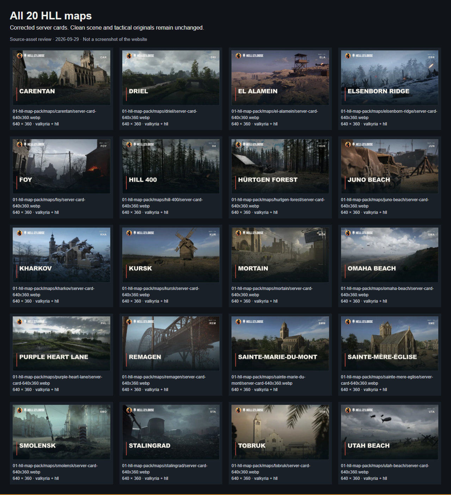
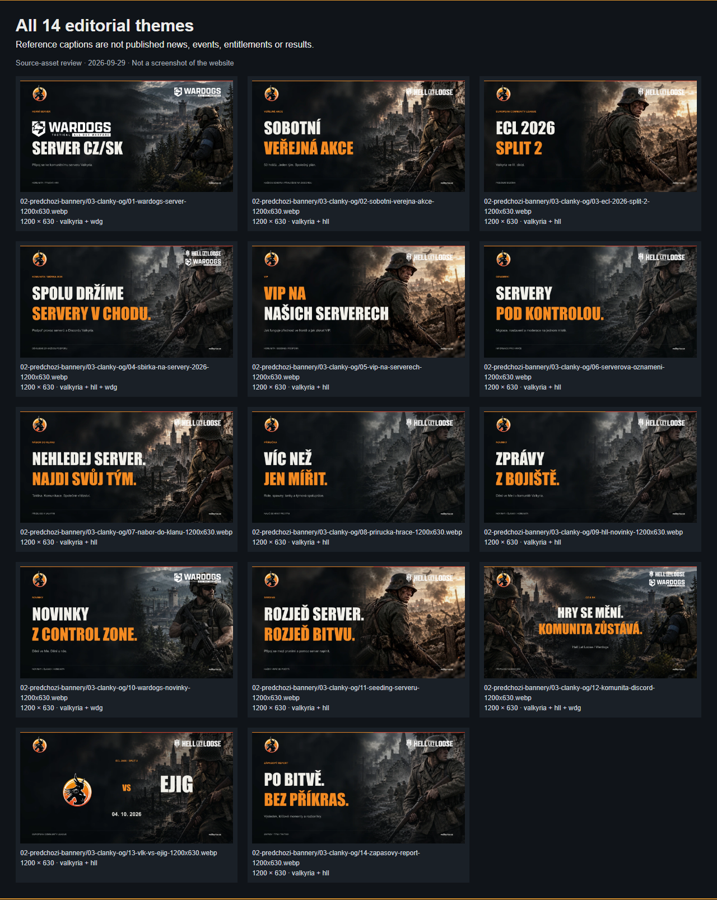
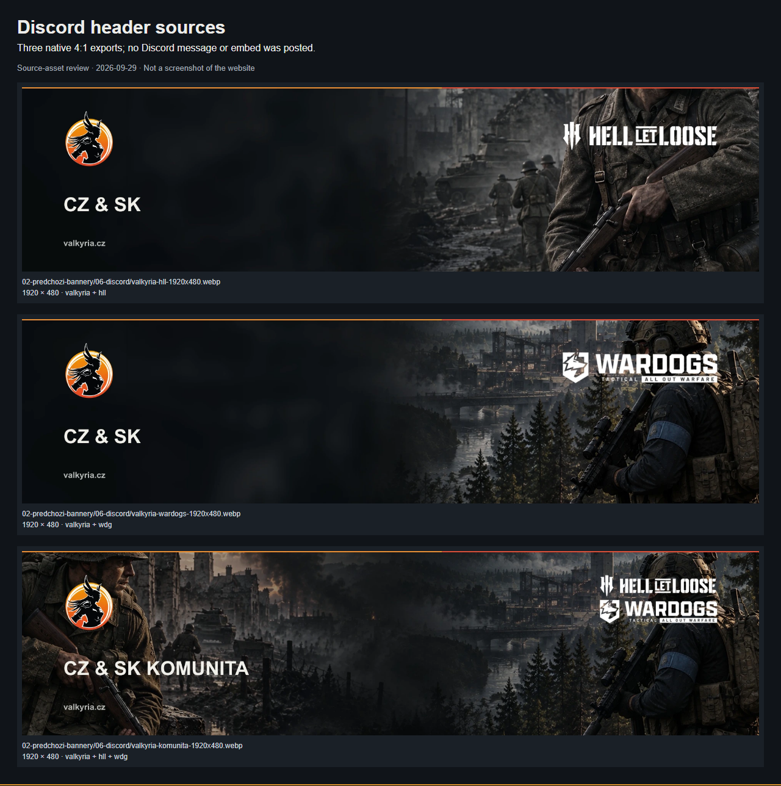

# Brand correction source evidence

These are **actual local Chromium captures of the exported source assets**, not
screenshots of new website features. Captured and visually reviewed on 2026-09-29.
Claude owns application integration and its CS/EN desktop/mobile evidence.

## Reproduction and scope

Follow [the native export tools](../../../scripts/graphics/README.md). The
[verification record](verification.json) binds the working-tree catalog, reviewed
asset hashes and captures to the inspected state. The recorded base revision is
the original PR70 handoff; new working-tree asset hashes identify this follow-up.
The [offline gallery](gallery.html) contains only local image references.

| Check | Observed result |
|---|---|
| `node scripts/check-foundation.mjs` | Passed for 2,304 files; all new visual files registered with hashes |
| `node --test scripts/tests/*.test.mjs` | 175 passed, zero failed/skipped; includes three new brand contracts |
| `node assets/design-packs/valkyria-2026-09-29/restore.mjs --verify` | All 497 original files / 259,585,695 bytes unchanged; no bundled code executed |
| `node scripts/graphics/capture-branded-pack.mjs` | 44 decoded images, four captures, no page errors/external requests |
| Icon source validator | 16 SVGs, 128 samples at each viewport; exact XML/source parity and desktop/mobile captures |

Full native export: **340 files / 226,577,060 bytes**, maximum file **3,935,668 bytes**.
All 286 rasters were decoded and checked against expected dimensions by the
exporter; 54 editable SVGs embed exact original logo bytes. The source contract
tests verify original/replacement hashes, one-to-one coverage, archive provenance,
logo identity, passive SVGs, portable scene layers, and numeric zero versus unknown
scores with escaped sample text. No archived editor code runs.

Chromium 153.0.8010.12 with Playwright 1.63.0 decoded **44 selected images** at a
1280px viewport. No external HTTP requests, page errors or horizontal overflow.
Four screenshots are below; all were inspected for blank map/background layers,
clipping, logo aspect ratio, readable text and overlap. An independent reviewer also
inspected ten representative exports. The review found and corrected missing WebP
layers in the first native-SVG render and two provenance metadata errors before
these captures. No remaining visual blocker was found in the reviewed samples.

The exporter uses Windows Arial/Impact for reference typography. Those fonts are
not distributed; existing app fonts and tokens remain unchanged. Sources contain
Czech captions, sample dates and unverified event/entitlement examples. They are
not English translations, published CMS records or claims of actual matches.

## All map cards

Twenty known HLL maps with the real clan crest and official HLL full mark. Scene
identities and long map names remain intact. These larger source cards are not
instructions to bake live status into a compact website row.

## Editorial themes

Fourteen OG previews: HLL and Wardogs use their respective full marks; community
themes include both. Match artwork uses the clan crest as the home identity.

## Discord headers

Three 1920×480 exports for HLL, Wardogs and the shared community. No external
Discord message, registration or embed was created.

## Other ratios

Foy strip, article, match result, match preview, wide banner, square and tactical
poster. The dash scores remain placeholders. Original tactical files are intact.

[Actual capture of all seven additional Foy formats](formats.png)

The separate [icon evidence](../../../assets/icons/valkyria-ui/evidence/README.md)
covers sixteen original SVG glyphs at desktop/mobile sizes and on light/dark
surfaces. Actual app integration, runtime performance, live locale switching,
production state and full application CI are **not established by this evidence**.
