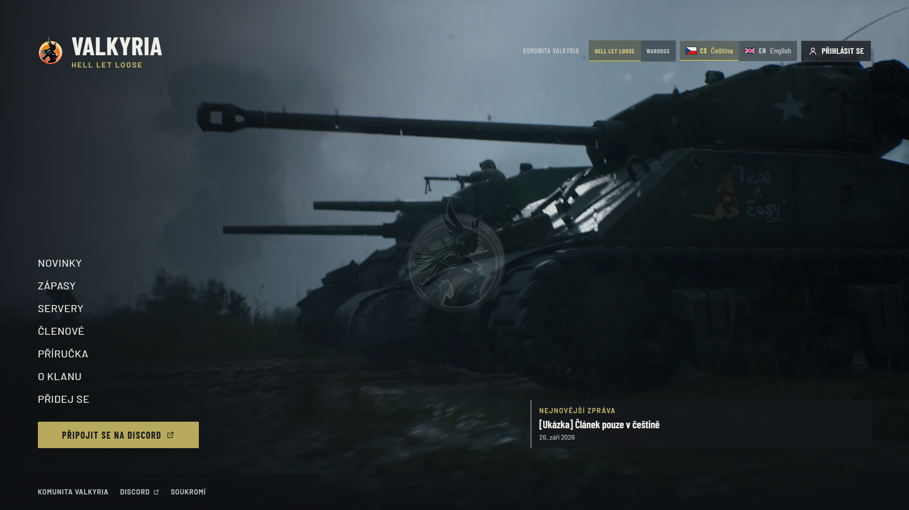
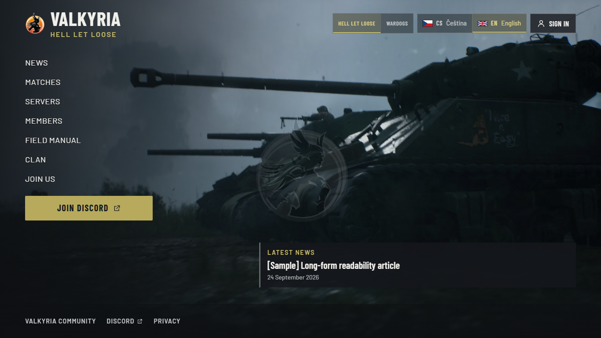
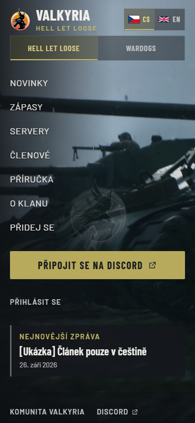
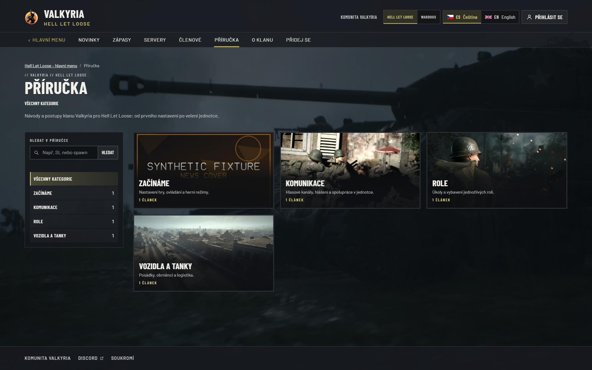
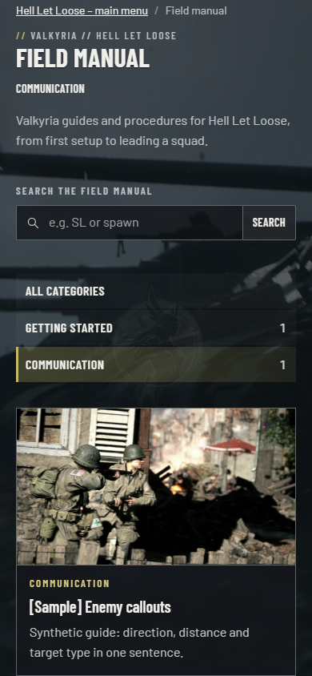
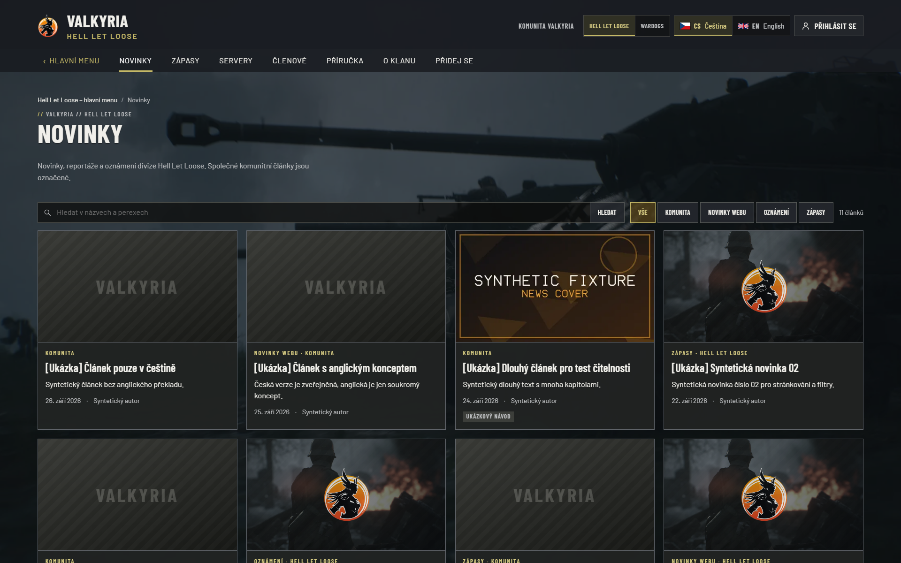
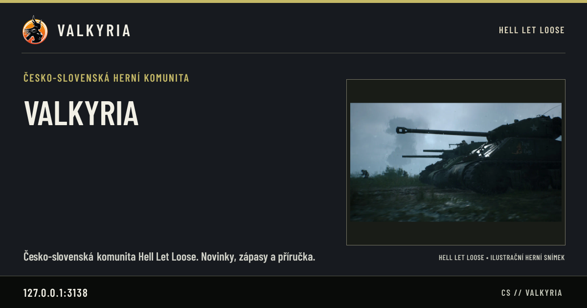
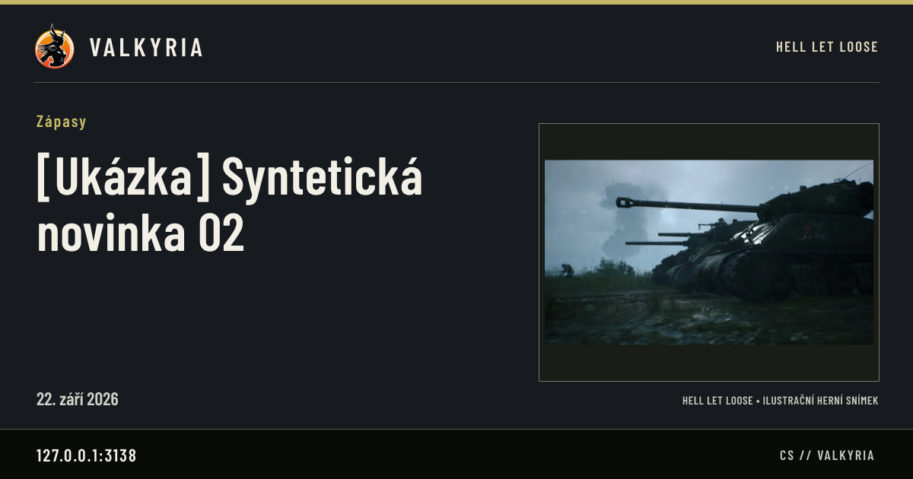
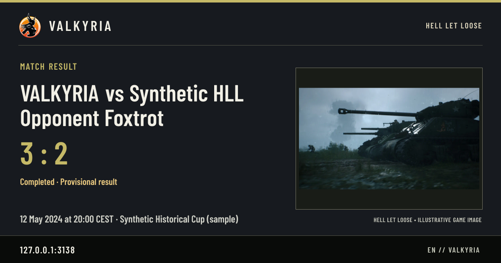

# HLL graphics verification

Scope: fullscreen HLL background, actual shipped poster, manual/news artwork and
localized game-scoped social cards. See the [delivery contract](../../assets/hll-graphics-delivery.md).

The implementation and evidence are tracked in [PR #55](https://github.com/ValkyriaWDG/www/pull/55),
with partial acceptance recorded on [issue #36](https://github.com/ValkyriaWDG/www/issues/36).
The issue stays open for work outside this graphics slice and final clan footage.

## Environment and boundaries

Windows local standalone production build, Node 24.21.0, pnpm 10.34.5, Playwright
1.63.0, Chromium 153.0.8010.12. All database/editorial records are labelled synthetic fixtures. Discord is
a local mock. No production database, credentials, deployed media or live social
network was involved. The actual art is the committed HLL WebP batch; playback
tests use a separately labelled browser-generated clip.

The local portable PostgreSQL is 18.4; CI uses PostgreSQL 17. Initial integration
execution exposed Windows C-locale Unicode case-folding and Sharp/libvips file
locking differences. These environment results are kept distinct from application
regressions and the final verified checks below. A fresh local cluster using
builtin `C.UTF-8` restored Czech case-insensitive search. An ignored Vitest
configuration appended an integration setup importing Sharp and calling
`sharp.cache(false)` after ESM initialization, releasing Windows file handles.
It preserved all existing projects, assertions, database helpers and application
code. No production setting or committed test configuration was changed for this
mitigation. The original 271-pass / 2-fail run and subsequent reports remain local.

## Reproduction

Use a disposable local PostgreSQL administrator database, `DATABASE_URL`, and
`E2E_DATABASE_URL` with a database name ending `_e2e`. Never use production data.
Install dependencies with the frozen lockfile. The Playwright server migrates,
seeds and loads synthetic data before serving the standalone build.

```sh
pnpm typecheck
pnpm lint
pnpm test:unit
pnpm build
pnpm test:integration
pnpm --filter @valkyria/web test:e2e e2e/hll-stage.spec.ts e2e/platform.spec.ts e2e/public-news.spec.ts e2e/social-seo.spec.ts --project=chromium
E2E_HLL_EMPTY_MEDIA=1 CAPTURE_EVIDENCE=1 pnpm --filter @valkyria/web test:e2e e2e/hll-artwork.spec.ts --project=chromium
pnpm check:foundation
pnpm test:foundation
```

The empty-playlist run must use a fresh server. Its six browser screenshots and
three actual PNG image responses are written to `.local/evidence/hll-graphics/`,
with route, viewport, browser and captions. The ordinary media suite continues to
use synthetic clips; it does not assert that clan footage has arrived.

## Results and inspected captures

Tested implementation: **`05bbde2774267b5d175fb3eda9ea85b4634214e7`**. Captures came
from the working tree committed at this revision without runtime changes. Later
documentation/evidence commits do not change that application. Final PR-head CI
is linked in the PR; this report does not claim an unobserved CI or container pass.

| Check | Observed result |
|---|---|
| Typecheck, full ESLint, standalone build + bundled CLIs | Passed |
| Unit | 48 files, **464 passed** |
| PostgreSQL integration | 28 files, **273 passed**, no skips, with the local Windows qualifications above |
| HLL stage + platform/manual + public news + social SEO | **37 passed** in Chromium; initially one stale `v=1` test expectation, corrected to new template `v=2` and rerun |
| Empty playlist / actual delivered graphics | **4 passed**; ten WebPs and three real social PNG endpoints fully decoded |
| Foundation tooling tests | **126 passed** |
| Foundation, manifest digests, local links and `git diff --check` | Passed |
| Final clan recording | Pending owner input; synthetic playback does not complete this |
| Production deployment and live Discord/social unfurl | Not performed in this graphics change |

Integration report SHA-256:
`ac4144cf55a286d28d4977652671fb85dee31fa1893cb82c765a3824f2fce4a3`.
The CI application job separately runs the normal PostgreSQL 17 suite and a fresh
empty-playlist HLL artwork run. Its `hll-artwork-<revision>` artifact retains
screenshots/report for 14 days. Essential captures below are durable in Git.

The browser assertions prove: one decoded video layer; viewport coverage at
1920 × 1200, 1366 × 768, 390 × 844 and 320 × 640; accessible visible controls;
unchanged clip/element/time through HLL navigation; content-route pause; no video
request on direct reading pages or automatic reduced-motion/Save-Data/mobile
paths; explicit mobile play; alternate rendition/failure fallback; and failed
configured poster recovery. They also check published-cover priority, game scope,
hidden drafts, CS/EN routes and sharing metadata. A still screenshot alone cannot
prove those transitions.

All nine selected PNGs were visually inspected. They are exact browser captures
or HTTP image-response bytes, without compositing, masking or replacement. Sizes,
hashes, routes, viewport, capture time and individual captions are in
[`captures.json`](captures.json). Before screenshots of the old central stage
were not recaptured; the original structure is visible in the PR base source,
and viewport assertions verify the corrected geometry.

### Fullscreen landing



`/cs/hll`, 1920 × 1080: the actual shipped still fills the scene, with a faded
clan emblem and readable menu. No video or play control exists for the empty
playlist. The news teaser is explicitly synthetic fixture content.



`/en/hll`, 1366 × 768: English menu, game/language navigation and footer fit the
short viewport; the scene remains full-size behind them.



`/cs/hll`, 390 × 844: the menu and CTA remain readable over the viewport scene,
with no horizontal overflow or video transfer. The document may scroll normally.

### Editorial artwork and cover priority



`/cs/hll/field-manual`, 1920 × 1200: the labelled synthetic CMS cover wins for
Getting started, while Communication, Roles and Vehicles use real decorative
HLL artwork. Draft-only categories are absent.



`/en/hll/field-manual?category=communication`, 390 × 844, scrolled to the card:
an article without a cover receives the category illustration. The article is a
synthetic guide; the illustration does not establish tactical advice.



`/cs/hll/news`, 1920 × 1200: only coverless HLL posts receive HLL scenery and a
clan crest; shared posts stay neutral and uploaded covers remain intact.

### Actual sharing responses



`/api/social/cs/site?game=hll`: actual 1200 × 630 server response, HLL theme,
Czech text and illustration label. Loopback hostname records the test origin.



Published synthetic news entity: actual localized PNG from the public endpoint,
with game scope obtained from the entity rather than caller-supplied styling.



Published synthetic HLL result: actual PNG includes the provisional-result label
and test opponent. This is template proof, not evidence of a real clan match or
a live social-network unfurl.
