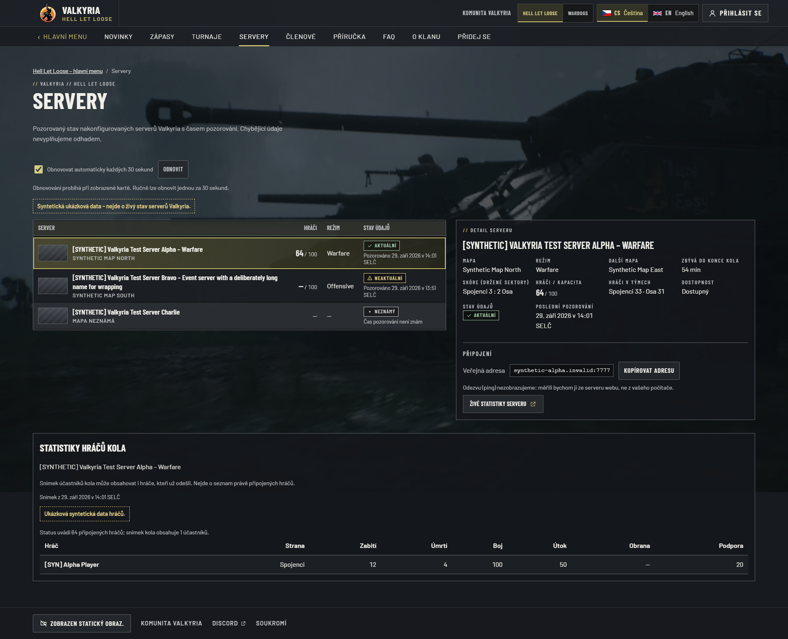
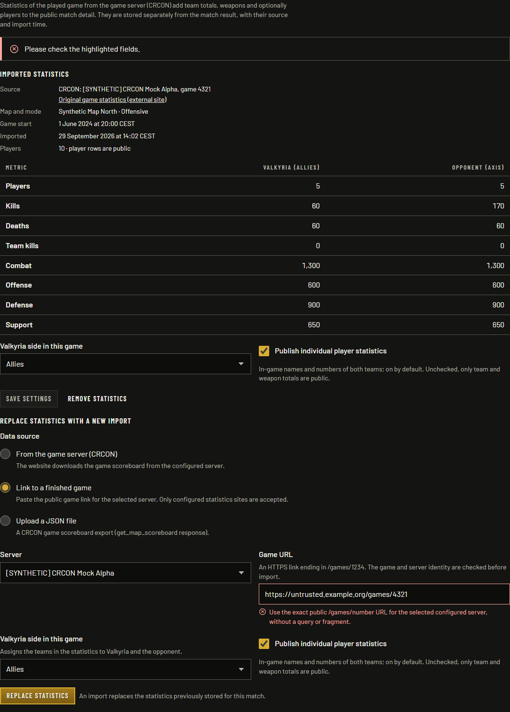
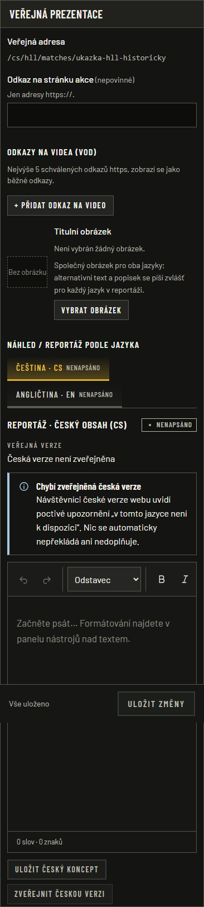

# HLL legacy and CRCON browser verification

Real application rendering against disposable synthetic fixtures and loopback
Discord/CRCON services. This is local feature proof, not evidence of a production
import, live clan statistics, domain cutover or Discord authorization in production.

## Tested source and environment

- Windows, Node 24, pnpm 10.34.5, Playwright 1.63.0, Chromium 153.0.8010.12.
- Standalone production build and disposable PostgreSQL. Czech and English UI,
  desktop viewport 1920×1200 and mobile viewport 390×844. Reduced motion uses the
  actual shipped HLL poster. Game reference screenshots are not feature proof.
- Nine server/import screenshots: source
  `69f341428aaf71696954cd657af048335eaaa2d1`, build `_mtTDOXtMEVb6HKl8x49O`.
- Two final mobile editor screenshots: application source
  `26ff8d9c60a4d8a3d214c4b290d16eee98e615dc`, build `YAPTliqY9l734s8lKFImM`.
  Two test-only working changes corrected a fixture-helper assumption; application
  sources match that revision. The only subsequent application change relative to
  the nine earlier captures is the editor's game-scoped public-address label.
- [Screenshot catalog](screenshots.json) records exact capture times, source SHA,
  route, viewport, dimensions, size, hash and inspection for every image. The eleven
  unchanged PNGs total 2,597,249 bytes and are registered in the
  [asset manifest](../../../assets/manifest.json) as verification-only evidence.

## Results and failure history

| Check | Observed result |
|---|---|
| Initial full default browser suite with opt-in capture | **164 passed, 106 skipped, 1 failed**. The failure was the new mobile editor overflow assertion during capture; this run was not fully green. |
| Focused mobile regression before CSS fix | **2 failed**, CS and EN at 390px: document width was 873px. |
| Production build at `69f3414` | Passed, including bundled CLIs and migration packaging. |
| Affected administration at `69f3414` | **21 passed**: match lifecycle, HLL CRCON import, rich-text editing/publication, CS/EN mobile regression and seven admin accessibility screens. |
| Public HLL subset at `69f3414` | **25 passed**: game navigation, manual, fullscreen media policy and three live-player snapshot/polling/privacy journeys. |
| Initial complete screenshot capture at `69f3414` | **1 passed**, eleven images inspected; nine unchanged images retained below. |
| Final production build at `26ff8d9` | Passed after correcting the two test-only fixture-helper references. |
| Final mobile editor regression | **2 passed**: scoped public path, no page overflow, toolbar's own horizontal scrolling/focus and translation switching in both locales. |
| Final affected screenshot capture | **1 passed**, two mobile editor crops replaced and inspected. |

The fix bounds the form, stack and tab grid tracks using `minmax(0, 1fr)`. It
preserves the toolbar's own horizontal scroll area; it does not hide overflow from
the page. The later public-address label uses the existing game route helper.
The before-fix numeric geometry and failing assertions are retained in the local
test record; no misleading before screenshot is presented as a final result.

An intermediate rebuild first encountered a Windows file lock from a separate
local rehearsal server; the server was stopped before rebuilding. A later build
caught the test helper's missing `slug` property and the tests were corrected to
use the known synthetic fixture slug. The preliminary public-path red assertion
therefore is not counted as valid red-test evidence. Test navigation also emitted
intermittent Next.js stream-closed messages without associated assertion failures.
All owned browser/mock listeners were absent after the final run.

The entire default browser suite was not repeated after the bounded CSS and
public-address changes. The initial full-run result and the final affected
subsets remain distinct. CI and production verification belong to their own
exact-revision records.

## Reproduction

Provide disposable `DATABASE_URL` and `E2E_DATABASE_URL` values; the latter must
end in `_e2e`. Never point this fixture runner at production. Install from the
frozen lockfile and run from the repository root:

```sh
pnpm build
pnpm --filter @valkyria/web exec playwright test e2e/admin-match-mobile.spec.ts e2e/admin-hll-matches.spec.ts e2e/admin-community-matches.spec.ts e2e/admin-editorial-posts.spec.ts e2e/admin-community-a11y.spec.ts --project chromium-admin --no-deps
pnpm --filter @valkyria/web exec playwright test e2e/server-live-players.spec.ts e2e/platform.spec.ts e2e/hll-stage.spec.ts --project chromium --no-deps
CAPTURE_LEGACY_EVIDENCE=1 EVIDENCE_SOURCE_REVISION=<tested-sha> pnpm --filter @valkyria/web exec playwright test e2e/visual-admin-legacy.spec.ts --project chromium-admin-capture --no-deps
```

For only the final editor crops, also set `CAPTURE_LEGACY_EDITOR_ONLY=1`.
Each invocation starts the fixture-backed standalone server and cleans it up.
The screenshot runner rejects document overflow and requires successful import,
untrusted-host rejection and expected source links before recording proof.

## Reviewed screenshots

All player names, counts, matches, administrator identities and URLs in these
captures are synthetic. `stats.example.org` is a configured test identity backed
by the loopback CRCON adapter. No external game import occurred. No image was
redacted, composited, restyled or substituted. Admin crops are actual element
screenshots; the mobile editor crop retains the real sticky save bar over the
blank canvas. Full-page public captures include the horizontally scrollable player
table rather than shrinking its columns beyond readability.

| Scenario / expected and observed result | Locale / viewport | Image |
|---|---|---|
| Selected server and round participants show source time, distinct connected/round counts and a missing defense value as a dash | CS / 1920×1200 | [Desktop server](server-round-players-cs-1920x1200.png) |
| Same selected server reflows without horizontal page overflow | CS / 390×844 | [Mobile server](server-round-players-cs-390x844.png) |
| Localized server detail and round-participant snapshot | EN / 1920×1200 | [Desktop server](server-round-players-en-1920x1200.png) |
| English server detail reflows and retains refresh controls | EN / 390×844 | [Mobile server](server-round-players-en-390x844.png) |
| Successful configured game-URL import displays provenance and team totals | CS / 1920×1200 | [Desktop import](crcon-game-url-import-cs-1920x1200.png) |
| Import fields, settings and totals fit the mobile panel | CS / 390×844 | [Mobile import](crcon-game-url-import-cs-390x844.png) |
| Unconfigured host is rejected while the existing statistics snapshot remains visible | EN / 1920×1200 | [Rejected host](crcon-untrusted-url-en-1920x1200.png) |
| Configured game-URL import succeeds with English feedback and provenance | EN / 1920×1200 | [Desktop import](crcon-game-url-import-en-1920x1200.png) |
| English import form and team totals fit the mobile panel | EN / 390×844 | [Mobile import](crcon-game-url-import-en-390x844.png) |
| Editor public path contains `/cs/hll/matches/`; toolbar stays inside the form | CS / 390×844 | [Fixed editor](match-editor-mobile-cs-390x844.png) |
| Editor public path contains `/en/hll/matches/`; localized prose tabs fit | EN / 390×844 | [Fixed editor](match-editor-mobile-en-390x844.png) |

### Selected visual proof

Source `69f3414`, Czech desktop, 1920×1200 viewport: the selected server shows
fresh round-participant data with an explicit synthetic-data label and source time.



Source `69f3414`, English desktop, 1920×1200 viewport: an unconfigured URL produces
a localized validation error and leaves the previously imported snapshot visible.



Source `26ff8d9`, Czech mobile, 390×844 viewport: the actual editor group now fits,
shows the correct HLL public path and preserves its scrollable formatting toolbar.


