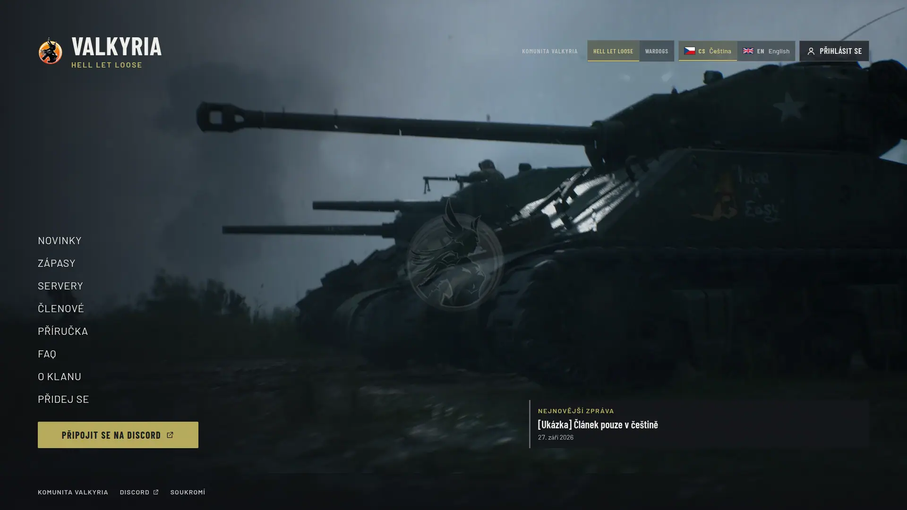
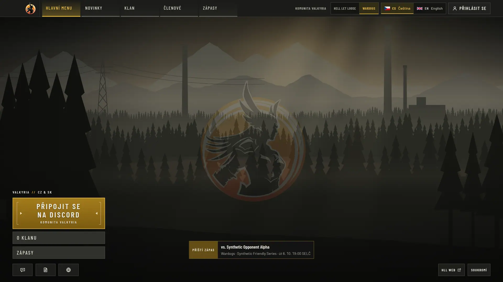
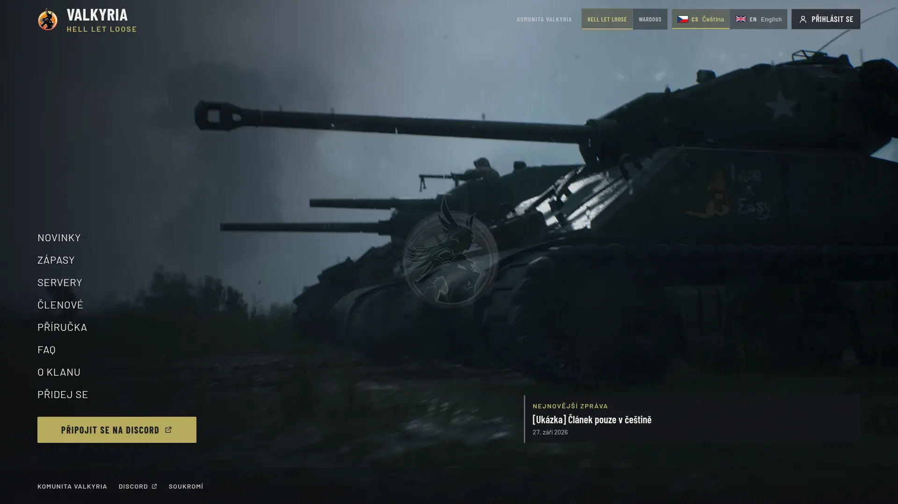
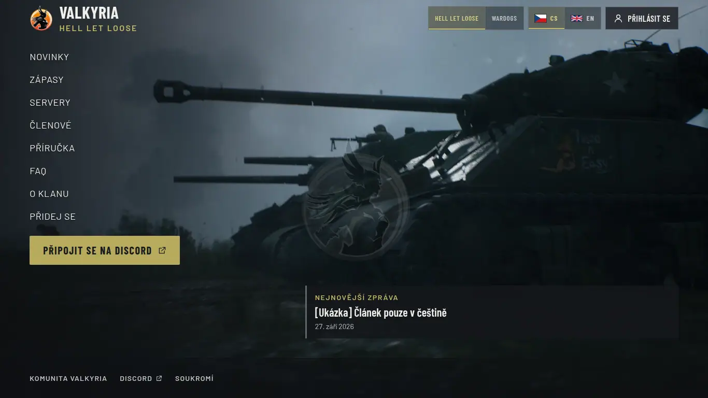
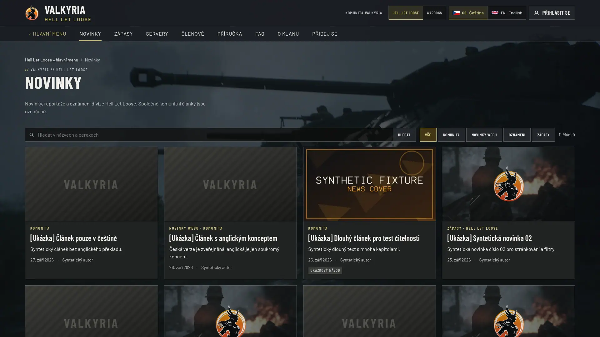
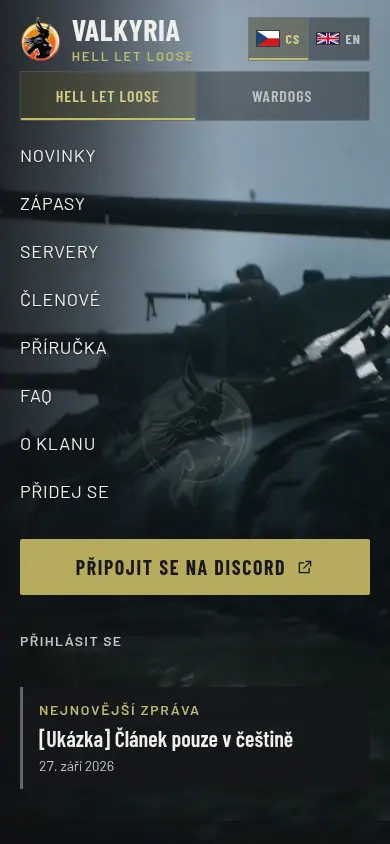
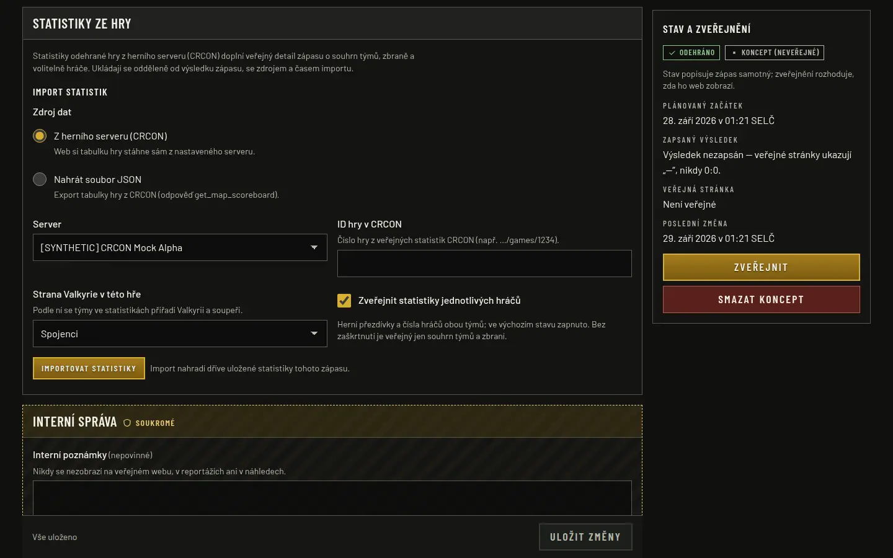

# HLL masthead position and default player statistics (2026-09-28)

Owner requests after PR #50: logo, sign-in, game and language switches at the same places
on both game sections, including the HLL main menu; player statistics public automatically.
Issue [#36](https://github.com/ValkyriaWDG/www/issues/36) stays open. Nothing was deployed.

## Context

- **Revisions:** `8ce1a69` (masthead), `46d22ff` (statistics default) on main `0794a71`.
- **Environment:** Claude Code cloud container, Node.js 24.21.0, PostgreSQL 16.13, Next.js
  16.3.6 standalone build, Playwright 1.63.0 / Chromium 141, synthetic fixtures, local
  Discord and CRCON mocks, empty HLL clip playlist (the shipped still), reduced motion.

## Changes

- The HLL main menu uses the same compact masthead row as the HLL content pages (48 px
  crest, content-size name); the reference's y=80–180 identity band is dropped by owner
  decision (`docs/design/hll/visual-spec.md`). Top padding follows the Wardogs strip.
- The statistics import form starts with "publish individual player statistics" checked;
  saving the settings carries the editor's choice to a replacement import.

## Checks (`46d22ff`)

| Check | Result |
|---|---|
| Foundation / tooling | Passed (1232 files) |
| Lint, types | Passed |
| Unit | 493 passed (50 files) |
| Integration (PostgreSQL 16) | 283 passed (30 files) |
| Browser | 156 passed, 0 failed; 106 opt-in capture cases skipped |

`platform.spec.ts` now also measures the two main menus: at 1920 and 1366 the game switch
row centre on `/cs/wardogs`, `/cs/hll`, both news pages and the hub differs by less than
12 px. Before the change it failed with `{"/cs/wardogs":32,"/cs/hll":96,…}` (64 px).
`admin-hll-matches.spec.ts` imports without touching the checkbox, expects 12 public
player rows, hides them explicitly and checks that the replacement CRCON import keeps
them hidden.

## Captures

### Masthead

- [`masthead/masthead-before-hll-landing-cs-1920x1080.webp`](masthead/masthead-before-hll-landing-cs-1920x1080.webp) — Before (main `0794a71` UI, captured at `c8fc2d7`): the HLL main menu kept the in-game identity band, so logo, game switch, language and sign-in sat about 64 px lower than on Wardogs. _(/cs/hll · 1920x1080 · cs)_

  
- [`masthead/masthead-wardogs-landing-cs-1920x1080.webp`](masthead/masthead-wardogs-landing-cs-1920x1080.webp) — Wardogs main menu for reference: controls at the top right, row centre at 32 px. _(/cs/wardogs · 1920x1080 · cs)_

  
- [`masthead/masthead-after-hll-landing-cs-1920x1080.webp`](masthead/masthead-after-hll-landing-cs-1920x1080.webp) — After: the HLL main menu uses the same compact top row as its content pages; the controls sit at the Wardogs position (game switch top 18 px vs 9 px); the menu lane and fullscreen scene are unchanged. _(/cs/hll · 1920x1080 · cs)_

  
- [`masthead/masthead-after-hll-landing-cs-1366x768.webp`](masthead/masthead-after-hll-landing-cs-1366x768.webp) — After at 1366 × 768: same row height as Wardogs (game switch top 12 px vs 9 px); the menu starts directly below. _(/cs/hll · 1366x768 · cs)_

  
- [`masthead/masthead-after-hll-news-cs-1920x1080.webp`](masthead/masthead-after-hll-news-cs-1920x1080.webp) — After on an HLL content page: identical masthead to the main menu, with the section bar below. _(/cs/hll/news · 1920x1080 · cs)_

  
- [`masthead/masthead-after-hll-landing-cs-390x844.webp`](masthead/masthead-after-hll-landing-cs-390x844.webp) — After on a phone: logo and language at the top, full-width game switch row under the header; no horizontal overflow. _(/cs/hll · 390x844 · cs)_

  

### Statistics import

- [`statistics/admin-hll-statistics-import-default-cs-1440x900.webp`](statistics/admin-hll-statistics-import-default-cs-1440x900.webp) — Statistics panel of a synthetic completed HLL match without statistics: "Zveřejnit statistiky jednotlivých hráčů" is checked by default and its hint says so; unchecking keeps only team and weapon totals public. _(/cs/admin/matches/<id> · 1440x900 · cs · match_manager)_

  

## Limitations

Captures use synthetic data and the static HLL still; no clan footage, real CRCON server or
production data. The masthead row is within 12 px of Wardogs, not pixel-identical: the HLL
identity keeps its name and division label.
