# HLL legacy parity: servers, matches and game statistics (2026-09-28)

Evidence for the follow-up to merged PR [#37](https://github.com/ValkyriaWDG/www/pull/37)
(branch `feat/hll-platform-handoff`, rebased on `40da3df`) and issue
[#36](https://github.com/ValkyriaWDG/www/issues/36). Nothing here was deployed; no real
CRCON server, Logi tenant, DNS or production database was used.

## Context

- **Revisions:** `6604626` (CRCON server status), `757bced` (HLL rounds), `1c12a5d`
  (statistics import), `44c8490` (admin captures, table header alignment), `65b47be`
  (browser import from the CRCON mock by game ID). All checks and captures below ran on
  `65b47be`, except where noted.
- **Environment:** Claude Code cloud container, Node.js 24.21.0, PostgreSQL 16.13,
  Next.js 16.3.6 standalone build, Playwright 1.63.0 / Chromium 141.
- **Sources:** CRCON behaviour follows the public
  [hll_rcon_tool source](https://github.com/MarechJ/hll_rcon_tool) (`rconweb/api/views.py`
  `get_public_info`, `rconweb/api/scoreboards.py` `get_map_scoreboard`, `rcon/models.py`
  player statistics). All responses used here are synthetic: `crcon-fixtures.ts`,
  `statistics-fixtures.ts` and the loopback mock `e2e/support/crcon-mock.mjs`
  (`get_public_info` and `get_map_scoreboard`).

## Legacy parity

Legacy features from the [inventory](../../product/hll/legacy-migration.md):

| Legacy valkyriahll.cz | Now | Proof |
|---|---|---|
| Server cards: name, current/next map, mode, players, remaining time, connection, live-score link | `SERVER_STATUS_SOURCE=crcon` reads `get_public_info` for configured servers; per-server outage; freshness | `crcon.test.ts`, `provider.test.ts`, `platform.spec.ts`; servers captures |
| Match list/detail: date, competition, teams, map, format, side, score | Shared match module; HLL rounds with official maps, modes, Allies/Axis side, 0–5 sectors | `matches-lifecycle.test.ts`, `admin-hll-matches.spec.ts`; admin rounds capture |
| Match creation/editing and results | Admin editor for HLL matches (game scope enforced) | `admin-hll-matches.spec.ts` |
| Completed match Summary / Players / Weapons | CRCON scoreboard import (the web downloads it from a configured server by game ID, or an uploaded JSON); public tabs; player rows opt-in | `statistics.test.ts`, `match-statistics.test.ts`, `admin-hll-matches.spec.ts` (both paths in the browser); statistics captures |
| Tactical map, videos | Videos: existing VOD links. Tactical map: **not implemented** (CRCON stores no map positions) | — |
| Rankings (`/zebricky/*`), per-server `/stats/*` | **Not implemented**: needs an aggregate statistics source; a configured `statsUrl` links to live stats | — |
| Events | **Not implemented**: owner of events is Logi (contract 0.3); tenant access pending | — |
| FAQ (`/faq`, eleven questions) | Shared core page `faq` at `/cs/hll/faq` (and `/cs/faq`): per-language drafts, preview and publication in the page editor, question index linking to answers; seeded only as an unpublished outline of the legacy question topics (answers not confirmed policy); legacy `/faq` redirect active | `seed-production.test.ts`, `platform.spec.ts`, `admin-faq.spec.ts`; FAQ captures |
| Tournaments | **Not implemented** | — |
| Legacy match history (26 pages) and match-ID aliases | **Not imported**: the legacy host is blocked here and no authorized export exists | — |

## Checks

| Check | Revision | Result |
|---|---|---|
| Lint, types | `65b47be` | Passed |
| Unit | `f5e56bc` (same application code) | 466 passed (48 files) |
| Integration (PostgreSQL 16) | `f5e56bc` (same application code) | 277 passed (29 files), incl. migration 0002 and `match-statistics.test.ts` |
| Standalone build | `f5e56bc` | Passed |
| Browser | `65b47be` | 144 passed; 101 opt-in capture cases skipped |
| Foundation / tooling | `f5e56bc` | Passed (1127 files) / 126 passed |

`65b47be` changes only browser-test support (`e2e/`) on top of `f5e56bc`.

### Review fixes (`722379e`, `59b3e38`)

- Statistics import, settings and removal lock the match row inside their transaction,
  reread its game and recheck `matches.edit`/HLL before writing; the CRCON fetch stays
  outside the lock; a denial is audited outside the rollback.
  `match-statistics-race.test.ts` holds the match and statistics rows, moves the match to
  Wardogs and expects a denial, one durable denial audit and unchanged statistics
  (upload import, CRCON import, settings, removal): 4 failed on `5530a8b`, 4 passed after.
- A server whose request failed is at most stale and shows no round details, even within
  the fresh window (partial and full-source failure): 2 new `provider.test.ts` cases
  failed on `5530a8b`, passed after.
- Checks on `59b3e38`: foundation (1129 files), lint, types, 468 unit (48 files), 281
  integration (30 files), standalone build, 144 browser passed (101 opt-in skipped).

### FAQ (`046176e`)

Migration `0003_faq_page.sql` only widens `content_document_page_key_ck` to allow `faq`.
Checks on `046176e`: lint, types, 468 unit (48 files), 282 integration (30 files, incl. the
draft-only FAQ seed), standalone build, 148 browser passed (102 opt-in skipped),
foundation. The opt-in Wardogs capture `visual.spec.ts` "keyboard focus on the primary
CTA" fails on a fresh e2e database because no Discord invite is configured there; it is
not part of the default suite and is unrelated to the FAQ.

### Integration with PR #55 (`c8fc2d7`)

PR [#55](https://github.com/ValkyriaWDG/www/pull/55) (fullscreen HLL scene, editorial
artwork, sharing cards) and main `048c179` (production records) are merged into this branch;
its own evidence is [hll-graphics-2026-09-28](../hll-graphics-2026-09-28/README.md). This
branch's earlier full-bleed attempt was dropped in favour of #55. Conflicts: the e2e server
environment (CRCON mock beside #55's `E2E_HLL_EMPTY_MEDIA` switch), the asset manifest and
`docs/STATUS.md`. #55's corrected HLL news placeholder test replaces this branch's version.
Checks on the merge (application source identical to `a7853d9`): foundation (1228 files),
126 tooling, lint, types, 493 unit (50 files), 283 integration (30 files), standalone
build, 156 browser passed (106 opt-in skipped), the CI artwork step
(`E2E_HLL_EMPTY_MEDIA=1 … e2e/hll-artwork.spec.ts`, 4 passed) and all 15 cold-mobile
page-budget samples (`scripts/release/measure-pages.mjs`).

Behaviour covered: CRCON config accepts HTTPS (loopback HTTP only for a mock), rejects
credentials/queries/duplicates; real-HTTP requests without redirects, with body limits and
timeouts; current and older response shapes; one failing server marked unknown with a
partial notice while others stay live; HLL round sides/scores enforced on update and
result; scoreboards stored without Steam/platform IDs or encounters; player rows hidden
until published; imports/settings/removal authorized per game and audited; editors without
match rights denied.

## Captures

### Servers (CRCON)

- **`servers/hll-servers-crcon-cs-1920x1200.webp`** — `/cs/hll/servers` with
  `SERVER_STATUS_SOURCE=crcon` against the local synthetic CRCON mock: live map, mode,
  players, next map, time left, sector score, players per team, join address and
  live-statistics link; the third configured server does not answer and is shown as
  unknown with a partial-outage notice, not as offline or empty.

  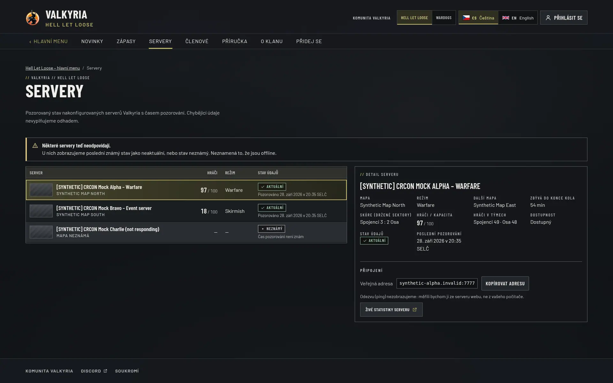
- **`servers/hll-servers-crcon-en-390x844.webp`** — The same server detail in English on a
  390×844 phone (full page).

  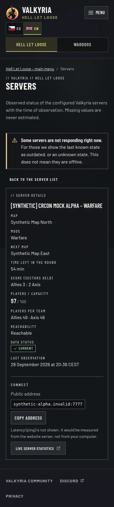

### Matches and statistics (public)

- **`matches/hll-match-statistics-cs-1440x900.webp`** — HLL match detail (full page):
  rounds with map, Warfare mode and Spojenci side, then the imported statistics (source,
  game ID, import time) with the Souhrn tab: team totals and kills by weapon type.
  Synthetic scoreboard and player names.

  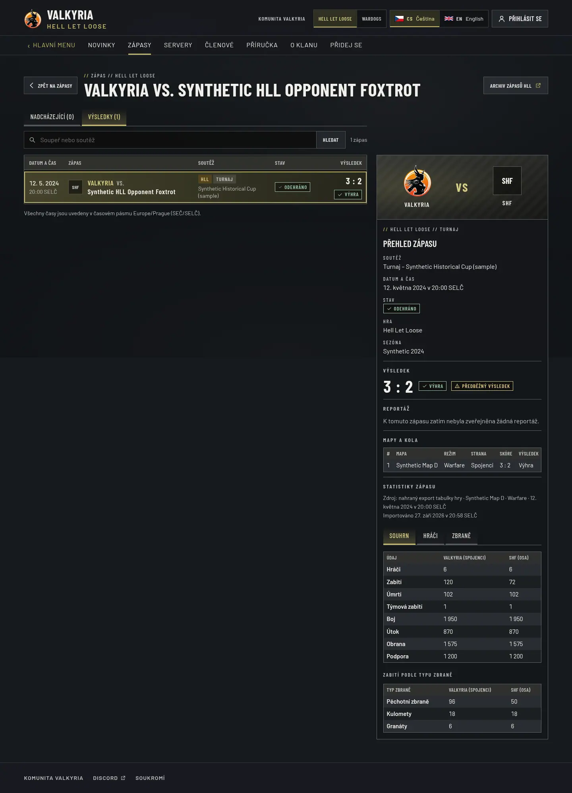
- **`matches/hll-match-statistics-players-en-390x844.webp`** — English on a 390×844 phone,
  Players tab: published synthetic player rows in a horizontally scrollable table
  (visible only because an editor published them).

  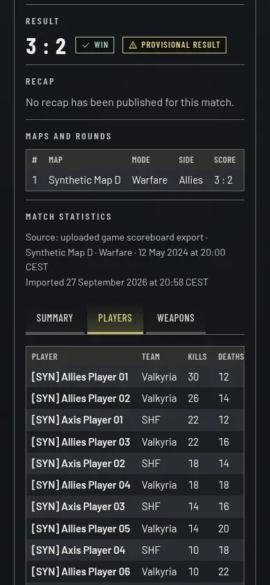

### FAQ (`046176e`)

- **`faq/hll-faq-cs-1440x900.webp`** — `/cs/hll/faq` (full page) after an editor published
  the Czech version in the e2e run: FAQ in the HLL section bar, question index in the
  editor's order, answers. The first answer is a synthetic test answer; the others still
  show the seeded "answer in preparation" placeholder.

  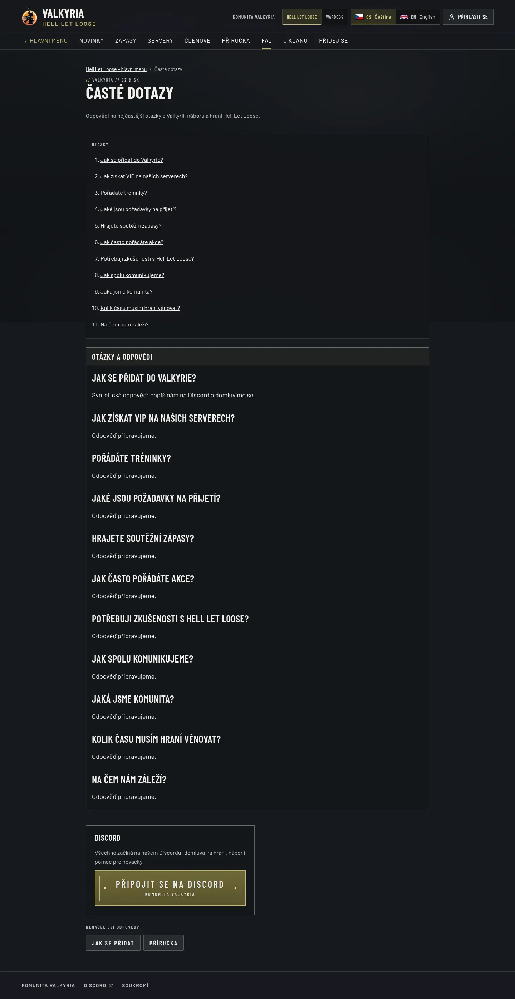
- **`faq/hll-faq-anchor-cs-390x844.webp`** — The same FAQ on a 390×844 phone after following
  the "Jak získat VIP na našich serverech?" index link.

  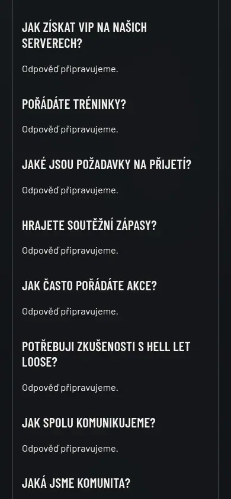
- **`faq/hll-faq-unpublished-en-1366x768.webp`** — `/en/hll/faq` at the same time: English
  is published separately and still a draft, so the page shows the unpublished state.

  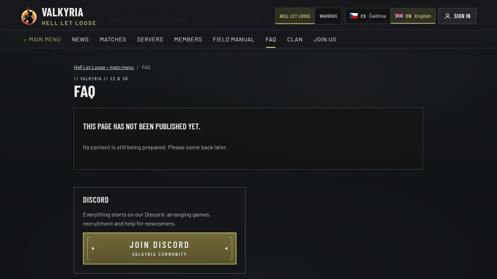

### Header positions (`9bbb49b`)

Owner request: logo, sign-in, game and language switches at the same places in both
games. The separate platform bar is gone; Wardogs and the hub carry the game switch beside
the language control like HLL. `platform.spec.ts` pins the positions at 1920 and 1366 and
the switch row on phones.

- **`header/header-before-wardogs-cs-1366.webp`** — before (`a331c69`): the game switch in a
  separate bar above the Wardogs strip.

  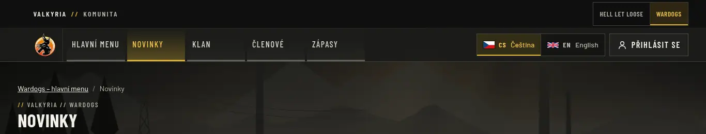
- **`header/header-after-wardogs-cs-1366.webp`** — after: logo left; game switch, language
  and sign-in together at the top right.

  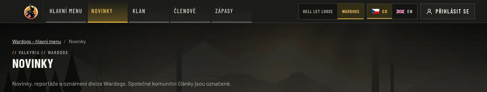
- **`header/header-after-hll-cs-1366.webp`** — HLL at the same width for comparison.

  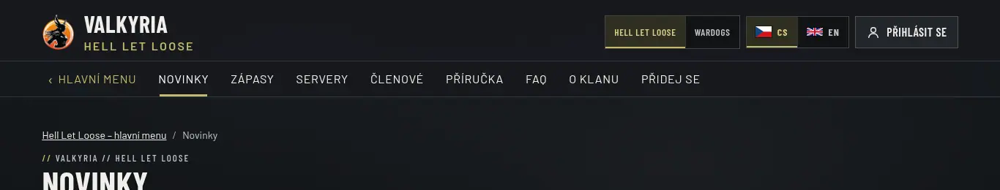
- **`header/header-before-wardogs-cs-390.webp`**, **`header/header-after-wardogs-cs-390.webp`**,
  **`header/header-after-hll-cs-390.webp`** — phones: before, the switch sat above the logo;
  after, it is the full-width row under the header in both games.

  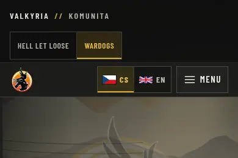 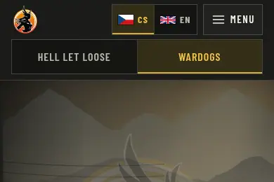 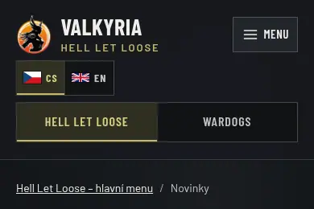

### Fullscreen scene with the unified header (`c8fc2d7`)

Standalone build of the merge with an empty clip playlist (the shipped HLL still, no video
request), synthetic fixtures and the synthetic server-status fixture. Reduced motion.

- **`integration/hll-landing-cs-1920x1080.webp`** — HLL main menu: the scene fills the whole
  viewport behind the menu; logo top left; community link, game switch, language and sign-in
  top right.

  
- **`integration/wardogs-landing-cs-1920x1080.webp`** — Wardogs main menu at the same size:
  the same controls in the same left-to-right order at the top right.

  
- **`integration/hll-servers-cs-1440x900.webp`** — HLL servers (synthetic, mixed freshness)
  as a reading page over the dimmed scene; masthead and section bar on top.

  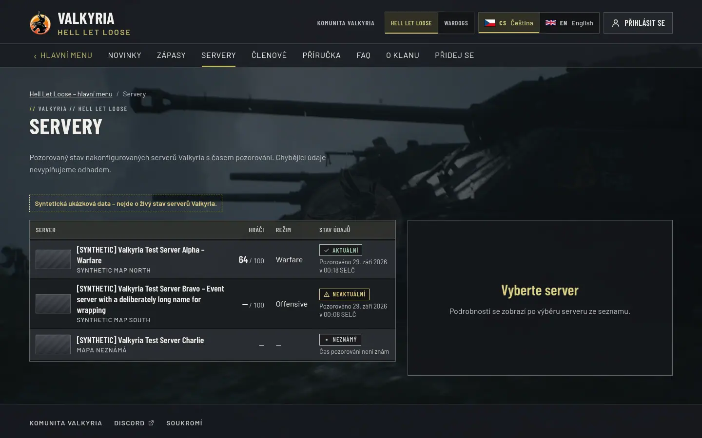
- **`integration/hll-landing-cs-390x844.webp`** — phone: scene behind the menu, full-width
  game switch row under the header, no horizontal overflow.

  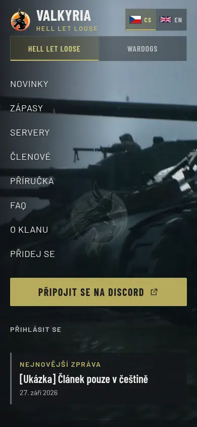

### Administration

- **`admin/admin-hll-match-rounds-cs-1440x1200.webp`** — HLL round in the match editor:
  official map list, Warfare/Offensive/Skirmish, Allies/Axis side, 0–5 sector scores.

  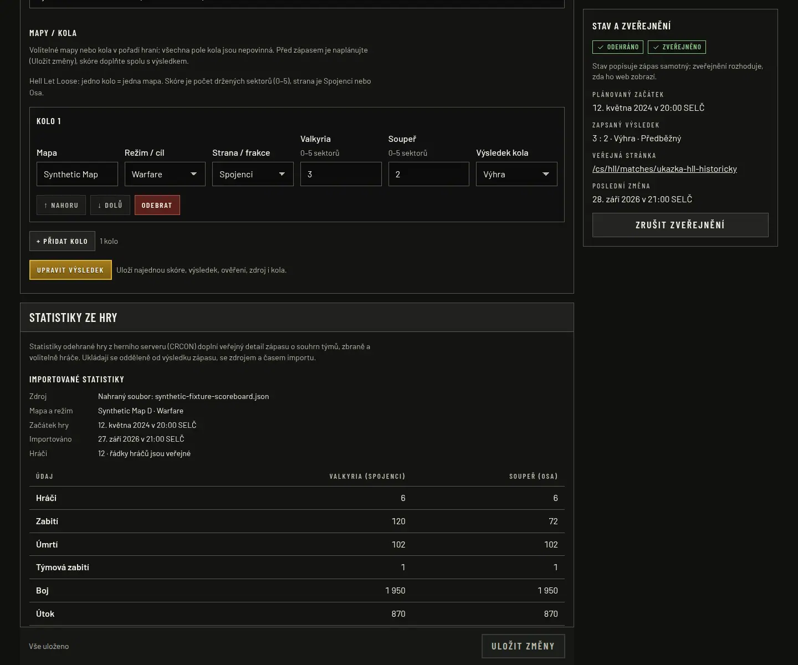
- **`admin/admin-hll-match-statistics-cs-1440x1200.webp`** — Game statistics panel:
  imported synthetic scoreboard (source, game time, import time, 12 players), team totals
  for Valkyria (Spojenci) and the opponent (Osa), side and player-publication settings, and
  the start of the replacement import form.

  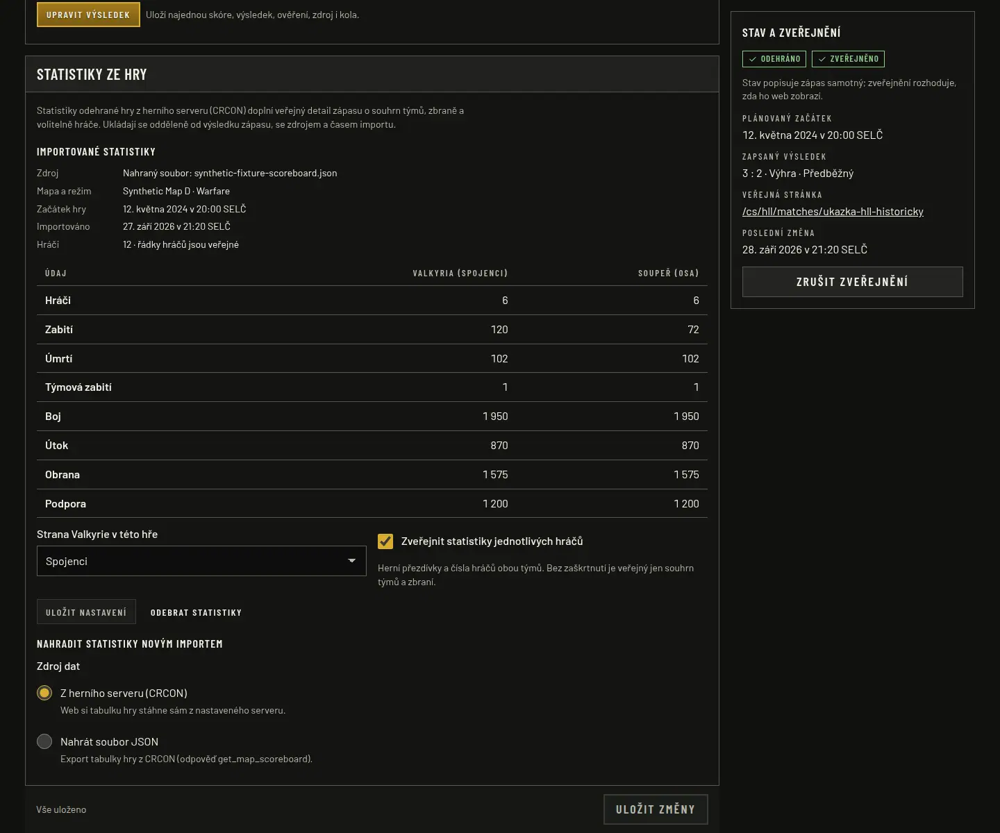
- **`admin/admin-hll-match-statistics-import-cs-1440x1200.webp`** — Replacement import:
  the configured synthetic CRCON server selected and game ID 1234 entered, with side and
  publication choice. Submitting downloads `get_map_scoreboard` from that server; the
  browser suite does this against the loopback mock (not submitted in this capture).

  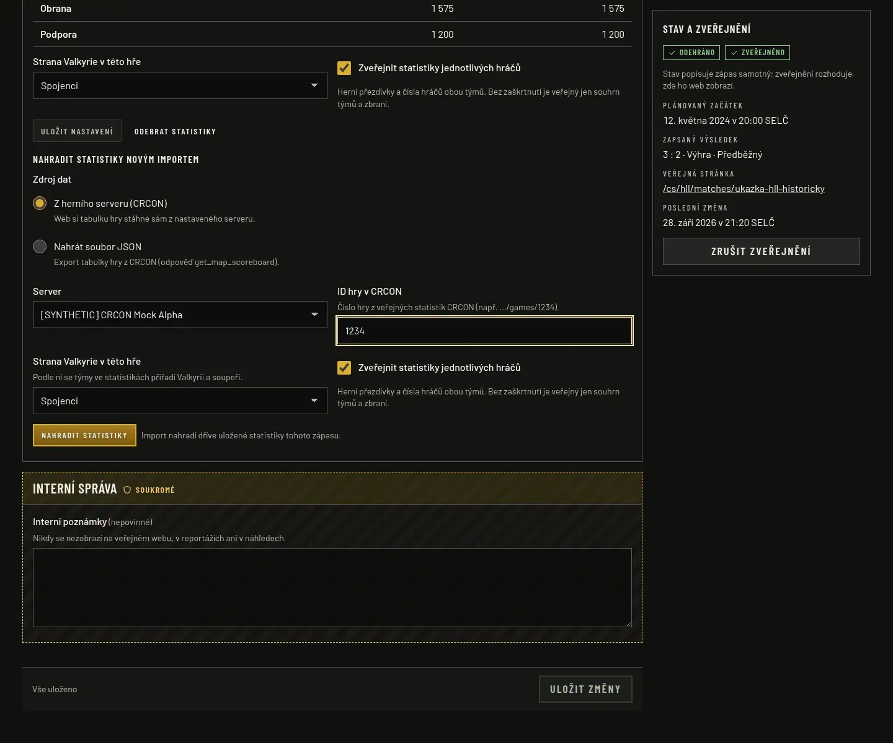

## Limitations

- No real CRCON server was queried. Real hosts, the optional statistics API key and
  acceptance against Valkyria's servers are deployment inputs (`HLL_SERVER_SOURCES_JSON`).
- Team attribution uses CRCON's per-player `team` detection; players it cannot attribute
  appear as unknown and are left out of team totals.
- The public match page is rendered per request; server status is cached for 15 seconds
  per server and is not pushed live to an open page.
