# Unified platform / HLL implementation evidence (2026-09-28)

Evidence for draft PR [#37](https://github.com/ValkyriaWDG/www/pull/37) and issue
[#36](https://github.com/ValkyriaWDG/www/issues/36). Nothing here was deployed; no DNS,
OAuth, Discord or production database was touched.

## Context

- **Application revision:** `ad0ea20b2aebf10e2bd1d4d93ba39670eb78e691` (branch
  `feat/hll-platform-handoff`, including the merge of `main` at `425fb5f`). Checks and
  captures below ran on this source; the capture harness and this record are committed
  on top without application changes.
- **Environment:** Claude Code cloud container, Ubuntu 24.04.4, Node.js 24.21.0,
  pnpm 10.34.5, PostgreSQL 16.13, Next.js 16.3.6 standalone production build,
  Playwright 1.63.0 with Chromium 141.0.7390.37 (`PLAYWRIGHT_CHROMIUM_EXECUTABLE`).
- **Data:** disposable databases with the production seed plus synthetic fixtures
  (`[Ukázka]`/`[Sample]`, `[SYNTHETIC]` servers, synthetic members/opponents) and a
  local Discord REST mock. The HLL stage uses a browser-generated test pattern and poster
  labelled `SYNTHETIC TEST CLIP` / `SYNTHETIC TEST POSTER` — not clan footage.

## Checks

| Check | Command | Result |
|---|---|---|
| Foundation | `node scripts/check-foundation.mjs` / `node --test scripts/tests/*.test.mjs` | Passed / 39 passed |
| Lint, types | `pnpm lint`, `pnpm typecheck` | Passed |
| Unit | `pnpm --filter @valkyria/web exec vitest run --project unit` | 439 passed (46 files) |
| Integration (PostgreSQL) | `… vitest run --project integration` | 261 passed (26 files) |
| Build | `pnpm build` (Next standalone + bundled CLIs) | Passed |
| Browser | `pnpm --filter @valkyria/web exec playwright test` | 136 passed, 0 failed; 98 opt-in capture cases skipped |
| Captures | `CAPTURE_EVIDENCE=1 … playwright test --project=chromium e2e/visual-hll.spec.ts` and `--project=chromium-admin-capture --no-deps e2e/visual-admin-hll.spec.ts` | 25 + 6 passed |
| Migration | `0001_unified_platform_scope.sql` applied over 0000 data, then re-run | Upgrade and no-op re-run verified at `a54ca21`; file unchanged since |

After merging main `df48609` (operations scripts, CI and documentation only; no
application source), `node scripts/check-foundation.mjs` and all 53 tooling tests passed
again; the application checks above apply to the unchanged application source. The
actual-media spec (`e2e/media`) now targets the Wardogs section but was not run here
(delivered media files are absent from this container).

New browser specs: `platform.spec.ts` (hub, game presentation/sections, 404s, game and
language switch, keyboard, 320 px reflow, servers, field manual), `hll-stage.spec.ts`
(one clip per document, no reroll across navigation/locale/history, zero video requests
under reduced motion, Save-Data and the mobile default, explicit pause, one alternate on
failure) and `admin-game-scope.spec.ts` (HLL-scoped Discord role vs platform editor).
Existing Wardogs, news, matches and admin specs pass against the canonical game URLs.

## Acceptance

| Criterion | Steps / expected | Observed | Proof |
|---|---|---|---|
| One site, hub + two game sections | `/cs` hub; `/cs/hll`, `/cs/wardogs` own presentation; unknown game/section 404 | Passed | `platform.spec.ts`; hub, HLL and Wardogs captures |
| Wardogs preserved | Original menu, background policy and pages under `/cs/wardogs` | Passed (existing shell/news/matches specs) | `wardogs-home-cs-1920x1080` |
| Game switch keeps locale/category | HLL news → Wardogs news; section missing → notice | Passed | `game-switch-notice-en-1366x768` |
| HLL stage lifecycle | See spec list above | Passed with synthetic media | `hll-stage.spec.ts`; landing captures |
| Servers honest states | Unselected, selected, stale/unknown rows, source unavailable | Passed (synthetic source) | server captures |
| Field manual | Browse, category, search (diacritics, SL), no results, article TOC/provenance, drafts hidden, translation notice | Passed | `field-manual.test.ts`, `platform.spec.ts`; manual captures |
| Game-scoped authority | HLL editor limited, Wardogs post denied, scoped creation; scheduled publication fenced to the document game | Passed | `game-scope.test.ts`, `authority-fences.test.ts`, `admin-game-scope.spec.ts`; admin captures |
| Legacy URLs | Reviewed map; pending/unknown never redirected to Home; inactive by default | Passed (unit) | `modules/legacy/hll.test.ts`, `lib/legacy-hosts.test.ts` |

## Captures

Each WebP is embedded below and registered in `assets/manifest.json` as verification evidence only.

### public

- **`public/hub-cs-1920x1200.webp`** — Community hub /cs: shared Valkyria identity, full-name game cards for Hell Let Loose and Wardogs, shared community sections and latest post; no game is marked current. _(/cs · 1920x1200 · cs)_

  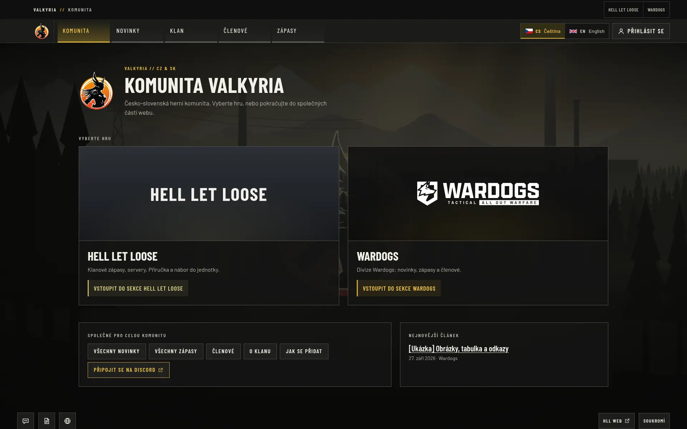
- **`public/hub-en-390x844.webp`** — Community hub /en on a 390×844 phone (full page): game cards stack, flags plus text labels in the language switch, no horizontal overflow. _(/en · 390x844 · en)_

  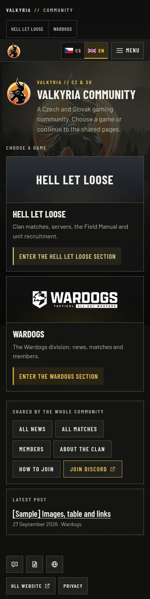
- **`public/hll-landing-cs-1920x1200.webp`** — HLL landing /cs/hll at 1920×1200 (compare reference 02): left menu lane with seven destinations, Discord CTA, utilities, the cinematic stage playing the labelled SYNTHETIC TEST CLIP (not clan footage) and the strip with the latest HLL post (the fixtures have no upcoming HLL match, so no match teaser is shown). _(/cs/hll · 1920x1200 · cs)_

  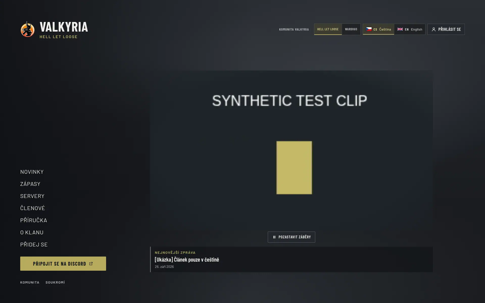
- **`public/hll-landing-en-1920x1200.webp`** — HLL landing /en/hll at 1920×1200 under reduced motion: poster-only stage showing the labelled synthetic poster (no video request), English menu labels and Czech/UK flag language switch with text labels. _(/en/hll · 1920x1200 · en)_

  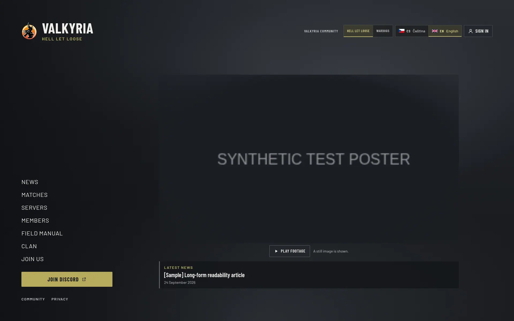
- **`public/hll-landing-cs-1366x768.webp`** — HLL landing /cs/hll at a short 1366×768 viewport: the menu, CTA and utilities reflow without clipping; stage plays the synthetic test clip. _(/cs/hll · 1366x768 · cs)_

  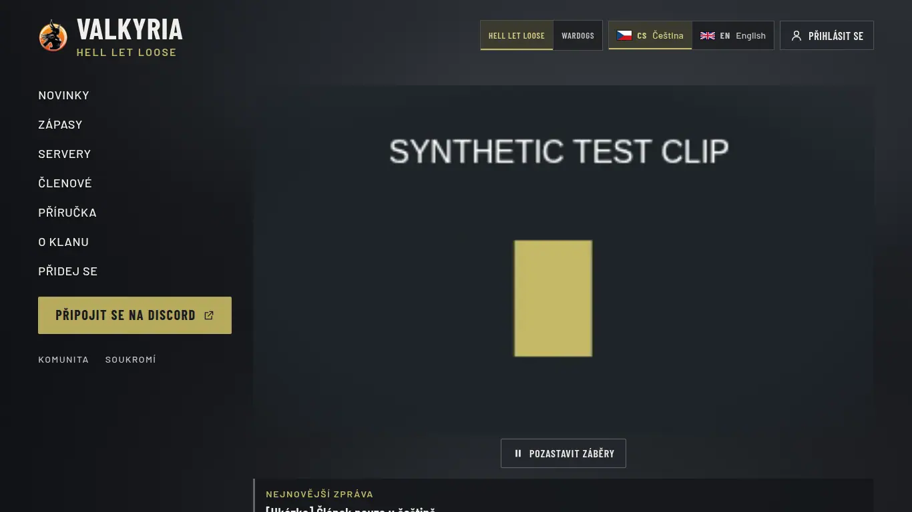
- **`public/hll-landing-cs-390x844.webp`** — HLL landing /cs/hll on a 390×844 phone (full page): poster-first stage after an explicit play press shows the compact synthetic rendition; menu remains visible below. _(/cs/hll · 390x844 · cs)_

  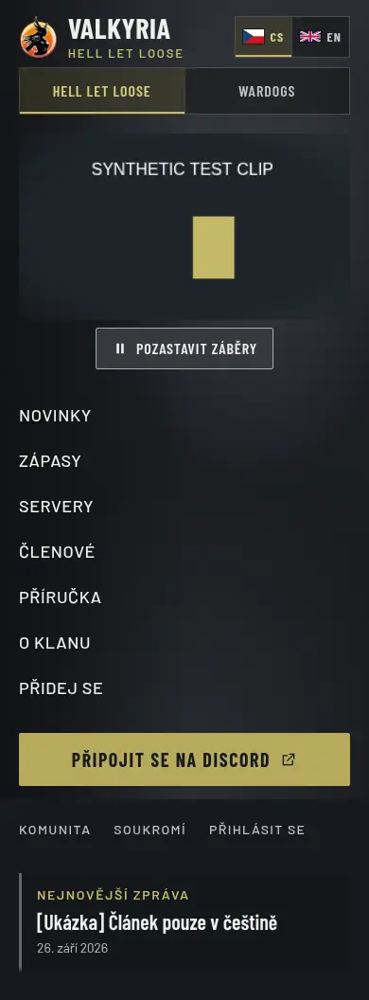
- **`public/hll-landing-cs-320x640.webp`** — HLL landing /cs/hll at 320 CSS px (full page, reduced motion): single-column reflow with no horizontal overflow and 44 px targets. _(/cs/hll · 320x640 · cs)_

  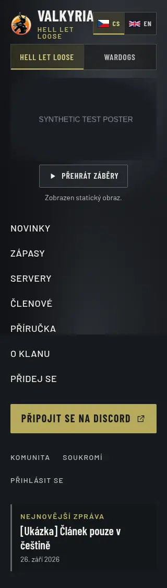
- **`public/hll-landing-focus-cs-1920x1200.webp`** — Keyboard focus on the HLL main menu (/cs/hll, reduced motion): visible focus outline around ZÁPASY; the stage shows the labelled synthetic poster with an explicit play control. _(/cs/hll · 1920x1200 · cs)_

  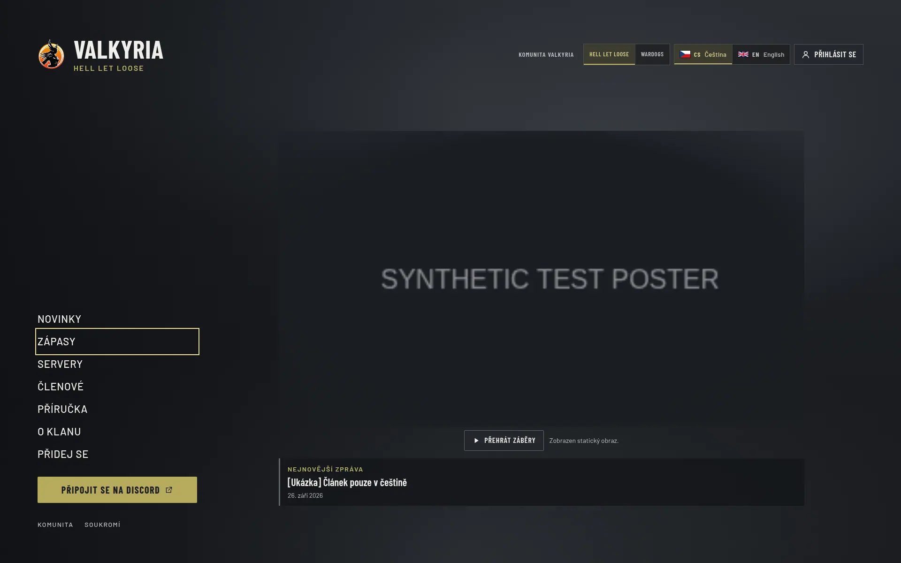
- **`public/hll-mobile-menu-cs-390x844.webp`** — HLL content page /cs/hll/news on a phone with the labelled MENU drawer open: all sections, community link and the one shared sign-in. _(/cs/hll/news · 390x844 · cs)_

  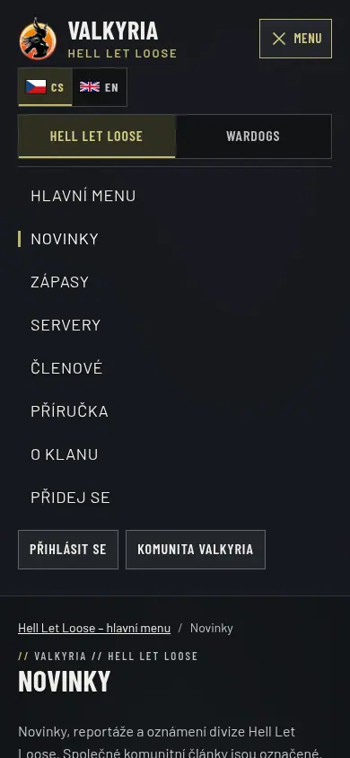
- **`public/game-switch-notice-en-1366x768.webp`** — Game switch from /en/hll/servers to Wardogs (no servers section there): lands on /en/wardogs?switch=section with an explanatory notice; locale kept. _(/en/wardogs?switch=section · 1366x768 · en)_

  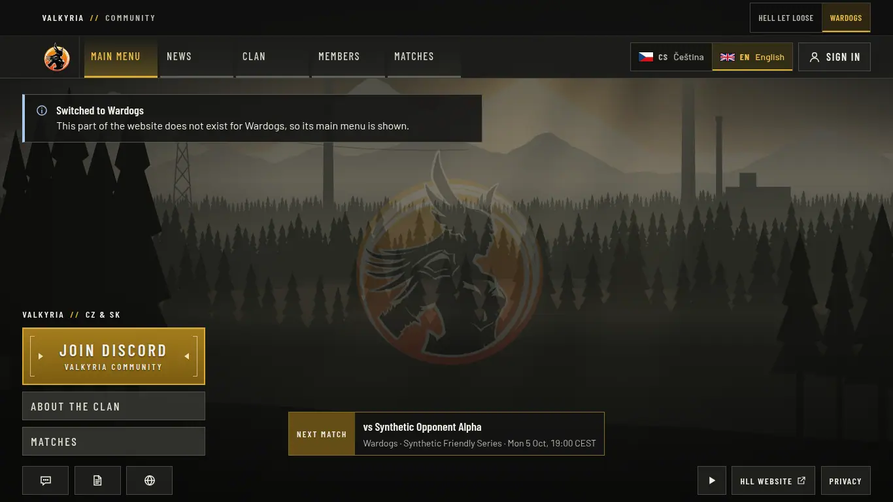
- **`public/wardogs-home-cs-1920x1080.webp`** — Wardogs baseline /cs/wardogs: the original menu composition and background fallback preserved, with the added platform bar (community link + full-name game switch). _(/cs/wardogs · 1920x1080 · cs)_

  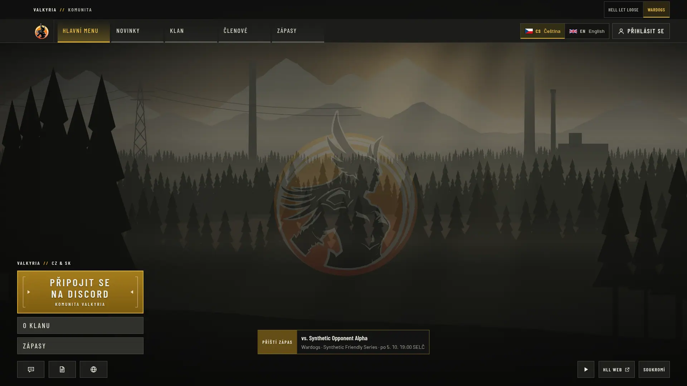
- **`public/hll-news-cs-1920x1200.webp`** — HLL news /cs/hll/news: HLL posts plus explicitly labelled community posts, each linking to its canonical section; HLL theme and section bar with NOVINKY current. _(/cs/hll/news · 1920x1200 · cs)_

  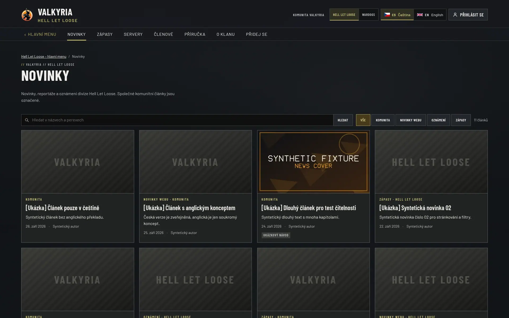
- **`public/hll-matches-results-cs-1920x1200.webp`** — HLL matches /cs/hll/matches?view=results: list/detail browser in the HLL theme with the synthetic historical HLL result (3 : 2). _(/cs/hll/matches?view=results · 1920x1200 · cs)_

  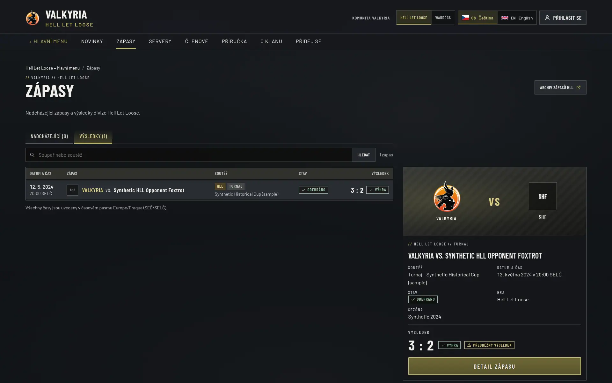
- **`public/hll-members-cs-1366x768.webp`** — HLL members /cs/hll/members: only public profiles affiliated with Hell Let Loose (synthetic names). _(/cs/hll/members · 1366x768 · cs)_

  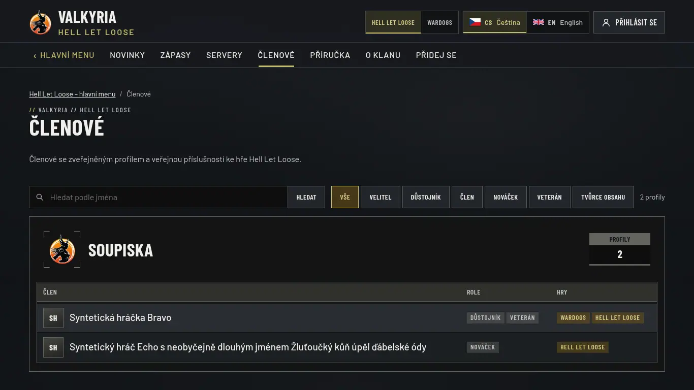
- **`public/hll-servers-unselected-cs-1920x1200.webp`** — Servers /cs/hll/servers without a selection (reference 12): SYNTHETIC label, fresh/stale/unknown observations with times, missing values shown as dashes, honest “select a server” detail area. _(/cs/hll/servers · 1920x1200 · cs)_

  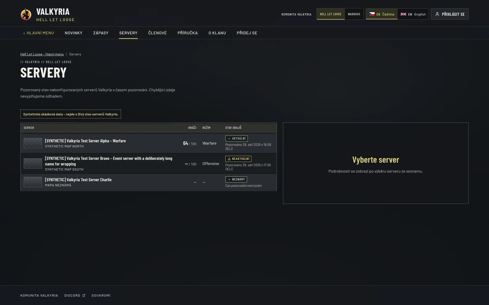
- **`public/hll-servers-selected-cs-1920x1200.webp`** — Servers /cs/hll/servers?server=synthetic-bravo (reference 13): ~58:42 list/detail, selected row, stale observation and unknown player count stay explicit. _(/cs/hll/servers?server=synthetic-bravo · 1920x1200 · cs)_

  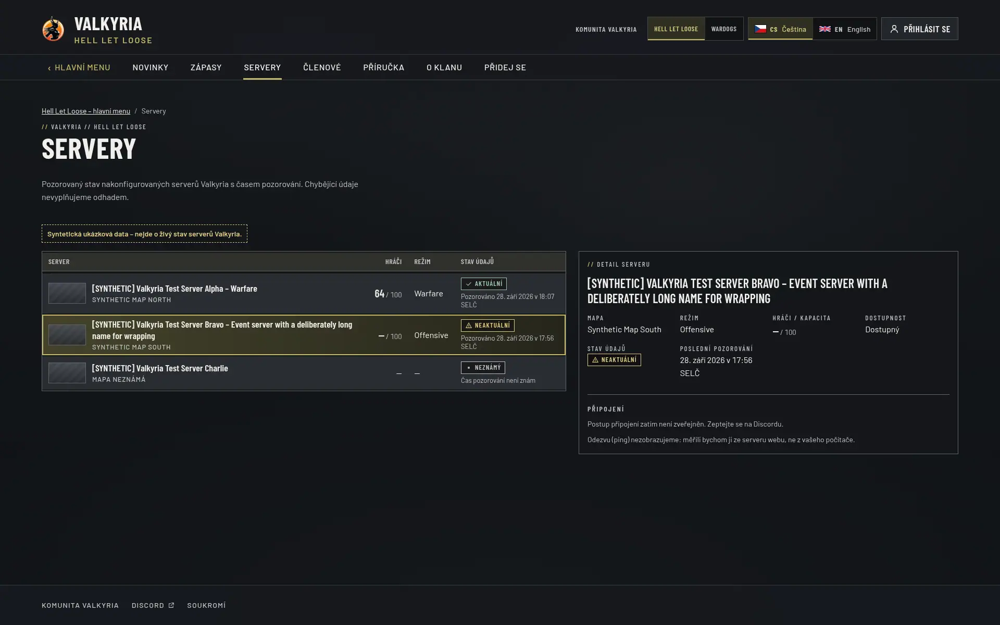
- **`public/hll-servers-selected-en-390x844.webp`** — Servers detail on a phone (/en/hll/servers?server=synthetic-alpha, full page): list becomes a routable detail with a back link; copy-address control. _(/en/hll/servers?server=synthetic-alpha · 390x844 · en)_

  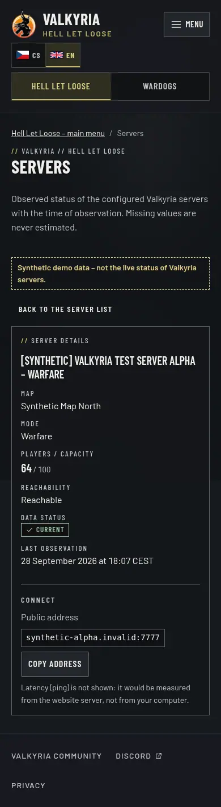
- **`public/manual-browse-cs-1920x1200.webp`** — Field manual /cs/hll/field-manual (compare reference 10): search rail with categories and counts beside category cards from published content only (draft-only categories hidden). _(/cs/hll/field-manual · 1920x1200 · cs)_

  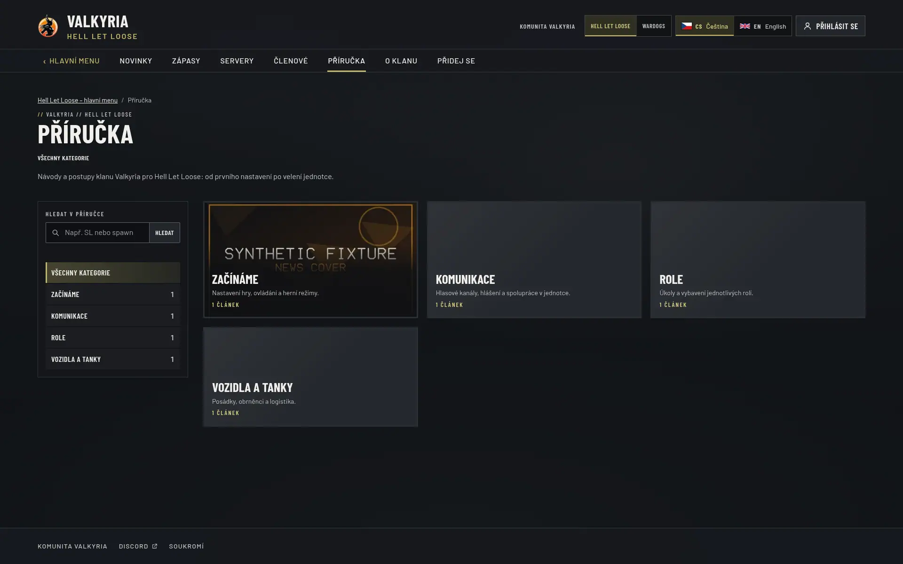
- **`public/manual-category-en-1366x768.webp`** — Field manual /en/hll/field-manual?category=communication: English category view; only published English articles are listed. _(/en/hll/field-manual?category=communication · 1366x768 · en)_

  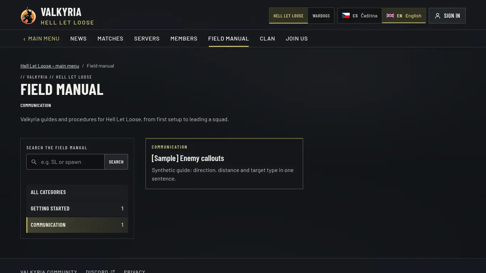
- **`public/manual-search-cs-1920x1200.webp`** — Field manual search /cs/hll/field-manual?q=sl: the abbreviation SL finds the synthetic squad-leader guide (synonym “velitel družstva”); query, result count and clear action in the rail. _(/cs/hll/field-manual?q=sl · 1920x1200 · cs)_

  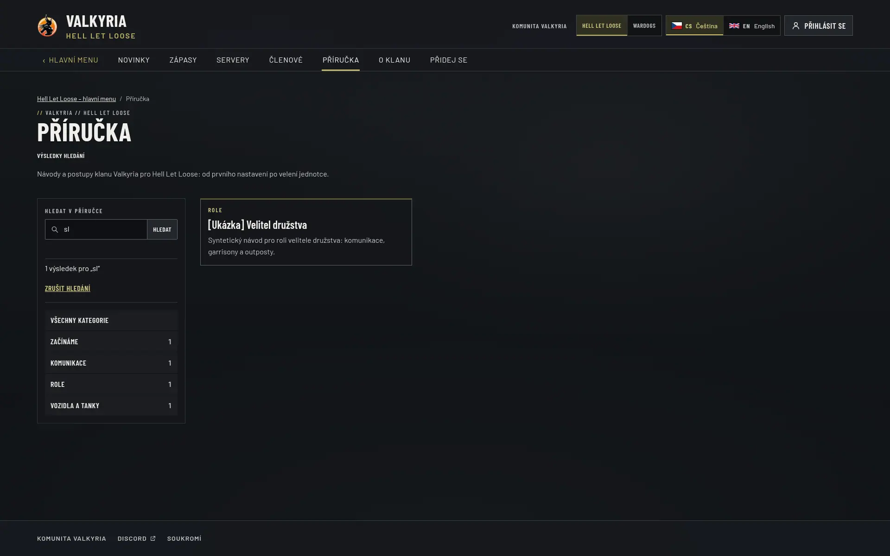
- **`public/manual-no-results-cs-390x844.webp`** — Field manual no-results state on a phone (/cs/hll/field-manual?q=soukromy koncept): a private draft is not searchable; calm message and clear-search action. _(/cs/hll/field-manual?q=soukromy%20koncept · 390x844 · cs)_

  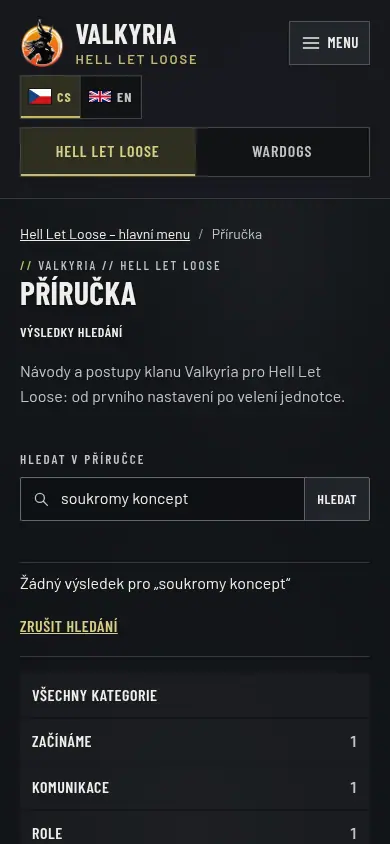
- **`public/manual-article-cs-1920x1200.webp`** — Field manual article /cs/hll/field-manual/ukazka-prvni-nastaveni (full page): table of contents from body headings, cover, rich text and the provenance block (synthetic source, date, language, credits, review date). _(/cs/hll/field-manual/ukazka-prvni-nastaveni · 1920x1200 · cs)_

  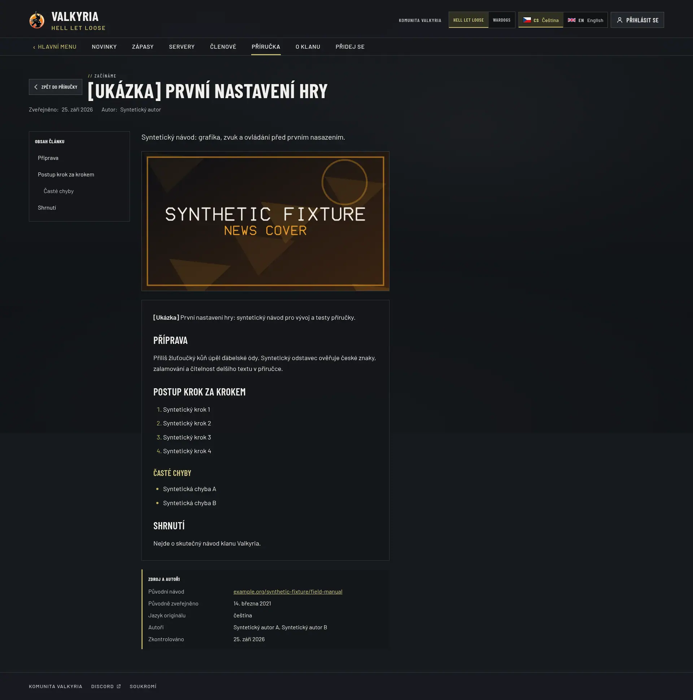
- **`public/manual-article-cs-390x844.webp`** — Field manual article on a phone (/cs/hll/field-manual/ukazka-velitel-druzstva, full page): contents list above the text, no horizontal overflow. _(/cs/hll/field-manual/ukazka-velitel-druzstva · 390x844 · cs)_

  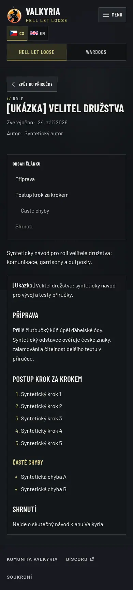
- **`public/manual-missing-translation-en-1366x768.webp`** — Language switch from the Czech-only guide ukazka-posadka-tanku: /en/hll/field-manual shows a notice with a safe link to the published Czech article instead of a draft or a guessed slug. _(/en/hll/field-manual?missing=cs:ukazka-posadka-tanku · 1366x768 · en)_

  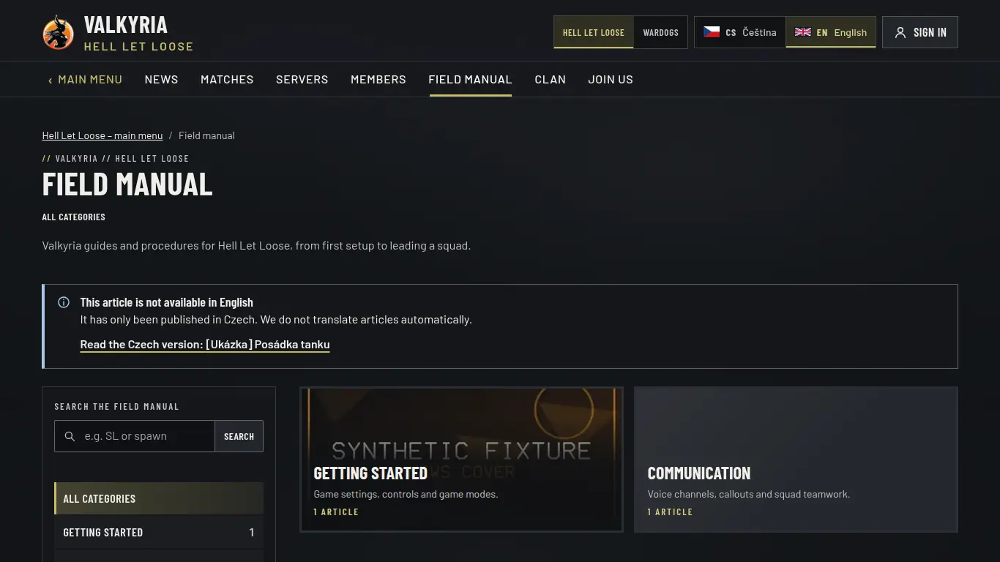
- **`public/hll-match-detail-cs-1366x768.webp`** — HLL match detail /cs/hll/matches/ukazka-hll-historicky: selected row and detail pane in the HLL theme; synthetic opponent. _(/cs/hll/matches/ukazka-hll-historicky · 1366x768 · cs)_

  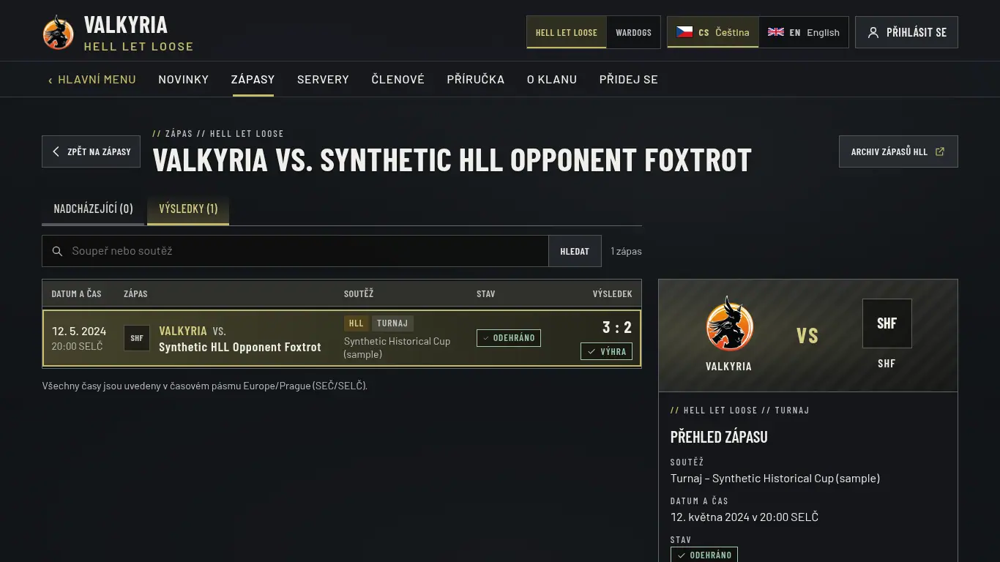

### admin

- **`admin/admin-news-hll-editor-cs-1440x900.webp`** — Admin news list for a Discord role mapped to editor for Hell Let Loose only: every row and the Rozsah (scope) column show Hell Let Loose; Wardogs and community posts are absent. _(1440x900 · cs · editor scoped to hell-let-loose)_

  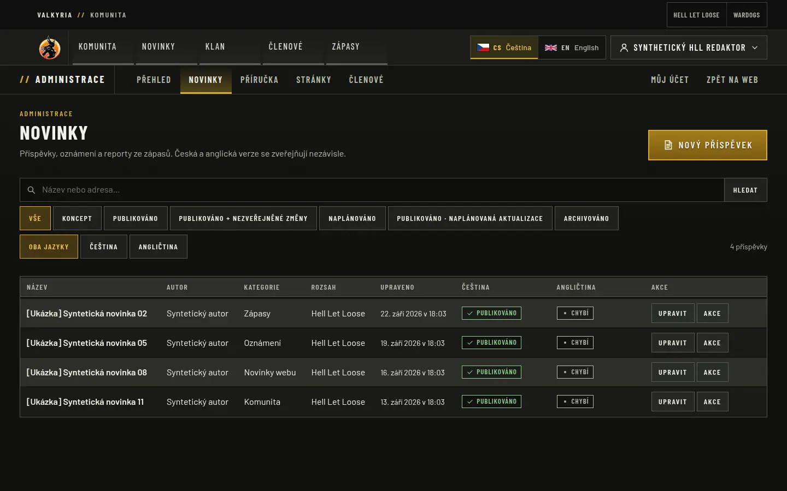
- **`admin/admin-denied-wardogs-cs-1440x900.webp`** — The same HLL-scoped session opening a Wardogs post by direct URL: localized access-denied panel (audited server-side), no content revealed. _(1440x900 · cs · editor scoped to hell-let-loose)_

  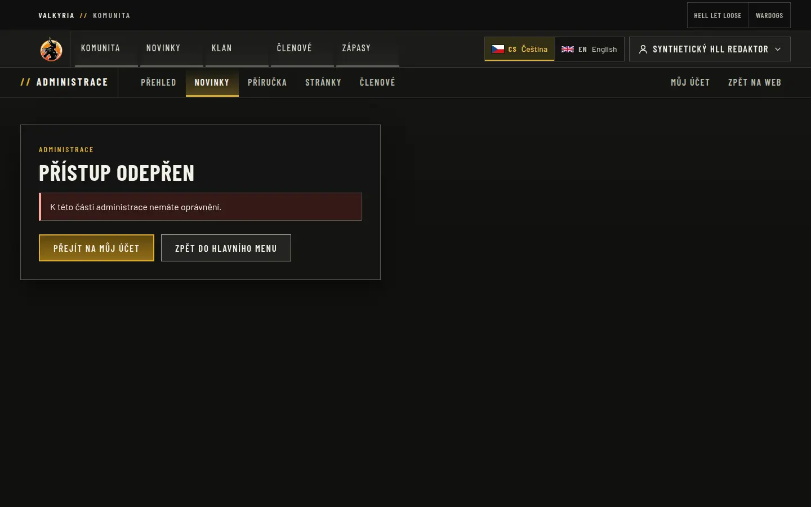
- **`admin/admin-new-post-hll-editor-cs-1440x900.webp`** — New post form for the HLL-scoped editor: the publication scope selector offers only Hell Let Loose. _(1440x900 · cs · editor scoped to hell-let-loose)_

  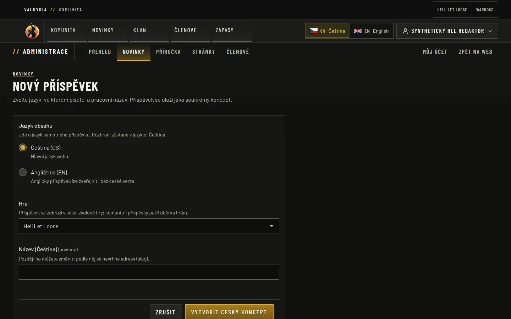
- **`admin/admin-news-platform-editor-cs-1440x900.webp`** — Admin news list for a platform-wide editor: Wardogs, Hell Let Loose and community (Komunita) posts side by side with a visible scope column. _(1440x900 · cs · editor (platform-wide))_

  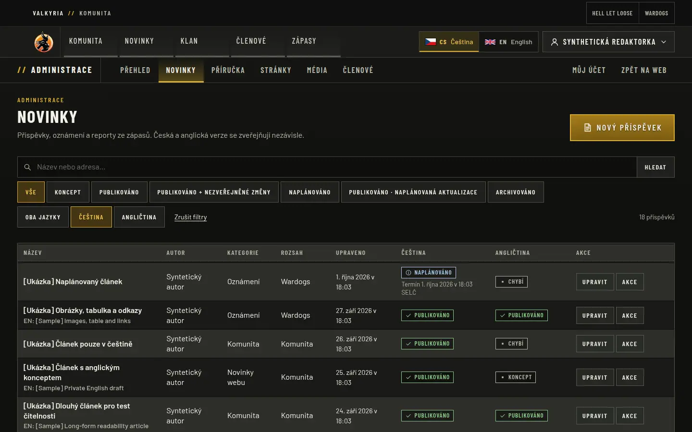
- **`admin/admin-manual-list-cs-1440x900.webp`** — Field manual administration (Příručka): manual articles on the shared CMS with independent Czech/English states (published, private draft). _(1440x900 · cs · editor (platform-wide))_

  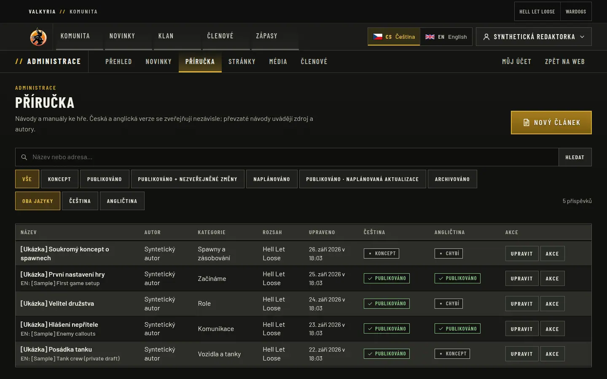
- **`admin/admin-manual-editor-cs-1440x900.webp`** — Field manual article editor (full page): the shared rich-text editor, HLL category, publication controls and the source/ordering form (original URL, date, language, credits, review). _(1440x900 (full page) · cs · editor (platform-wide); cropped to the first 4000 px)_

  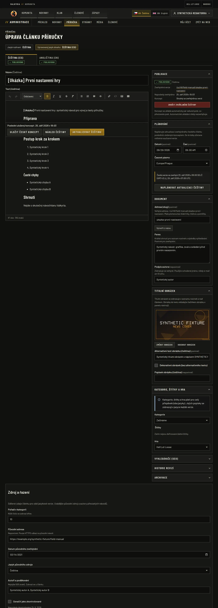

### servers-unavailable

- **`servers-unavailable/hll-servers-unavailable-cs-1920x1200.webp`** — Servers /cs/hll/servers when the (synthetic) status source times out: an explicit “source not responding” notice that states this does not mean offline or empty servers; navigation keeps working. Separate standalone run with SERVER_STATUS_FIXTURE_SCENARIO=unavailable. _(/cs/hll/servers · 1920x1200 · cs)_

  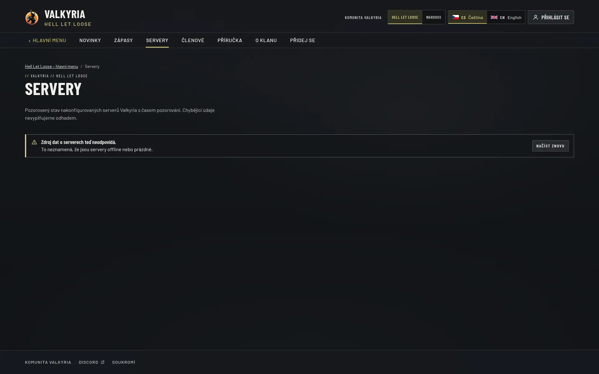
- **`servers-unavailable/hll-servers-unavailable-en-390x844.webp`** — Servers /en/hll/servers when the (synthetic) status source times out: an explicit “source not responding” notice that states this does not mean offline or empty servers; navigation keeps working. Separate standalone run with SERVER_STATUS_FIXTURE_SCENARIO=unavailable. _(/en/hll/servers · 390x844 · en)_

  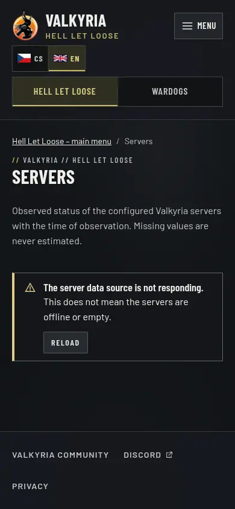

## Limitations

- No approved clan footage exists: stage playback is proven only with synthetic test
  media; real renditions, focal points and contrast over the brightest frame remain open.
- Server status is a labelled synthetic source; no hosted Logi/provider data or live SSO.
- Legacy guide text and images were not imported (legacy host blocked here; reuse of
  external illustrations unrecorded); the import creates empty draft shells only.
- FAQ, events, tournaments, leaderboards and legacy match-ID aliases are not built.
- Game-scoped editors cannot use the platform-only media library; `STRÁNKY` stays
  visible to them in the admin navigation but core pages need platform authority.
- `test:e2e:media` (delivered background files) was not run: the files are not in this
  container. Firefox/Safari and MP4/H.264 playback were not tested.
