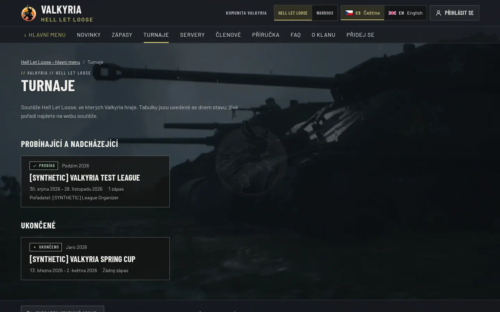
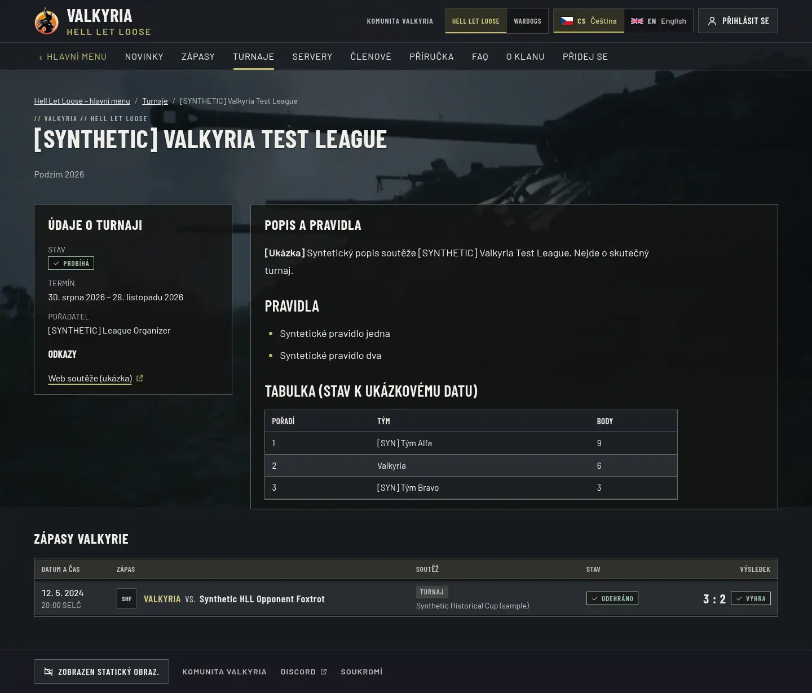
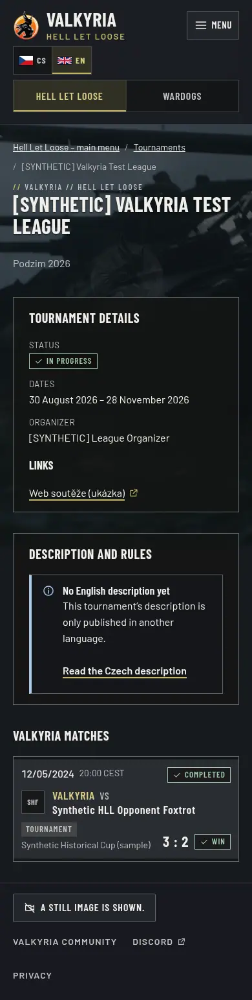
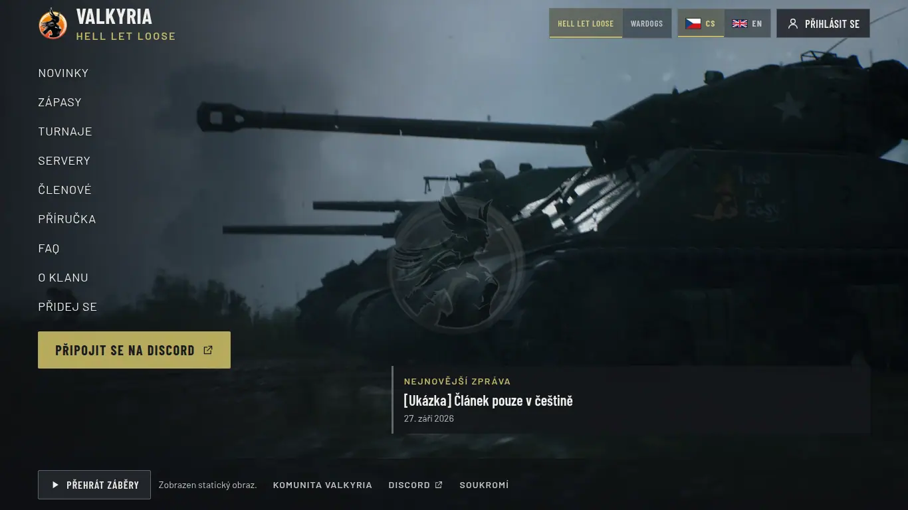
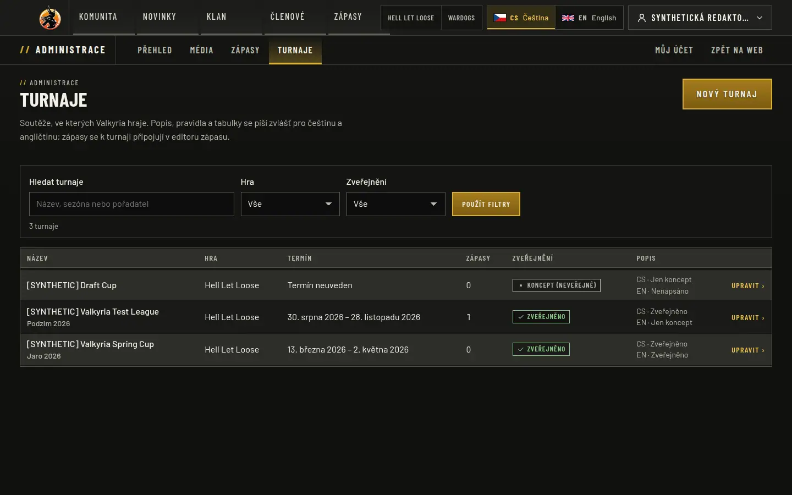
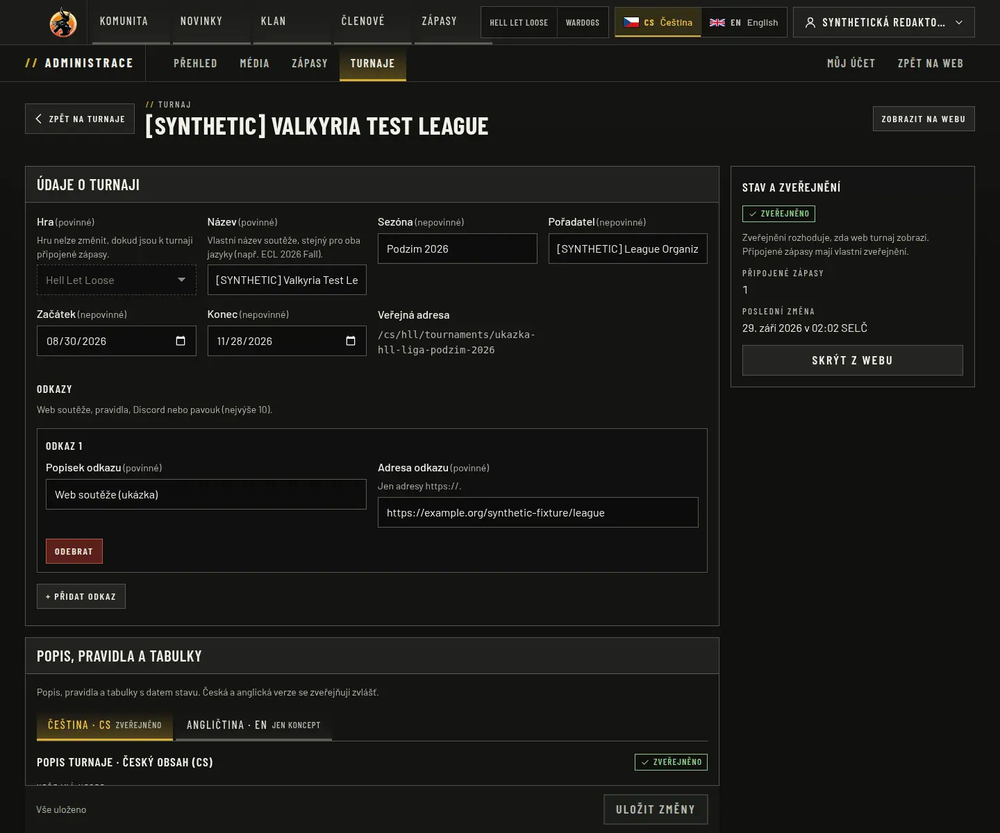
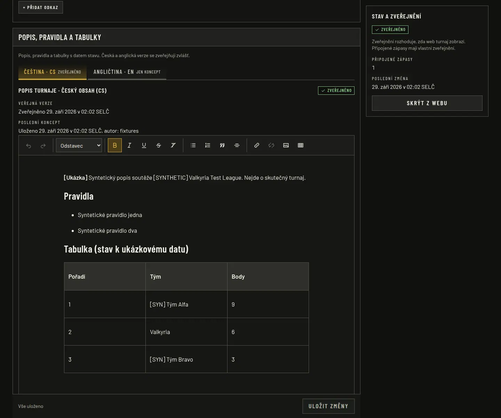
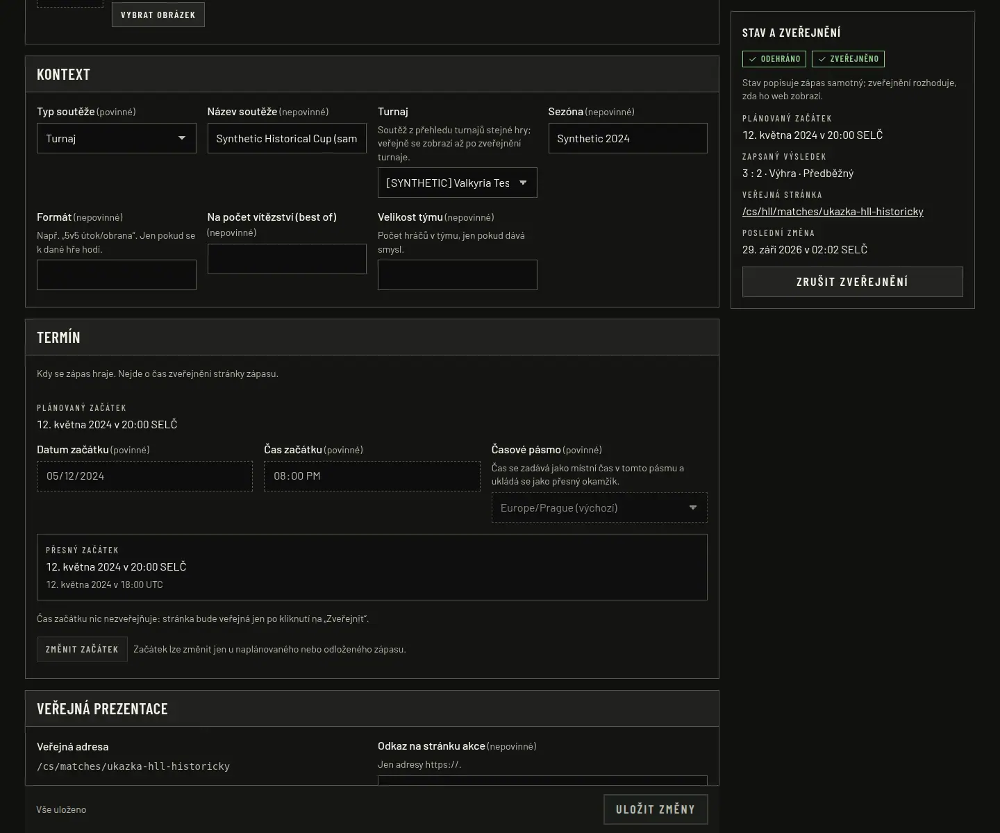

# HLL tournaments (2026-09-29)

Owner decision: tournaments and matches are managed by administrators in the admin menu.
Refs issue [#36](https://github.com/ValkyriaWDG/www/issues/36) (stays open). Nothing was
deployed; the legacy tournament records are not imported (`valkyriahll.cz` is blocked in
this environment).

## Context

- **Revisions:** `1d4e390` (editor normalization fix), `c3e65a6` (tournaments) on main
  `4f346c4`. Captures and checks ran on `c3e65a6`.
- **Environment:** Claude Code cloud container, Node.js 24.21.0, PostgreSQL 16.13, Next.js
  16.3.6 standalone build, Playwright 1.63.0 / Chromium 141, synthetic fixtures (three
  `[SYNTHETIC]` tournaments: current, finished, draft), local Discord mock, empty HLL clip
  playlist, reduced motion.

## Behaviour

- `tournament` (migration `0004`): game, name, season, organizer, start/end calendar day
  (Europe/Prague), up to ten HTTPS links, publication, internal notes. The description
  (rules, dated standings) is per-locale prose with independent drafts, revisions and
  publication, behind the tournament's own public gate (also for its images).
- Administration `/admin/tournaments`: list, create, edit, publish/unpublish, delete an
  unpublished draft (linked matches are unlinked). `matches.edit`/`matches.publish` within
  the actor's game scope; denials are audited; optimistic versions.
- Matches link to a tournament of their own game (match editor "Turnaj"); a game change of
  a linked match or of a tournament with matches is refused.
- Public `/{locale}/hll/tournaments` (current/upcoming, then finished) and detail with the
  published linked matches; the match detail links to its published tournament; sitemap
  entries; legacy `/turnaje` and `/tournaments` redirect to the collection.
- The candidate fixture loader inserts only columns the connected schema has, so the
  release rollback rehearsal can still load fixtures into the previous schema
  (`fixtures-schema-compat.test.ts` failed on `tournament_id` before, passes after).

## Fixes found while verifying

- **Stored prose opened as unsaved.** TipTap's trailing-node plugin appends a paragraph
  after a final table, list or image in the load transaction, which the editor reported
  as a change: a stored description ending with a table showed "Zveřejněno · neuloženo"
  and blocked publication actions. The load transaction now carries `preventUpdate`
  (`1d4e390`; also used by the news editor). `admin-tournaments.spec.ts` failed before
  ("Čeština · CS Zveřejněno · neuloženo") and passes after.
- **Squeezed match row on phones.** The first tournament detail table left the opponent
  column 9.3 px wide at 390 px. It now uses the match list's five columns and compact
  mobile rows; the phone test failed before (`9.3125`) and passes after.

## Checks (`c3e65a6`)

| Check | Result |
|---|---|
| Foundation / tooling | Passed (1261 files) / 126 passed |
| Lint, types | Passed |
| Unit | 497 passed (52 files), incl. tournament phase and input schemas |
| Integration (PostgreSQL 16) | 291 passed (31 files), incl. `tournaments.test.ts` (8) and the older-schema fixture load |
| Browser | 160 passed, 0 failed (106 opt-in capture cases skipped), incl. `admin-tournaments.spec.ts` (4) |
| CI artwork step (`E2E_HLL_EMPTY_MEDIA=1`) / page budgets | 4 passed / all 15 samples passed |

## Captures

- [`tournaments/hll-tournaments-cs-1440x900.webp`](tournaments/hll-tournaments-cs-1440x900.webp) — Public HLL tournaments: Turnaje in the section bar; current and upcoming competitions first, finished ones below; phase, season, dates, organizer and published match count per card. Draft tournaments are not listed. _(/cs/hll/tournaments · 1440x900 · cs)_

  
- [`tournaments/hll-tournament-detail-cs-1440x900.webp`](tournaments/hll-tournament-detail-cs-1440x900.webp) — Tournament detail (full page): facts and links on the left, the published Czech description with rules and a dated standings table, and the published linked match with its result. _(/cs/hll/tournaments/ukazka-hll-liga-podzim-2026 · 1440x900 (full page) · cs)_

  
- [`tournaments/hll-tournament-detail-en-390x844.webp`](tournaments/hll-tournament-detail-en-390x844.webp) — English tournament detail on a phone (full page): the English description is only a private draft, so the page shows the explicit absence with a link to the Czech description; facts and matches are shared. _(/en/hll/tournaments/ukazka-hll-liga-podzim-2026 · 390x844 (full page) · en)_

  
- [`tournaments/hll-landing-cs-1366x768.webp`](tournaments/hll-landing-cs-1366x768.webp) — HLL main menu at 1366 × 768 with the new Turnaje entry after Zápasy; the menu still fits above the fold. _(/cs/hll · 1366x768 · cs)_

  
- [`tournaments/admin-tournaments-cs-1440x900.webp`](tournaments/admin-tournaments-cs-1440x900.webp) — Administration list of tournaments within the manager’s game scope: name and season, game, dates, linked matches, publication and the per-language description state. _(/cs/admin/tournaments · 1440x900 · cs · match_manager)_

  
- [`tournaments/admin-tournament-editor-cs-1440x1200.webp`](tournaments/admin-tournament-editor-cs-1440x1200.webp) — Tournament editor: game (locked while matches are linked), name, season, organizer, start and end day, links, the Czech/English description tabs and the publication panel (published, one linked match). The stored description opens without unsaved changes. _(/cs/admin/tournaments/<id> · 1440x1200 · cs · match_manager)_

  
- [`tournaments/admin-tournament-description-cs-1440x1200.webp`](tournaments/admin-tournament-description-cs-1440x1200.webp) — Description of the same tournament: the Czech tab is published (rules and a dated standings table in the shared rich-text editor), the English tab is a private draft; each language is saved and published separately. _(/cs/admin/tournaments/<id> · 1440x1200 · cs · match_manager)_

  
- [`tournaments/admin-match-tournament-cs-1440x1200.webp`](tournaments/admin-match-tournament-cs-1440x1200.webp) — Match editor, context group: the Turnaj select offers only tournaments of the match’s game (drafts are marked); the public match detail links to the tournament once it is published. _(/cs/admin/matches/<id> · 1440x1200 · cs · match_manager)_

  

## Limitations

Synthetic data only. Legacy tournament pages (`/turnaje/<slug>`) stay pending until their
content is imported. Wardogs has no tournaments section yet; the model is game-scoped and
can expose one later.
