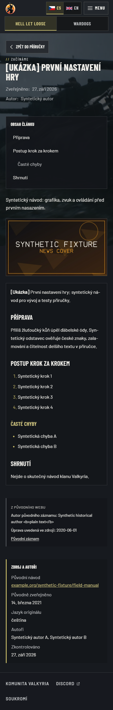

# Legacy editorial attribution renderers

Follow-up to [issue #73](https://github.com/ValkyriaWDG/www/issues/73). Published
clan/FAQ pages and field-manual articles received validated historical metadata in
their public DTOs but did not render it. The two page renderers now display the
existing attributed archive component beside the current editorial body. Manual
source, date, language, credits and review information remain intact.

## Scope and environment

These are **local synthetic application captures**, not production migration
acceptance. They were taken on 30 September 2026 using a production Next.js build,
disposable PostgreSQL fixtures and Playwright Chromium at 1920 x 1080 and 390 x 844.
The tested source is this PR's working-tree renderer changes based on
`6f8f40662e49b432540cbf571e6eaf6966c37b06`. [Captions and source-file hashes](captures.json)
identify each route, viewport, observation time and tested renderer bytes. All six
images were inspected visually; none required redaction.
Commit `8bc036d7adfa6cd07c4c10956fcdaba54ed8f341` subsequently recorded these
implementation changes; the images retain their actual earlier working-tree provenance.

The source author, date and links are deliberately fictional. The literal
`<b>plain text</b>` in the synthetic author stays text, not injected markup. Existing
clan copy is unchanged, including its older statement about matches remaining on
the original website. FAQ screenshots show the existing admin publication journey:
only its first answer is synthetic published copy; other seeded answers remain
in preparation. They do not establish completeness of real migrated FAQ answers.

## Verification

| Criterion | Observed result |
|---|---|
| Render metadata without replacing current content | The renderer regression initially failed in all three affected cases (3 failed, 9 passed); after the fix all 12 passed. Current body and manual provenance assertions remain. |
| Czech publication and English isolation | Four browser cases cover clan/manual at desktop and mobile in both locales. Czech shows attribution; English retains its independent copy without invented Czech metadata. |
| Unpublished and ordinary content | A browser case checks draft FAQ in both locales plus ordinary privacy/manual pages. No archive block is exposed. |
| FAQ after publication | The existing admin journey publishes Czech only. Source metadata becomes visible, the 11-question index and saved answer remain, and English stays unpublished. |
| Accessibility and reflow | Scoped axe WCAG A/AA checks and horizontal-overflow assertions passed on all six Czech views. Visible images decoded before capture. |
| Fixture safety and schema compatibility | Seeded translation rows remain unchanged through reload/reset; synthetic archive rows are idempotent. An actual older-ledger regression first reproduced the missing `source_metadata` column failure, then passed all 4 compatibility cases after column-aware guards. |

Final local checks: lint, typecheck and application build passed; **766 unit tests
across 69 files**, **357 integration tests across 38 files**, **5 read-only browser
cases** and **1 FAQ admin journey** passed. The initial FAQ axe run required an
explicit anonymous browser context; the corrected journey passed without removing
accessibility assertions. The fixture CLI was rebuilt after the compatibility fix.

Reproduce from `apps/web` using an isolated test database and the documented E2E
environment. Capture mode writes only ignored local evidence:

```sh
pnpm exec vitest run --project unit tests/unit/legacy-editorial-renderers.test.tsx
pnpm exec vitest run --project integration tests/integration/fixtures-synthetic.test.ts tests/integration/fixtures-schema-compat.test.ts
CAPTURE_EVIDENCE=1 pnpm exec playwright test e2e/legacy-editorial.spec.ts --project chromium
CAPTURE_EVIDENCE=1 pnpm exec playwright test e2e/admin-faq.spec.ts --project chromium-admin --no-deps
```

## Inspected captures

All routes are Czech HLL views. English absence and independent content are asserted
in the browser suite; these six images show the newly visible Czech attribution.

| Scenario | Desktop | Mobile |
|---|---|---|
| `/cs/hll/clan`: historical author/date/source after unchanged current clan copy | [1920 x 1080](legacy-editorial-clan-cs-1920.png) | [390 x 844](legacy-editorial-clan-cs-390.png) |
| `/cs/hll/field-manual/ukazka-prvni-nastaveni`: synthetic archive plus existing manual provenance | [1920 x 1080](legacy-editorial-manual-setup-cs-1920.png) | [390 x 844](legacy-editorial-manual-setup-cs-390.png) |
| `/cs/hll/faq`: archive shown only after the admin publishes Czech | [1920 x 1080](legacy-editorial-faq-cs-1920.png) | [390 x 844](legacy-editorial-faq-cs-390.png) |



Exact-revision CI, immutable-image rehearsal and public production acceptance are
still required. This evidence does not close the migration's production acceptance.
