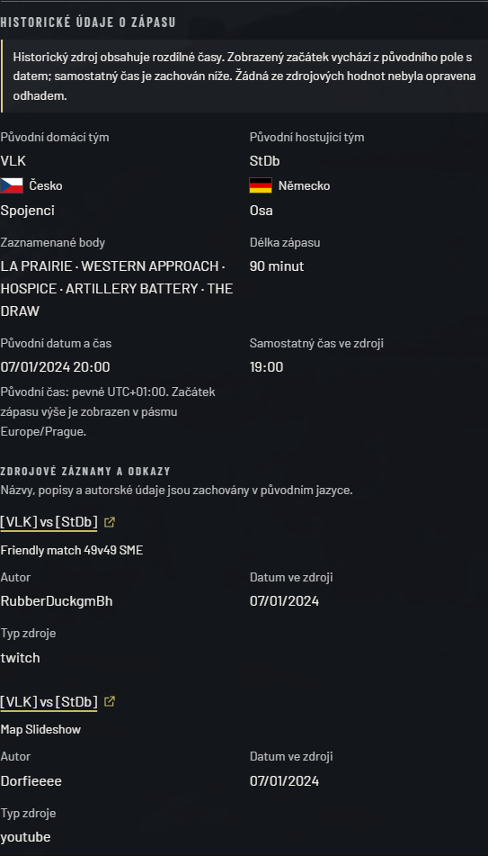
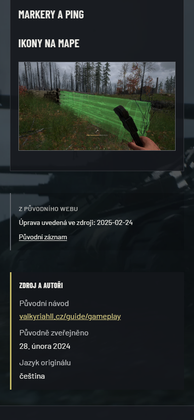
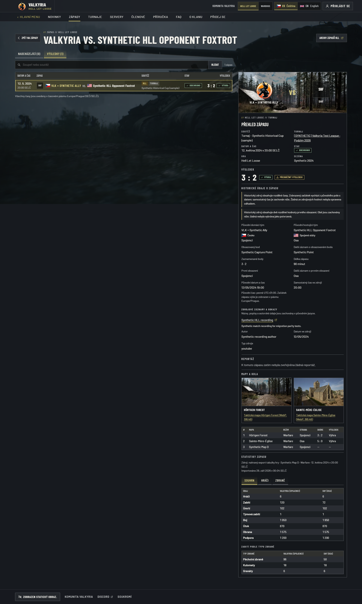
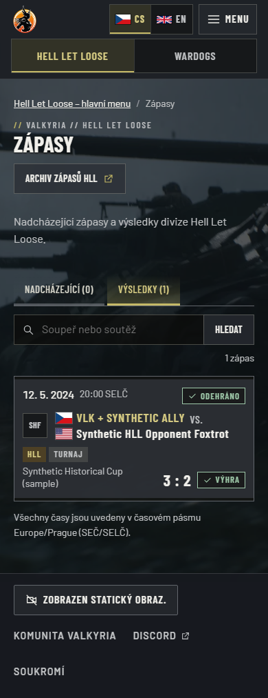

# Legacy HLL public field parity

Follow-up to [issue #73](https://github.com/ValkyriaWDG/www/issues/73). The earlier
import proved record counts and technical integrity, but omitted some public source
fields. This additive repair preserves the original import identities and every
current match, result, statistics, content/prose revision and publication decision.
Historical metadata is visibly attributed rather than replacing current editor text.

## Production acceptance

Accepted at **30 September 2026, 09:08:13 UTC** on source
`609528df9e6a201f7cab9775607dd0f9210dcd63`, image
`majorluk/valkyria-www@sha256:b4c849213aaf954a4f88817f462d506aa78c3de1ed5eb76f195145c5f71e30b2`.
[Sanitized acceptance record](production-acceptance.json) binds the exact source,
image, captured state, operator/rehearsal reports and public evidence.

The additive repair verified **235 historical overlays: 205 matches and 30 documents**
(12 news, eight manuals, eight tournaments and two shared pages). Nine news records
remain published and three announcements archived. Original match import identities
and source hashes, existing editorial/results/statistics values, revisions and
publication decisions were preserved. Only declared historical metadata, two original
author-image assets/four variants and their audit entries were added. There are
**221 imported assets / 442 stored variants**; all previous media bytes are unchanged.
No SQL migration or seed ran; all nine journal entries and sequence values are unchanged.
Dry-run and repeat repair made no writes.

| Evidence boundary | Observed result |
| --- | --- |
| [Exact-source CI](https://github.com/ValkyriaWDG/www/actions/runs/36689819903) | 766 unit tests / 69 files; 357 integration tests / 38 files; 193 browser tests, 124 explicitly skipped; four artwork tests; foundation, lint, types, build and budgets passed |
| Protected publisher | [Successful exact-source run](https://github.com/ValkyriaWDG/www/actions/runs/36689822633) |
| Isolated PostgreSQL 15 restored-image rehearsal | 1094/1094 candidate and 682/682 previous-image HTTP/media checks; repair, unchanged replay and previous-image compatibility passed |
| Anonymous production proof | 888/888 HTTP checks; 410 CS/EN match projections, 27 published editorial projections and three archived-page denials; 9,064 source-field assertions; 422 public media responses and 20 expected media denials |
| Reviewed browser proof | Five real scenarios; source fields, image decode, page errors and horizontal overflow checked; [capture captions/hashes](production-captures.json) |
| Final same-image/readback and automation | Same immutable image recreated through the production channel; Watchtower and publisher timer restored at 09:08:37 UTC. [Later read-only observation](production-post-resume.json) verified a natural 09:13:43 UTC poll: one scanned, zero updated, zero failed; no forced run, configuration bytes and 50 unrelated containers unchanged. |

The later observer completed at 09:17:10 UTC and rechecked the same application and
updater containers, runtime contract, configuration, unrelated workloads and both
public health endpoints. `production-acceptance.json` retains its true 09:08:37 UTC
checkpoint where natural polling had not yet been observed; the separate aggregate
report establishes the later observation and binds its full private-report hash.

The first observer attempt remained pending because the pinned Watchtower emits
`Update session completed` rather than the older `Session done` message. The private
parser now accepts both exact messages while retaining timestamp, counter and runtime
identity checks; all 31 offline guard tests passed. This was a log-format recognition
gap, not a runtime failure or a forced updater run.

At 09:09:02 UTC, the [allowlisted server readback](production-server-readback.json)
reported both configured HLL sources online and fresh: primary 0/100 concurrent
players and one round participant; event 0/100 concurrent players and two round
participants. Round participation is not the current connected-player count. The
Wardogs server projection returned 404 (unconfigured); no private player identifiers
or credentials are included in this evidence.

The first acceptance preflight stopped before mutation because pulling the production
channel had removed the previous image's RepoDigest reference. Re-pulling the exact
previous digest restored that reference; the pending apply record remained unchanged
and the retry passed without weakening the identity guards. No database restore or
legacy-data reimport was performed.

The two match screenshots crop the historical provenance panel and exclude real
player tables. The three editorial screenshots are viewport captures scrolled to
provenance context, not full-page captures. Their manifests identify route, viewport,
capture dimensions and source image. Earlier source,
lexical, static-markup and synthetic screenshot evidence remains separately labelled.

- [Actual Czech historical match provenance, country labels and conflicting source-time notice. Browser panel capture excludes the real player table.](production-match-cs-desktop.png)
- [Actual English historical match provenance at a mobile viewport, retaining original source facts. Browser panel capture excludes the real player table.](production-match-en-mobile.png)
- [Actual desktop viewport at the published Czech article provenance, showing its restored source-author image and historical metadata with surrounding page context.](production-article-cs-desktop.png)
- [Actual desktop viewport at the published Czech tournament provenance, showing its restored description, labels and logo with surrounding page context.](production-tournament-cs-desktop.png)
- [Actual mobile viewport at the published Czech field manual provenance, showing source attribution and historical metadata with surrounding page context.](production-manual-cs-mobile.png)

The accepted image includes #76's clan/FAQ and eight field-manual renderer correction.
Its first CI run, `36687129273`, stopped on four fixable OpenSSL OS-package findings;
that failed candidate was not accepted. The final runtime updates only the two
affected packages to `3.5.7-1~deb13u3`; later full CI and exact-image rehearsal provide
qualification. [Runtime qualification details](../../operations/release-hardening.md#september-2026-openssl-runtime-update).
Publisher qualification reported zero fixable HIGH/CRITICAL findings and 43 unfixed
findings at scan time; this does not claim the image has no advisories. The channel
promotion at 08:46:17 UTC preserved migration/runtime fingerprints. PR #75's
publication record did not itself observe the live runtime; this section records
the later independent live acceptance.

Input qualification retained the frozen bundle bytes and original entity hashes.
The reviewed supplement was generated for the target Linux collation; its internal
canonical bundle hash differs from Windows default collation. This was a pre-write
qualification failure, corrected after byte/per-entity comparison rather than by
changing existing import identities. [Operator procedure](../../operations/legacy-hll-import.md#additive-public-metadata-repair).

The **134 retained statistics snapshots are 131 primary exports plus three extra
rounds across 131 matches**, not 134 newly verified CRCON matches. Only match 211's
external provider origin was individually verified. Two hidden matches, private
identity fields and conflicting exports 101/199 remain excluded; empty exports do
not become zero statistics. Unknown statistical sides, three source-time conflicts
and anomalous source modification dates remain attributed. Unsupported media stays
as readable source links; Czech/Slovak historical prose is not an invented English
translation.

This proves the declared field preservation and public projection, not universal
historical truth, manual formatting or semantic identity. Existing clan/community
CMS wording is unchanged. admin2 DNS remains unavailable; authentication/hosted Logi,
Wardogs API/RCON and legacy-domain cutover remain separate work. This acceptance
closes #73's public-field-parity scope only.

## Source reconciliation

The frozen source revision is `1f0396517f90527f5aa44d7c66ac8f1c1117c425`.
The original bundle byte SHA-256 is
`7d3151b895607f4c3ec8e8d7c91acf9b101cf0a067d2df3277e0f451d4ee48fe`.
It has not been rewritten. [Read-only match reconciliation](source-match-parity.json)
verifies all 205 original normalized identities and both country labels, 26 complete
recording links, 17 primary capture fields, one alternate capture field, three point
fields and 70 standalone times. Three standalone times differ from their source date.
They are preserved and marked; this does not assert which historical time is correct.

The separately hashed editorial supplement restores two local author images used by
nine articles, source cover/thumbnail references and manual ordering. The typed
editorial projection also preserves descriptions, labels and imported logos for
eight tournaments. Public media requires an active published owner. Archived
announcements remain archived; editor versions and revisions are not rewritten.

Known source limits remain: two hidden matches are excluded; conflicting exports
for matches 101/199 are quarantined; empty exports do not become zero statistics;
21 unassigned statistical sides remain unknown; only match 211 has an individually
verified external CRCON origin/game link. Private player/account data are excluded.
Original Czech/Slovak source text is not presented as an invented English translation.
The [field disposition inventory](source-field-coverage.json) covers every observed
match/frontmatter key and all 30 document cases. Its lexical check found no missing
word occurrences across 25 extracted HTML bodies (11,592 tokens); this does not
prove sentence order, formatting or semantic identity. Home/league source images
remain staged and mapped in the source/media ledger; match presentation deliberately
uses the Valkyria crest and competition text. Opponent/map images and tournament
logos have their own public presentation.

## Local verification

Environment: Windows, Node 24.21.0, pnpm 10.34.5, isolated PostgreSQL test databases,
production Next.js build and Playwright Chromium. Browser data are **synthetic**;
no private legacy export, credential or player record is included in these captures.

- `pnpm lint`, `pnpm typecheck`, `pnpm build`, `node scripts/check-foundation.mjs` passed.
- `pnpm test:unit`: **749 tests passed across 68 files** in the final integrated run.
- Focused metadata repair tests exercise dry-run, real apply, unchanged repeat,
  conflicting source rejection and preservation of subsequent editor changes.
- `CAPTURE_EVIDENCE=1 pnpm exec playwright test e2e/legacy-parity.spec.ts --project chromium`:
  five scenarios passed; CS/EN at 1920 x 1080 and 390 x 844, recording attribution,
  unchanged published start, axe checks, reflow and ordinary-match absence.
- The initial full Windows database run had 354 passing tests and one fixture reset
  failure caused by a retained native image file handle. The test now decodes a read
  buffer, preserving the same image assertions without keeping the file open.
  The subsequent full PostgreSQL run passed **356/356 tests across 38 files**.
- Foundation tooling: **176/176 passed**. Independent public-projection and media
  review found no remaining actionable issue after the digest validation correction.

These historical local checks did not establish production acceptance. The separate
production section above records the later exact-image repair, no-op replay and live
checks; these synthetic screenshots retain their original scope.

## Inspected application captures

Captured 29 September 2026 at 22:05 UTC from the implementation changes in this PR.
[Machine-readable captions](captures.json) identify each route, locale and viewport.
The fictional fixture deliberately includes conflicting capture/time values and
recording metadata; it is not a claim that every real source has those conflicts.

| View | Desktop | Mobile |
|---|---|---|
| Czech match details: provenance, flags, source conflicts and complete recording credits | [Capture](legacy-detail-cs-1920.png) | [Capture](legacy-detail-cs-390.png) |
| English match details: equivalent localized UI with preserved source text | [Capture](legacy-detail-en-1920.png) | [Capture](legacy-detail-en-390.png) |
| Czech results: original coalition name and country labels | [Capture](legacy-list-cs-1920.png) | [Capture](legacy-list-cs-390.png) |
| English results: equivalent list behavior | [Capture](legacy-list-en-1920.png) | [Capture](legacy-list-en-390.png) |

