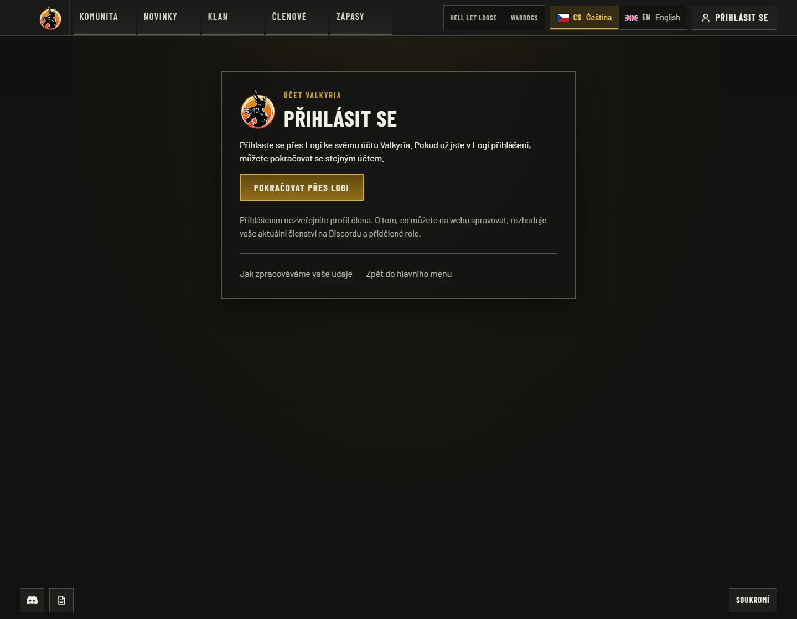
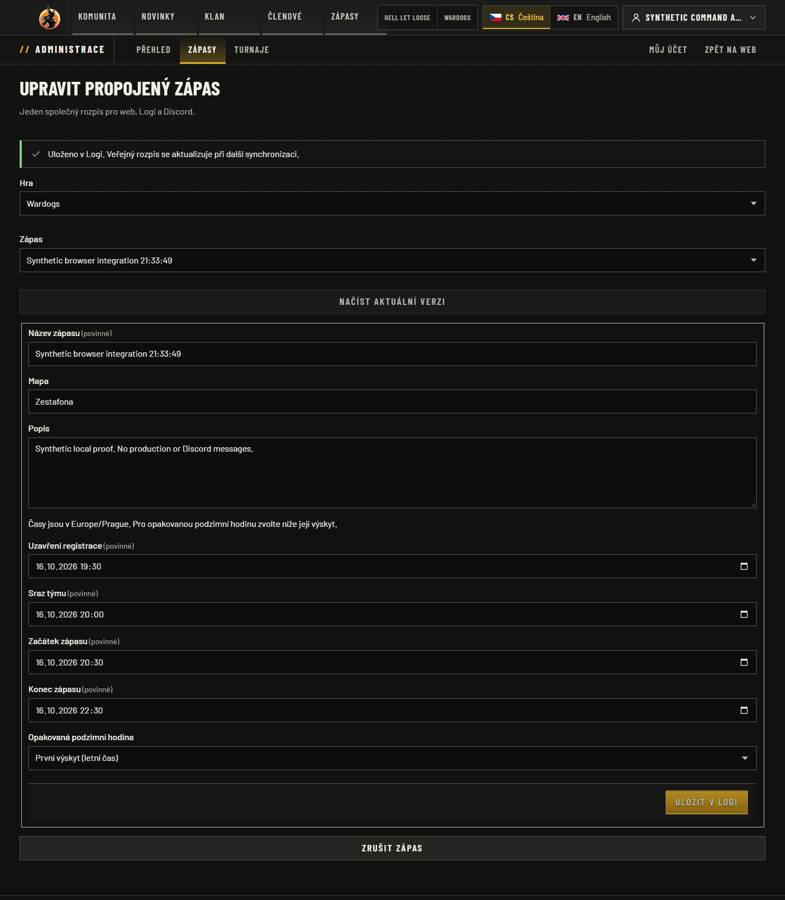
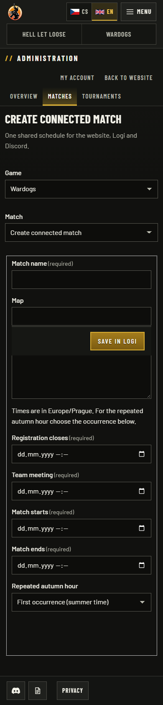

# Logi integration acceptance — 2026-10-02

The paired implementation passed local qualification. This is **not hosted or
production acceptance**. Exact changed-file hashes for both repositories are in
[source-manifest.json](source-manifest.json); hashes use LF-normalized UTF-8 and also
record the original tested bytes. Base commit IDs alone do not identify the patch.

Environment: Windows, Node 24.21.0, pnpm 10.34.5, Next 16.3.6, Better Auth 1.7.6,
PostgreSQL 18.4 with ICU cs-CZ, and an isolated native Convex instance. UI captures
use the optimized website build `dQIO2k_7lNUWYEYPleEPi` through `next start`, with
explicit local test configuration (`NODE_ENV=test`) for loopback HTTP. Logi was an
actual local Next/Convex provider. Synthetic existing central sessions and trusted
synthetic Discord observations replace real Discord OAuth/gateway traffic.

## Observed results

| Criterion | Observed result | Evidence |
| --- | --- | --- |
| Website regression suite | 875/875 unit; 440/440 PostgreSQL integration; lint, typecheck and optimized build passed | [Checks](checks.json) |
| Logi regression suite | 696/696; typecheck and webpack production build passed; scoped lint has no errors and one pre-existing unused OpenAPI helper warning | [Checks](checks.json) |
| Maintained SSO consumer/provider | 33/33 actual paired HTTP checks, including PKCE/nonce, private per-session binding, account isolation and revocation | [SSO checks](sso-interop.json) |
| Native event command boundary | 22/22 actual HTTP/Convex checks, including eight concurrent identical creates, revision conflicts and current authority on receipt replay | [Command checks](native-event-commands.json) |
| User flow in browser | 9/9: existing central login -> website session -> UI create -> native event -> sync -> public CS/EN detail | [Browser checks](browser-proof.json) |
| Lifecycle and access loss | 10/10: load/update, role removal blocks open editor, same request succeeds after restoration, cancel, central logout denies access and deletes the website session | [Lifecycle checks](lifecycle-proof.json) |
| English editor/mobile | Two visual checks; desktop 1440x1050, phone 390x844; public phone also checked at 360px | [Visual metadata](visual-proof.json) |
| Schema upgrade | 6/6: preceding migration 0008 with an existing user/session -> additive 0009, seven null bindings, five new tables, second run idempotent | [Migration checks](migration-proof.json) |
| Bounded built CLI | `node dist/cli/logi-sync.mjs` resumed initial bootstrap; subsequent passes reached `caught_up`, then create/update/cancel appeared publicly | Browser scenarios and [runbook](../../integrations/logi/runbook.md) |

The integration suite uses a disposable database and real transactions. Its remote
provider stubs are not live-provider proof; the separate paired HTTP and browser
checks above establish that boundary. The full suite was run with four workers.
An earlier C-locale database failed an unrelated Czech case-folding assertion; ICU
cs-CZ was selected without weakening that test. A resource-contention timeout from
an earlier parallel run was resolved by running the final suite alone.

Browser checks wait for actual navigation and initialized controls, not global
network idleness. Review found that input during hydration could be lost; the
editor now remains disabled until React can handle it. A central revocation may
first render access denied or redirect to login; both deny protected content, and
the final test also verifies the durable website session is gone.

## Captures

All data and visible identities below are synthetic. Desktop viewport is 1440x1050
unless stated; full-page captures can be taller. These images are registered as
verification-only assets and are not imported by the application.

| Capture | Route / criterion |
| --- | --- |
| [Czech login](login-cs.png), [English login](login-en.png) | `/cs/login`, `/en/login`: central Logi sign-in action |
| [Czech saved event](saved-cs.png) | `/cs/admin/matches/new`: actual native create acknowledged and canonical event loaded |
| [English editor](editor-en.png), [English phone editor](editor-en-phone.png) | `/en/admin/matches/new`, phone 390x844: localized authoring and no horizontal page overflow |
| [Czech public list](matches-cs-desktop.png) | `/cs/wardogs/matches`: same native event visible through the data projection |
| [Czech phone detail](match-detail-cs-phone.png), [English detail](match-detail-en.png) | `/{locale}/wardogs/matches/logi/{id}`: canonical event identity; phone 390x844; unknown result stays unknown |
| [Role denied](role-denied-cs.png) | Open Czech editor rejects save after upstream role removal |
| [Cancellation projection](cancelled-public-cs.png) | `/cs/wardogs/matches?view=results`: native pre-meeting cancellation is represented by Logi's concluded state |
| [Central logout](central-logout-cs.png) | Protected website visit after central logout: no editor or protected content |

## Reproduction and review

Use the exact paired source hashes and the [verification commands](../../integrations/logi/verification.md).
Configure an isolated Logi backend and disposable website database following the
[operator runbook](../../integrations/logi/runbook.md), with distinct data/membership/
command keys, a registered client, explicit per-game role mapping and an enabled
provider command policy. Bootstrap only synthetic identity and membership data.

1. Establish a central Logi session; open website login and choose Logi. Observe a
   separate website session for the same subject without another identity prompt.
2. Create a future match from the connected editor. Record its canonical ID; run
   bounded pulls until `caught_up`; open that ID in both public locales.
3. Load current native facts/revision. Remove the mapped test role, attempt save,
   restore the role and repeat the same pending request. Verify one updated event.
4. Cancel before meeting start, pull again and verify the concluded record. Log out
   centrally; visit the protected editor and query the website session endpoint.
5. Repeat the committed negative tests for current identity/session/account, wrong
   game/key, stale observation, 429, lost replies and conflicting revisions.

Independent review covered producer SSO/session transactions, consumer binding and
scheduled authority, actor-command policy and durable journal recovery. Corrections
included final current-account checks after waits, preserving uncertain outcomes,
confirmed receipts winning late failures, source-generation cleanup and safe logout.

Hosted HTTPS/cookies, live Discord OAuth and roles, real collectors in this website,
production migrations, installed timers, container image execution/scanning and
deployment were **not performed**. CI status belongs to the exact PR head and is
reported in the PR discussion. Roster/result writes, live player names, advanced
statistics and Discord command redesign remain outside this slice.
