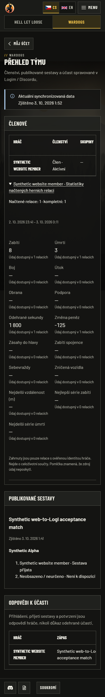
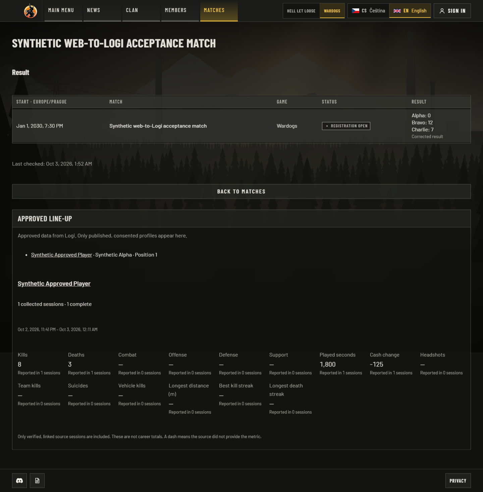

# Logi people: local acceptance evidence

The website reads Logi membership, published rosters, attendance responses and verified
player facts. Management remains in Logi/Discord. News and CMS content remain
website-owned. Public enrichment additionally requires an explicit association to an
existing consented, published website profile and separate statistics/roster opt-ins.

This is **local acceptance with synthetic identities**, completed on 3 October 2026
in Europe/Prague (JSON timestamps are UTC, on 2 October). It is not hosted or
production acceptance. The paired runtime uses real Next.js handlers, a separate local
Convex backend, authenticated HTTP pulls, disposable PostgreSQL and Chromium.

## Tested source and results

- Website runtime: `b47796c913d9d65ba3952adafd6462c26f1ec71a`, based on merged PR #83
  at `f13332e334eda7c0db75077412f8c72c4e08d271`.
- Optimized website build: `7RwlYoJbvvirW8MEZoocO`.
- Producer delivered in Logi `6314c164a3268320688203d36644f9d02d955993`;
  its [tested overlay manifest and evidence](https://github.com/Ninjonik/logi/blob/6314c164a3268320688203d36644f9d02d955993/docs/integrations/website/v0.14/evidence/2026-10-03/README.md)
  identify the preceding exact runtime bytes. Only documentation followed those tests.
- Windows x64, Node 24.21.0, Playwright 1.63.0 / Chromium 153.0.8010.12,
  isolated PostgreSQL 18.4 with ICU cs-CZ. No production credentials were used.

| Check | Result | Evidence |
| --- | --- | --- |
| Website lint, typecheck, optimized build | Passed | [Checks](checks.json) |
| Website unit suite | 894 passed | [Checks](checks.json) |
| Website real PostgreSQL integration suite | 476 passed | [Checks](checks.json) |
| Existing browser regression suite | 199 passed, 124 opt-in captures skipped | [Checks](checks.json) |
| Actual Logi → website browser flow | 23 assertions passed | [Browser checklist](browser-proof.json) |
| Upgrade from nonempty schema 0009 to 0010 | 7 assertions passed | [Migration proof](migration-proof.json) |
| Provider regression suite / typecheck / webpack build | 725 passed / passed / passed | [Producer evidence](https://github.com/Ninjonik/logi/blob/6314c164a3268320688203d36644f9d02d955993/docs/integrations/website/v0.14/evidence/2026-10-03/README.md) |
| Provider people reads / native roster management | 46 / 17 actual local HTTP assertions passed | Same producer evidence |
| Source and attached artifact identity | SHA-256 recorded | [Source manifest](source-manifest.json), [artifact manifest](artifact-manifest.json) |

The 52-file source manifest includes this addition and the upstream application changes
merged while work was in progress. Every website check saw identical source hashes.
The following evidence/status/asset-manifest commit changes no tested runtime code.
The migration proof used the previous `79e0486` schema 0009; that schema is unchanged in
the new base, and the tested migration checksum still matches 0010. Exact-head GitHub
CI is recorded in the PR discussion, separately from these local runs.

## Paired flow and reproduction

1. Seed one synthetic native member, published roster, attending response and collected
   session in isolated Logi. The session has a synthetic verified Steam binding and an
   explicit reviewed result association. Issue separate people/data/membership grants.
2. Run the real website `logi:sync` CLI until both configured scopes are caught up. The
   people collections, opaque cursors and sync records reach PostgreSQL over HTTP.
3. An anonymous visitor is redirected to sign-in. Reusing a synthetic durable central
   Logi login opens the permitted Wardogs team view; the same login cannot read HLL.
4. The CS/EN team view shows membership, a published squad and an attending response.
   Statistics retain 8 kills, 3 deaths, -125 cash change and missing metrics as dashes.
   No roster/attendance write controls exist. Phone page width stays contained.
5. Select an exact source member for an existing website profile in the admin editor.
   Both publication opt-ins start off. Saving through the actual browser action
   persists the immutable member/user association and selected options.
6. The public profile retains its approved website name and exposes no native identity,
   Discord/platform identifier or service credential. The linked match displays only
   session facts associated with its current reviewed result version.
7. Withdrawing profile consent immediately hides the profile and removes its public
   match rows. Removing the current role immediately denies the private team view.
   Synthetic consent/role state is restored at the end of the test.

PostgreSQL regressions additionally cover source resets/errors, all-session attribution
freshness, consent/remapping races, current-session expiry and logout while waiting for
a write lock, MFA, scope/role denial, unique bindings and opt-in defaults. Polling tests
cover empty continuation pages, a 55-page baseline and separate budgets.

Use the project toolchain and a disposable PostgreSQL database:

```sh
pnpm lint
pnpm test:unit
pnpm test:integration
pnpm build
pnpm typecheck
pnpm test:e2e
node scripts/check-foundation.mjs
```

For the paired scenarios, use separate local provider/consumer runtimes, synthetic
native data/grants and the sequence above. Private fixture helpers, filled environment,
tokens, cookies and databases are excluded. Committed parser/route/projection and
PostgreSQL tests provide deterministic regressions. See the
[people contract and operator steps](../../integrations/logi/people.md).

## Review

Review checked contracts, immutable identity binding, current role/session fences,
consent gates and freshness. Corrections keep native directory metadata private,
suppress the whole statistics scope when any attribution expires, recheck the local
interactive session at the final association write and contain phone tables. Native
Logi roster management follows current session/workspace authorization; this does not
grant website roster writes.

A bounded source review after rebasing onto PR #83 found no actionable interaction
regression. That reviewer authored the consumer, so this is an independent review of
upstream/publication interactions, not their whole implementation. Automated tests and
the paired runtime were run by the integrator. No review replaces hosted acceptance.

## Inspected screenshots

All eight images are actual captures of the optimized revision/build above, with
synthetic records. Desktop viewport: 1440 × 1050; phone: 390 × 844. Images are full-page,
so capture height can exceed viewport height. Times render in Europe/Prague. No image
generation or redaction was used. They are registered as evidence-only assets.

| Capture / locale / route | Expected and observed result |
| --- | --- |
| [Private team, CS desktop](team-cs-desktop.png), `/cs/wardogs/team` | Member, published squad, attending response and expanded collected-session statistics after real sync |
| [Private team, CS phone](team-cs-phone.png), same route | Readable statistics; wide tables scroll inside their region without widening the page |
| [Private team, EN desktop](team-en-desktop.png), `/en/wardogs/team` | Same source records and English labels; attendance responses remain distinct from played attendance |
| [Association editor, CS desktop](association-cs-desktop.png), `/cs/admin/members/logi` | Saved exact member/profile association and independent opt-ins; the synthetic native ID is visible only in this authorized editor |
| [Public profile, CS desktop](profile-cs-desktop.png), `/cs/members/synthetic-logi-proof` | Approved name, collected-session metrics, null markers and approved roster position |
| [Public profile, CS phone](profile-cs-phone.png), same route | Contained two-column metrics; browser assertion confirms no page overflow |
| [Public match, EN desktop](match-people-en-desktop.png), `/en/wardogs/matches/logi/{synthetic-id}` | Approved player and exact reviewed-session statistics; the future date and scores are synthetic fixture values |
| [Role removed, CS desktop](team-role-removed-cs.png), `/cs/wardogs/team` | Same signed-in session is denied after current role removal |

The initial phone overflow was reproduced during browser proof and corrected before
these final captures. Selected views are embedded below; the table links all states.

Private CS team on a phone: synchronized membership, contained statistics and published
roster/attendance sections on the actual local optimized build.



Public EN connected match: only the approved player appears, with the collected-session
facts tied to the current reviewed result.



## Limits and next activation

Not exercised here: a new live Discord OAuth login, actual Steam ownership verification,
production CRCON/Warcon collection, real Discord command redesign, hosted callbacks,
production migration, scheduler activation or deployment. Earlier live-provider evidence
was not rerun by these fixtures. The website's separate
[pre-activation follow-ups](../../integrations/logi/runbook.md#review-follow-ups-before-activation)
remain documented. Local container execution is not claimed; CI reports its own
container checks. A skipped opt-in capture is not a passed test.

Enable after the qualified producer, restricted keys, migration and scheduler are
available. `syncPeople` defaults off. Statistics cover collected verified sessions,
not career totals. Large histories that cannot meet the bounded freshness contract
remain unavailable. Rollback disables the people source and publication opt-ins; keep
the additive table during application rollback instead of deleting approved mappings.
