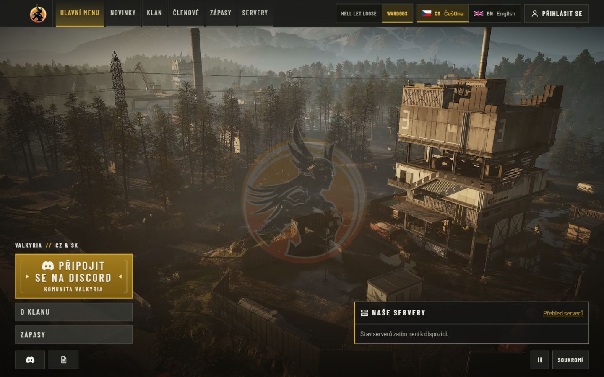
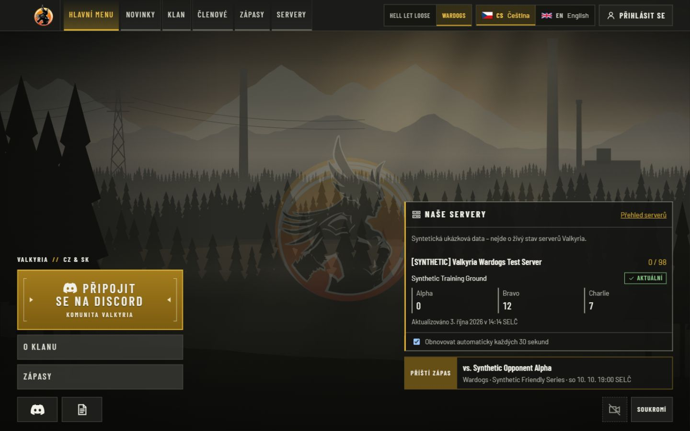
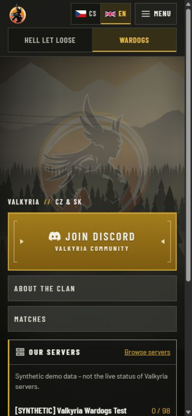
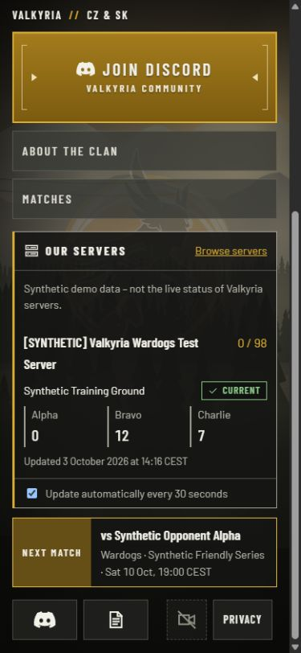
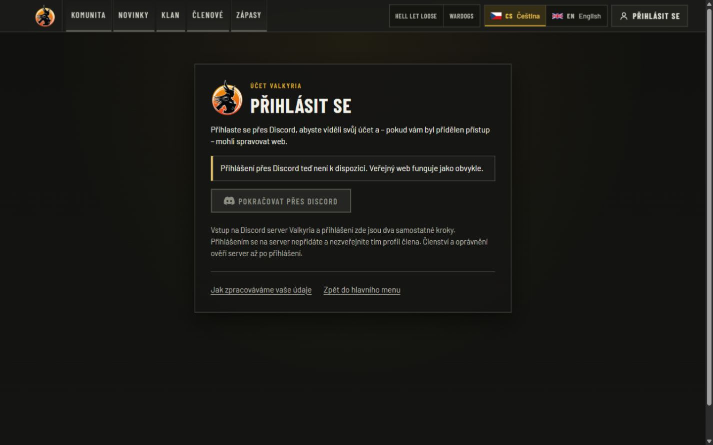
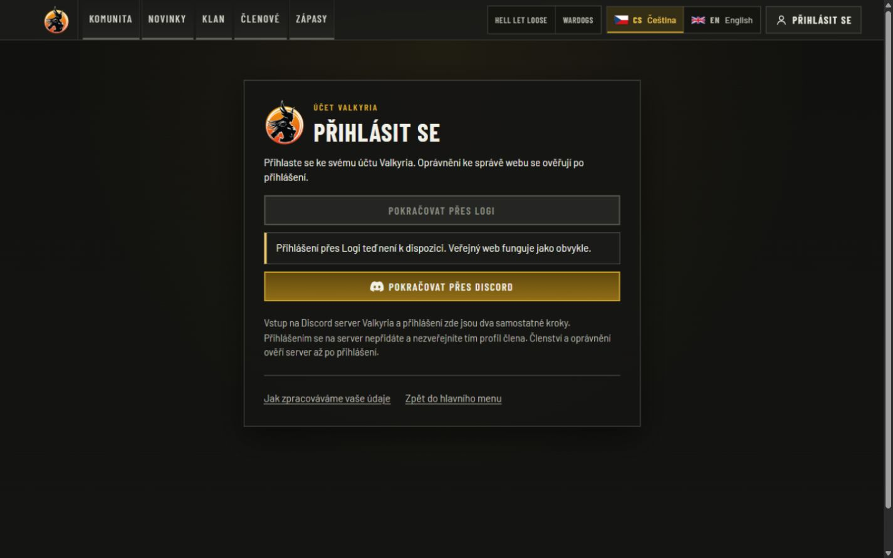
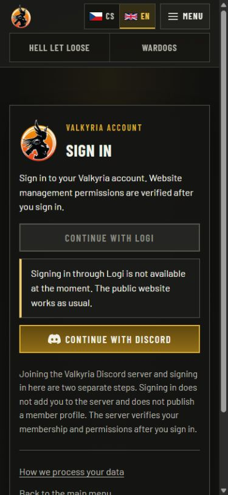
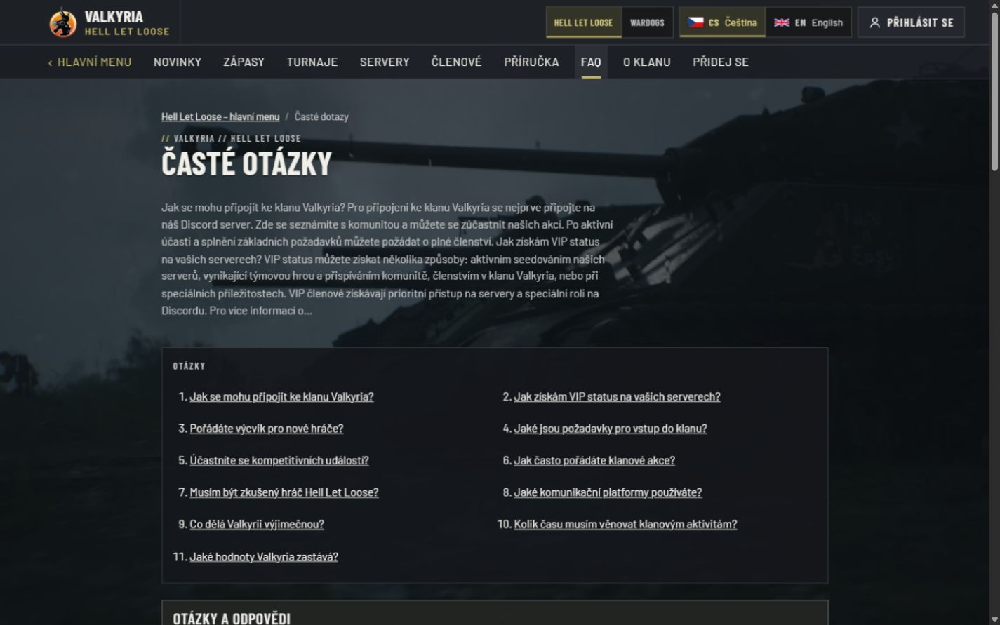
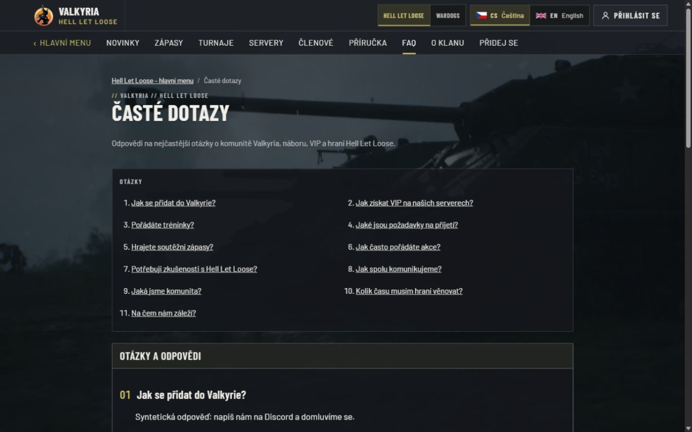

# Website / Logi readiness: review handoff evidence

Runtime/test source: `ce0db5ebb00b2d341d0cde45e49b4e6f296f83e1`, based on
`0a94d59c32831cfa198a0371bf204523e6555a3a`. Optimized Next.js build:
`_Xdm70C5k9uTgh4u_8UfD`. Windows x64, Node 24.21.0, pnpm 10.34.5,
PostgreSQL 18.4 (UTF-8, ICU en-US), Chromium. Captured 3 October 2026,
Europe/Prague. [Source fingerprints](source-manifest.json) connect the tested
working files to the committed blobs; line-ending normalization is explicit.

## Observed verification

| Criterion | Reproduction and observed result |
| --- | --- |
| Login readiness | CS/EN login shows Logi even when disabled, with a localized notice; only configured/permitted Discord fallback appears. Unit/server-action and browser checks passed. No hosted OAuth attempt. |
| Admin scope | HLL editors get the manual, WDG-only editors do not; platform-wide Pages/FAQ requires platform authority, including direct URLs. Unit, PostgreSQL and CS/EN browser denial checks passed. |
| Manual editor | Search preserves its route and selected filters. Dirty metadata supports stay/save/discard; validation/network failure preserves values and permits retry. All four new CS/EN browser cases passed. |
| FAQ | Imported body-prefix excerpt becomes a concise localized introduction; independent editorial summaries and answer content remain. Renderer and real CMS publication/browser regression passed. |
| Logi collection reset | A pagination `410 reset_required` starts a fresh complete shadow generation; abandoned rows never enter the promoted snapshot. Multi-pass transport regression passed. |
| Logi server failure | A collector error after recent success immediately marks HLL/WDG data stale/unknown and removes scores. Six network/401/403 regression cases passed. |
| WDG controls | Larger desktop actions and utility icons; inspected CS desktop and EN phone captures without horizontal overflow. Existing responsive/header browser regressions passed. |
| Local regression | Lint, typecheck, optimized build passed; **929 unit, 482 PostgreSQL, 214 browser tests passed**. **124 opt-in captures skipped**, zero retries. See [checks](checks.json). |

Commands: `pnpm lint`, `pnpm typecheck`, `pnpm test:unit`,
`pnpm test:integration`, `pnpm build`, `pnpm test:e2e` with disposable fixtures.
The clean E2E run used `CI=true` to prevent reusing a server whose fixtures had
already been modified by admin tests. A prior new-test filter-navigation race was
corrected by waiting for committed selection/form state, without weaker assertions.

These checks ran before commit; the unchanged app bytes were verified before
staging. There is no new local container/hosted-provider acceptance. Latest-head
CI belongs to the PR and must be checked before merge/publication. The owner
authorized Claude to complete that review and website release autonomously.

## Inspected public UI captures

All images are actual browser screenshots, unedited and unredacted. The viewport
excludes browser chrome; image width may exclude the vertical scrollbar. Before
captures are public production at the base above. After captures are the local
optimized build with synthetic data and intentional missing-MP4 fallback. They
do not claim identical backgrounds/content or successful production recovery.
Image dimensions, routes, context and hashes are in [captures](captures.json).

Live `/cs/wardogs`, 1440×900: the original small actions and utility icons.

Local `/cs/wardogs`, 1440×900: larger action column and footer controls; the
synthetic server/next-match panels remain visible. Fallback background is expected.

Local `/en/wardogs`, 390×844: actions stay within the phone viewport. The second
capture is scrolled to show the footer; it is not a stitched/full-page screenshot.

Live `/cs/login`, 1440×900: Logi is absent. Local CS desktop and EN phone: Logi is
visible but unavailable, while the harness supplies a synthetic Discord fallback.
These captures prove rendering, not real hosted login or production configuration.

Live `/cs/hll/faq`, 1440×900: the introduction duplicates the beginning of answers.
Local same route/viewport: short localized introduction and intact synthetic FAQ.

## Remaining review and acceptance

- The owner stopped implementation for handoff. New manual screenshot attachments
  were not visually inspected; inspect/regenerate CS/EN admin proof before marking
  the PR ready. Behavioral tests passed, but this visual review is still pending.
- Hosted Logi deployment/grants, real sign-in/role removal/central logout and sync
  scheduling remain distinct acceptance. Production lacks the necessary configured
  client/source inputs at the read-only observation; do not claim activation.
- FAQ/manual articles already have editors. Taxonomy definitions (#86), approved
  League/Warcon readers (#87), and integration health administration (#22) remain.
- Existing RSC destination-stream cancellation logs do not close issue #46.
- Images are verification-only, registered in `assets/manifest.json`, and must not
  be imported into runtime artwork. The full [handoff](../../handoff/claude-logi-web-readiness-2026-10-03.md)
  specifies the owner's authorization, review order and release checks.
