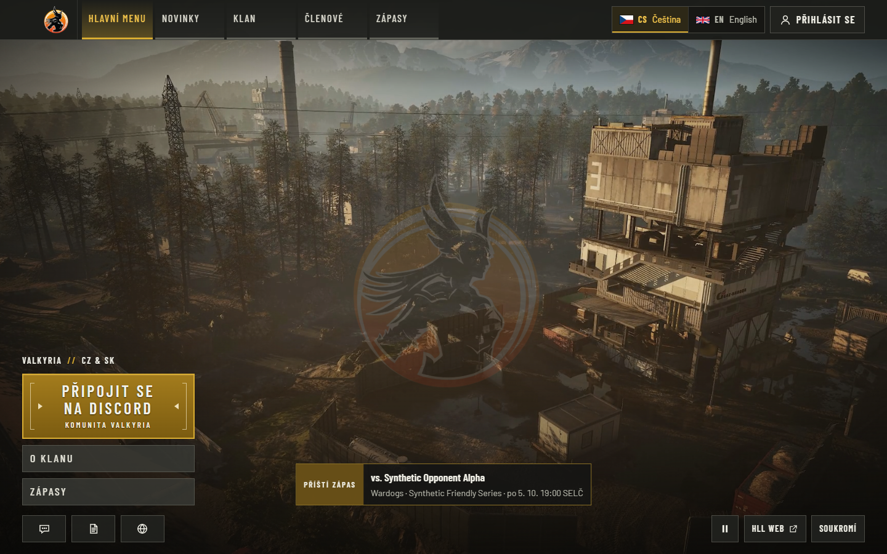
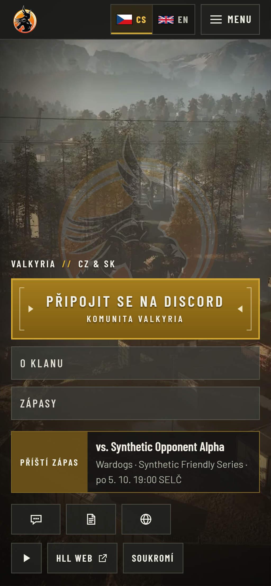

# Native full-length H.264 playback proof

Issue [#25](https://github.com/ValkyriaWDG/www/issues/25), partial acceptance evidence recorded on 2026-09-28.
The actual standalone application played the full primary H.264 rendition through a natural loop in
**Microsoft Edge 154.0.4258.37 on Windows x64**, headless. The original WebM-first configuration also
selected MP4 after a controlled WebM network failure. All **11 MP4-only scenarios and 2 dual-source
scenarios passed**, with no skipped tests in these runs. No application source was changed for this proof.

This does **not** close cross-browser or real-device acceptance: actual Chrome, Firefox, Safari/macOS,
Safari/iOS, mobile hardware performance and production delivery remain unverified by this run.

## Tested revision and controls

- Source: `14b0863c498f3f117426e448dfe68dcceb977b5f`, clean tracked worktree; `pnpm build` passed immediately
  before execution. Standalone build ID: `CsQZWZbcbmDXkWmy1yD7b`; Node `v24.21.0`.
- The player, settings, site configuration and media manifest were byte-equivalent to merged main
  `b3793139` (`git diff` of those paths was empty). This is not a claim that the entire revisions are identical.
- PostgreSQL 18.4, loopback only, disposable test database and synthetic fixtures. Discord was a local
  test double. No production access, provider credentials, publication or deployment occurred.
- MP4-only run: the test-server environment sets `BACKGROUND_VIDEO_WEBM_URL` to an empty string.
  It uses the same application player and native media APIs, with one actual MP4 source element.
- Dual-source run: original WebM-first/MP4 source order. One scenario is unchanged; the other aborts
  only WebM requests through Playwright routing. Media APIs, player state and decoder capabilities
  were not replaced or forced. This proves one network-failure path, not every codec failure mode.
- The Playwright project is named `chromium` and inherits a desktop device preset, but launches the
  installed **Edge** executable. Those names do not establish Chrome coverage.
- Narrow/coarse-pointer checks emulate a Pixel 7 viewport in desktop Edge, not a physical phone.
  The existing hidden-tab and Save-Data checks simulate the corresponding browser properties/events.

[Provenance and source hashes](provenance.json) identify the player, configuration, original media test
and ignored harness. [The delivery metrics](metrics/mp4-only/delivery.json) contain all four verified
artifact digests, byte sizes, MIME types, cache headers and range-response results. The existing
[media manifest](../../../assets/background-media.json) retains source and rights provenance.

## Observed playback

| Check | Observed result | Evidence |
| --- | --- | --- |
| Native primary MP4 selection | `wardogs-menu-full-1080p-619b27261fc9.mp4`; H.264 support `probably`; 1920×1080; duration 192.466016 s | [Natural playback](metrics/mp4-only/playback-natural-wrap.json) |
| Full uninterrupted first loop | From first `playing` to observed wrap: **192.472300 wall-clock seconds** at rate 1. Time changed from 192.396801 to 0.000063; 5,774 frame callbacks before wrap. No scripted seek during this first pass. | [Natural playback](metrics/mp4-only/playback-natural-wrap.json) |
| Frame quality during full pass | 0 dropped frames; median callback gap 34 ms, p95 34.1 ms, maximum 36.1 ms; no observed video-layer hiding at wrap | [Natural playback](metrics/mp4-only/playback-natural-wrap.json) |
| Playback events | 2 `waiting`, 2 `playing`, 1 native loop `seeking`, 1 `seeked`; no recorded `stalled`, `error`, `pause` or `ended` in the full-pass snapshot. Waiting-event timestamps were not separately captured, so their individual causes are not established. | [Natural playback](metrics/mp4-only/playback-natural-wrap.json) |
| Route reuse and admin pause | Same video element across news, matches, members and home; admin pauses; direct admin loads request no video. This short navigation check recorded **2 dropped frames out of 94**, unlike the zero-drop full-pass result. | [Route persistence](metrics/mp4-only/route-persistence.json) |
| Manual pause/reload/resume | Pause persisted; paused reload made zero video requests; explicit resume fetched and played MP4 | [Pause](metrics/mp4-only/manual-pause.json) |
| Poster and motion policy | Reduced motion, simulated Save-Data and narrow/coarse viewport made zero video requests before opt-in; poster loaded. Narrow-view opt-in then played primary MP4. | [Reduced motion](metrics/mp4-only/zero-requests-reduced-motion.json), [Save-Data](metrics/mp4-only/zero-requests-save-data.json), [Narrow view](metrics/mp4-only/zero-requests-mobile.json) |
| All media rejected | Poster remained available when all video requests failed | [Failure state](metrics/mp4-only/rejected-media.json) |
| Original two-source order | Edge selected WebM; no MP4 request in the unchanged scenario | [WebM-first](metrics/dual/default-webm-first.json) |
| WebM network failure | Native application player selected 1080p MP4; playback advanced; no media error | [Fallback](metrics/dual/controlled-webm-network-failure.json) |
| Rendition seek/decode | Primary MP4, compact 720p MP4 and WebM decoded at midpoint and near the end. Full continuous-loop timing here covers only the primary MP4. | [Seek probes](metrics/mp4-only/rendition-seeks.json) |

The first full-pass metrics were saved before the subsequent darkest/brightest-frame seek captures.
The source scene transition is preserved; no claim of an artificially seamless loop is made. Local
headless decode performance does not predict production network or mobile battery performance.

## Actual captures

These are unmodified browser screenshots of the tested app, with synthetic content. Captions describe
the conditions; the JSON metrics provide temporal proof that a still image alone cannot establish.
Three captures are published here; the run also produced the other caption-metadata records under
`metrics/mp4-only/`, whose image files remain local. Third-party Wardogs imagery is excluded from the
repository's code license; these captures are verification evidence, not reusable product artwork.



**Czech desktop home, 1440×900:** primary full-length H.264 selected in the actual app at approximately
4 seconds. Logo and menu remain legible over the moving background. [Capture metadata](metrics/mp4-only/screenshot-cs-desktop-home-playing.json).


**Czech desktop home, 1440×900:** original two-source configuration; WebM network requests deliberately
failed, then the native player selected and advanced the full H.264 MP4. [Scenario metrics](metrics/dual/controlled-webm-network-failure.json).



**Czech narrow/coarse viewport, 390×844 CSS pixels:** poster-first state and explicit play control,
with zero video requests before opt-in. PNG is 1024×2216 due to emulated device scale. This is desktop
Edge emulation, not Android or iOS. [Capture metadata](metrics/mp4-only/screenshot-cs-mobile-home-poster.json).

## Reproduction

The test uses the repository's existing standalone-server, media and synthetic-auth fixtures. Supply
the approved full media bundle out of band; videos are intentionally not committed here. Check the
four files with `node scripts/media/verify-bundle.mjs <approved-bundle-directory>`, then place those
verified derivatives in ignored `apps/web/public/media/background/` as described by the media guide.

Use a disposable **loopback PostgreSQL** instance. The harness creates/migrates/resets its `_e2e`
database and exercises synthetic administrator fixtures. Never supply a production connection.
Set environment variables without printing their contents:

| Variable | Required value |
| --- | --- |
| `DATABASE_URL` | Disposable loopback PostgreSQL administrative connection |
| `E2E_DATABASE_URL` | Separate disposable target ending `_e2e`; this run used `valkyria_edge_h264_20260928_media_e2e` |
| `E2E_MEDIA_PORT` | Unused loopback port; this run used `3317`, with local mock on `4317` |
| `PLAYWRIGHT_CHROMIUM_EXECUTABLE` | Installed Edge executable; record the actual version for any rerun |
| `H264_PROOF_MODE` | `mp4-only`, then `dual` for a separate invocation |

From the repository root:

```sh
pnpm build
node docs/evidence/native-media-2026-09-28/harness/prepare.mjs
```

Then from `apps/web`, run the following once for each `H264_PROOF_MODE` value:

```sh
node node_modules/@playwright/test/cli.js test -c .local/edge-h264-proof/playwright.config.ts
```

The recorded execution used an ignored local wrapper to inject those environment variables and
invoke this exact Playwright command. Its credential-file adapter is deliberately omitted. The
original commands were `node apps/web/.local/edge-h264-proof/run.mjs mp4-only` (11 passed, 4.3 minutes)
and the same wrapper with `dual` (2 passed, 16.5 seconds). The portable preparation script writes
byte-identical tested specs/config and refuses to adapt a changed source anchor silently.

New output lands under ignored `.local/evidence/edge-h264-2026-09-28/<mode>/`. Runs produce actual
metrics/captures; do not publish traces, cookies, database URLs or unsanitized test logs. Rebuild on the
revision under review and record new hashes rather than presenting these historical metrics as a rerun.
