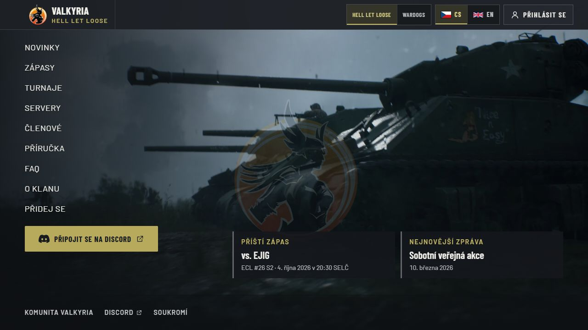
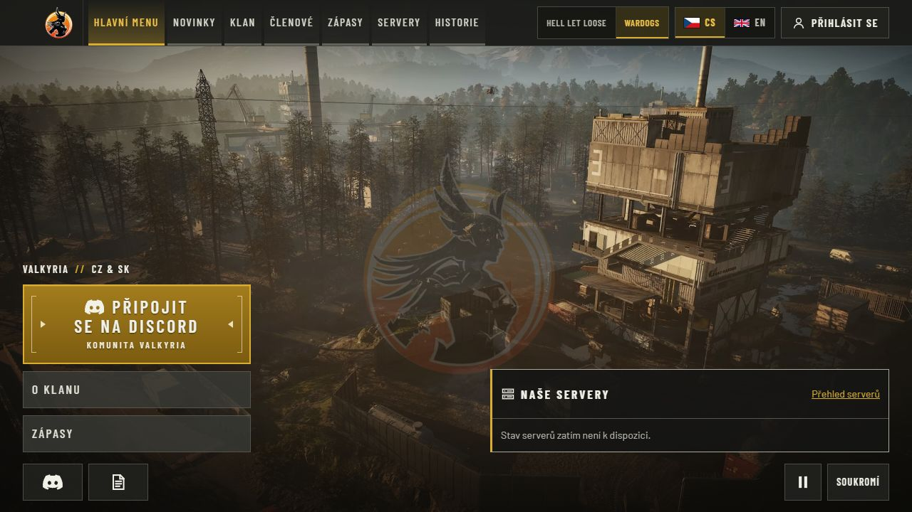
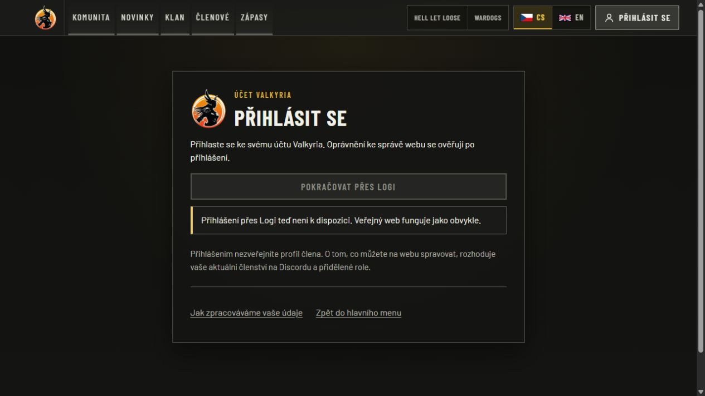

# Production deployment — 2026-10-04

The owner requested deployment of the latest published website image. This is
production runtime evidence, separate from the publisher's synthetic CI tests.

| Item | Observed result |
| --- | --- |
| Accepted source | `3dbfee7f4612dbcb943ecb324ee6763127002bd4` |
| Public image | `majorluk/valkyria-www` |
| OCI index digest | `sha256:d6087257f939e2294f651df32fe9d2a3ed72e13569cba843e58884cf82e60ad3` |
| Publication and repeated CI | [37162780893](https://github.com/ValkyriaWDG/www/actions/runs/37162780893), successful |
| Previous source | `0a94d59c32831cfa198a0371bf204523e6555a3a` |
| Previous index | `sha256:336c317a50c5be1bd639259c582dc88177d9c4d6d7701acabf5508e8706b56ec` |
| Deployment | Healthy app, exact accepted digest; CS/EN HLL and Wardogs |
| Production channel | Exact existing OCI index copied with attestations preserved |
| Scheduled publishing and backups | Existing timers resumed; successful service status |
| Automatic updater | Existing dedicated Watchtower resumed, 300-second interval |

The first natural poll completed at 01:17:35 UTC: `scanned=1`, `updated=0`,
`failed=0`. The container ID was unchanged from post-promotion acceptance and the
accepted image remained healthy. This proves the resumed selection/polling path
and no unnecessary restart for the unchanged digest, not a future replacement.

## Database and storage acceptance

Automatic promotion correctly held this candidate because its migration bundle
changed. The operator stopped the dedicated updater, waited for scheduled writers,
and froze the application before taking paired database/media backups. No shared
database service, proxy, tunnel, unrelated container or DNS record was restarted.

The PostgreSQL 15 backup restored into a uniquely created disposable database owned
by the application role. All 37 table-content fingerprints matched the frozen
source. Extracted editorial media matched all 442 file hashes. Runtime settings
and configuration snapshots are retained in protected operator storage, outside
this repository. This verifies on-host recovery; it does not establish encrypted
off-host backup retention.

The candidate's explicit `/app/scripts/migrate.mjs` runner applied migrations
`0011_taxonomy_admin` and `0012_league_match_url` under its advisory lock: 2 applied,
11 existing, 13 total. Repeating it applied 0 with 13 already present. Comparing
existing columns before/after proved existing table content was preserved. The
same upgrade and retry results were observed in production, with the same
post-upgrade fingerprints as the restored copy.

Before production migration, both the candidate and previous image passed
liveness, readiness and 9 public-page route checks against the upgraded disposable
copy. Those probes used disabled external providers and no public host ports;
they prove image rollback compatibility, not hosted Logi or Discord acceptance.

The first deployment attempt compared Docker mount arrays in their returned order
and rejected the replacement. It automatically restored the previous image and
verified readiness. The retry compared complete mount objects sorted by their
destination, preserving paths, read/write flags and propagation. Effective runtime
environment, media/cache/background mounts, non-root/read-only execution and the
absence of published host ports were retained. The failed attempt and rollback
remain in the protected operator records.

## Live verification

`runtime.json` contains the sanitized runtime, migration and image-rehearsal result.
`public-http.json` records two consecutive liveness/readiness/canonical-page rounds
and additional public routes. Full readiness checked configuration, database,
schema and editorial media; all returned `ok`.

Representative operator commands (protected environment supplied separately):

```sh
docker buildx imagetools inspect majorluk/valkyria-www:production
docker image inspect majorluk/valkyria-www@sha256:d6087257f939e2294f651df32fe9d2a3ed72e13569cba843e58884cf82e60ad3
docker compose run --rm --no-deps --entrypoint node web /app/scripts/migrate.mjs
docker compose up -d --no-deps --wait --wait-timeout 120 web
curl --fail https://valkyria.cz/api/health/live
curl --fail https://valkyria.cz/api/health/ready
docker logs --since 10m valkyria-watchtower
```

The image was first pinned by digest for verification, then the exact OCI index was
promoted and the Compose channel restored to `production`. The promotion checked
that no container publisher was running and rechecked the old alias immediately
before writing. No immutable revision tag was rebuilt or overwritten.

Browser proof below is from the live canonical origin at 1280×720. Navigation from
HLL to Wardogs and then to the new history section completed; no browser console
errors were observed. History correctly showed the unconfigured/unpublished data
state. No provider credentials were supplied or enabled by this deployment.
The Wardogs video was observed playing (`paused=false`, `muted=true`,
`readyState=4`, playback time approximately 30 seconds) from the canonical media URL.







## Remaining boundaries

- Production SSO, privileged admin mutations, role-removal behavior and real
  Logi/League/Warcon data require their existing configuration and acceptance work.
- The source/image identity and healthy runtime are verified; a loaded page alone
  is not proof of every feature or external integration.
- Watchtower has no automatic application rollback. Future schema/runtime changes
  continue to be held for the documented operator workflow.
