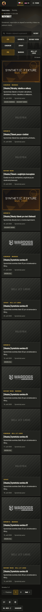
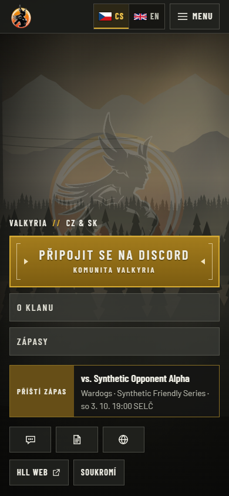
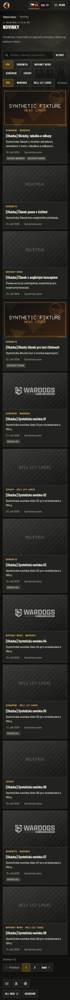
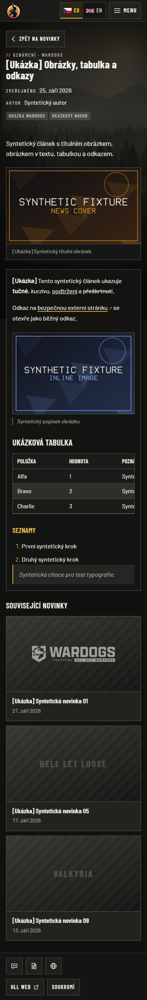

# Release hardening evidence — 2026-09-26

## Linux follow-up: budgets passed, runtime correction pending

[CI run 36265109815](https://github.com/ValkyriaWDG/www/actions/runs/36265109815)
tested PR head `6d48258926aed74b5e1b27bac93b1143f47520b3` through merge checkout
`5603528d928640211e088443e6aaba858842ecff`. The
[compact evidence record](linux-attempt-36265109815.json) identifies the exact artifacts,
raw-report hashes and three inspected capture hashes. All nine Linux navigations passed:

| Route | Median LCP | Maximum CLS | Maximum transfer |
|---|---:|---:|---:|
| `/cs` | 1976 ms | 0.049400 | 503139 bytes |
| `/cs/news` | 860 ms | 0.002521 | 492609 bytes |
| Synthetic published article | 992 ms | 0.005101 | 585727 bytes |

Both same-source Docker variants built. The disposable rehearsal failed while loading
synthetic fixtures: the standalone pnpm graph contained `sharp`, but external operational
CLIs could not resolve its bare package import. Cleanup passed. Native runtime acceptance,
image rollback/restore, scan comparison and SBOM were not reached; this run is not green.

The correction links only the exact pinned, already-traced package during the image
build, rejecting absent, ambiguous or mismatched packages. Two regression tests and an
actual Windows standalone 8 × 8 WebP encode passed; 32 foundation tests passed locally.
The corrected Linux images still require a new exact-source CI run. This evidence does
not assert results for that later commit. No registry publication or deployment occurred.

## Follow-up: mobile font-swap regression

The first [Linux CI run](https://github.com/ValkyriaWDG/www/actions/runs/36263964911)
failed the unchanged 0.1 CLS limit for `/cs/news`: all three samples were 0.11814349.
[Original CI samples](page-budgets-ci-before-font-fix.json) are retained. The final
screenshot alone did not expose this transient layout defect.

Delaying the actual font responses and selecting a generic Arial fallback reproduced
the wider-fallback behavior on Windows: the game filters lost one row (48 px) when
Barlow Condensed loaded, then the result summary moved onto the previous row.
[Observed source rectangles](font-fallback-diagnosis.json) record the resulting
0.11953 accumulated shift. Native Windows condensed fallback did not expose the same
wrap, explaining why the initial local run passed.

Mobile filter groups now use three equal columns with room for two-line labels; the
result summary has its own row. The CS/EN delayed-font browser regressions failed
before the correction with a 48 px height change and passed afterwards, including
unchanged group height, CLS ≤ 0.1 and unclipped labels. The regular budget runner now
records layout-shift source rectangles to diagnose future failures.

The [new nine-run report](page-budgets-font-fix.json) passed on the same Windows,
Edge 154.0.4258.37 and PostgreSQL 18.4 setup. Source was `1c034dd2347e1e4d7836c39320b0b8ed8bf302be`
plus the uncommitted correction; [source and capture hashes](font-fix-provenance.json)
identify those inputs. This local evidence does not replace a new Linux CI run.

| Route | Median LCP | Maximum CLS | Maximum transfer |
|---|---:|---:|---:|
| `/cs` | 1980 ms | 0.032223 | 524173 bytes |
| `/cs/news` | 976 ms | 0.000758 | 509079 bytes |
| Synthetic published article | 1136 ms | 0.002694 | 604387 bytes |

Production build, lint, typecheck and 30 foundation tests passed. Three new diagnostic
tests prove that rollback failures retain bounded stderr/assertion reasons while
removing generated credentials, database URLs and command arguments. Docker image
build/scan/rollback remain blocked locally and require the candidate's Linux CI.

## Initial local run (historical)

These results use a local production standalone build with synthetic PostgreSQL data,
not the live website. The base commit is `507e704d288cd93d7baa0d1ab22ba8347fd67b0a` with
the uncommitted issue #26 patch. The raw reports explicitly record `sourceDirty: true`;
they do not prove a later commit or Linux CI. [Provenance](provenance.json) records
normalized source hashes and screenshot hashes for this local run.

| Check | Observed result |
|---|---|
| Frozen dependency install | Passed |
| Production build after the emblem loading fix | Passed |
| Lint and typecheck | Passed |
| Dependency-free foundation regression tests | 27 passed, including 8 new budget/scan tests |
| Real PostgreSQL fixtures + nine throttled browser navigations | Passed budget assessment |
| Image build, native image checks, scan comparison, image rollback and restore | Blocked locally by unavailable Docker engine; required Linux CI checks are implemented but not claimed passed |
| Registry publication / deployment | Not performed |

Runtime: Node 24.21.0, Windows PostgreSQL 18.4 and real headless Edge/Chromium
154.0.4258.37. CI uses the locked Playwright Chromium and PostgreSQL 17. See the
[procedure and fixed budgets](../../operations/release-hardening.md) for the exact
network/CPU profile, excluded optional background media and reproduction commands.

| Route | Before median LCP | After median LCP | After maximum CLS | After maximum total transfer |
|---|---:|---:|---:|---:|
| `/cs` | 2756 ms | 2004 ms | 0.032223 | 521971 bytes |
| `/cs/news` | 980 ms | 1072 ms | 0.023926 | 511163 bytes |
| Synthetic published article | 1072 ms | 1340 ms | 0.002694 | 604326 bytes |

The browser identified the emblem as the homepage LCP element. Eager/high-priority
loading brought its median below the unchanged 2500 ms limit. The first after-run home
sample was 3576 ms, so these results do not claim every individual LCP passed. News
and article transfer rose because the persistent emblem now loads eagerly there too;
those bytes are counted. All nine after-run responses were HTTP 200 with zero page
errors, failed/incomplete requests and video requests. This shared local machine's
lab measurements are not production field metrics.

- [Before samples](page-budgets-before.json)
- [After samples and assessment](page-budgets-after.json)
- [Local Docker precheck failure](container-local-attempt.json): stopped at the first
  availability check, with no fixture/image/scan work performed.

These captures show synthetic fixtures and the CSS background fallback. They do not
show the deployed site, game video, authentication or editorial management behavior.

Before merging or releasing, require the exact candidate's Application/Quality gate,
inspect `page-budgets-*`, `release-rehearsal-*`, `runtime-scans-*` and `sbom-*` artifacts,
and reconcile any platform-dependent results. No runtime size reduction or advisory
count is asserted until the two real Linux image builds/scans complete.
