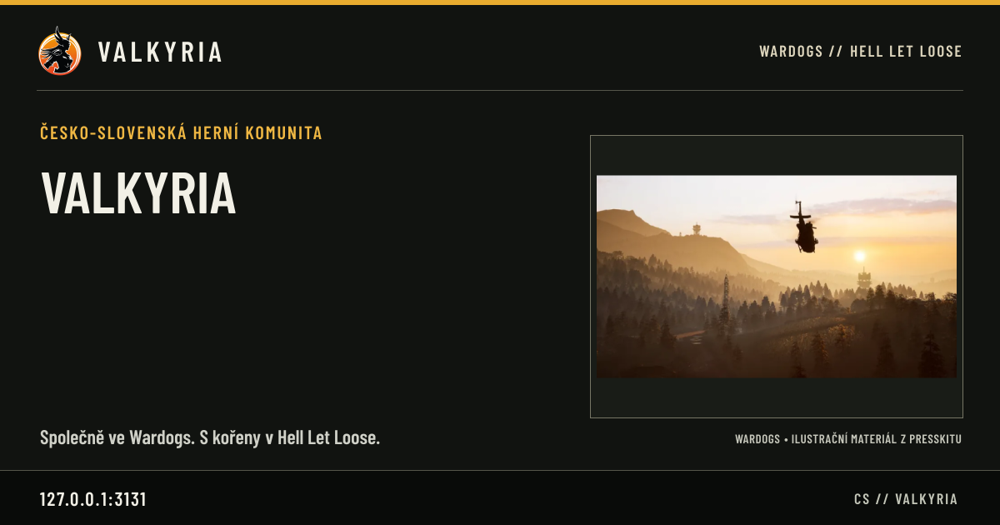
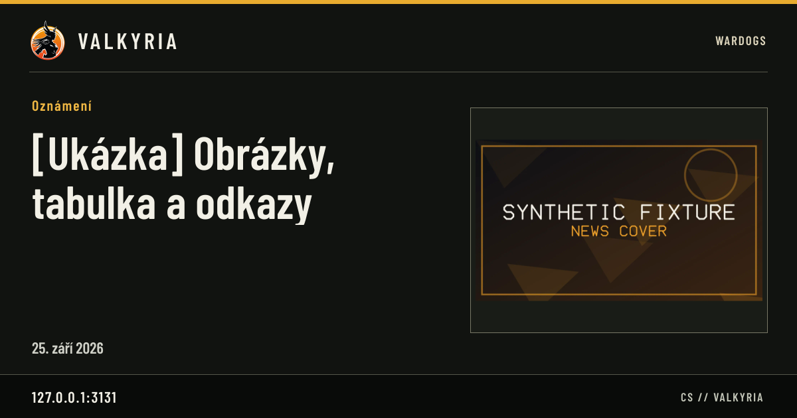
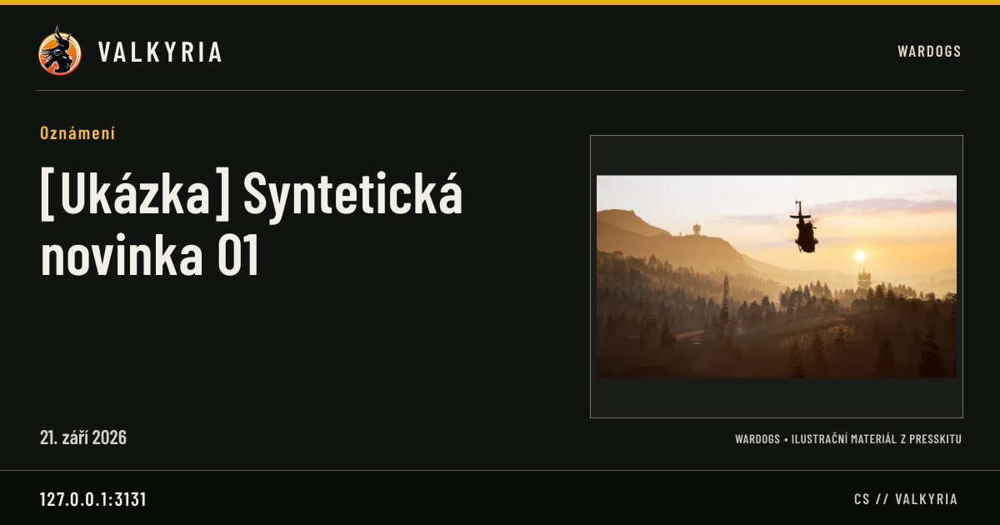
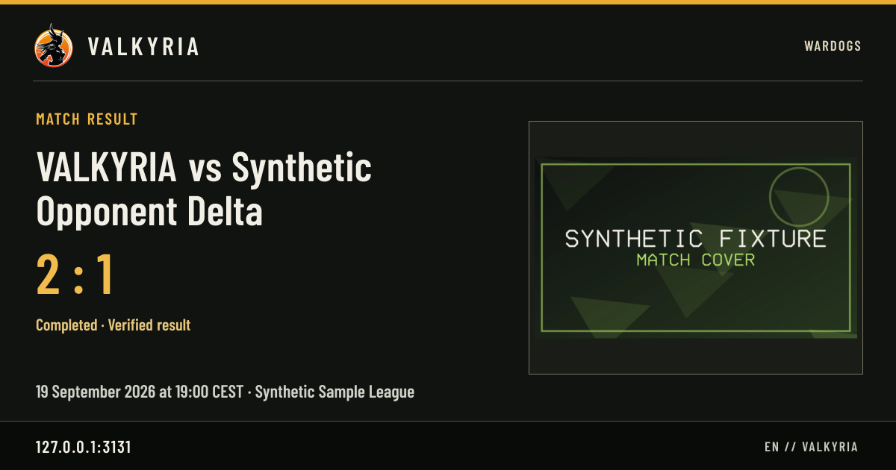
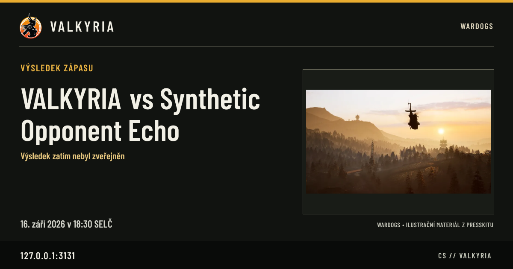
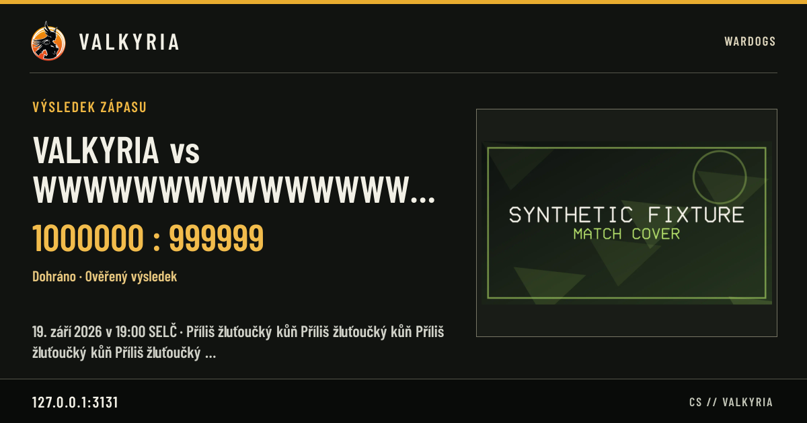
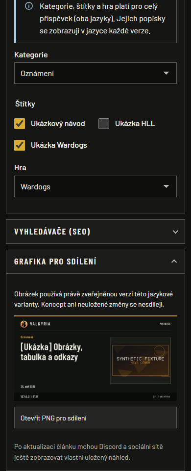
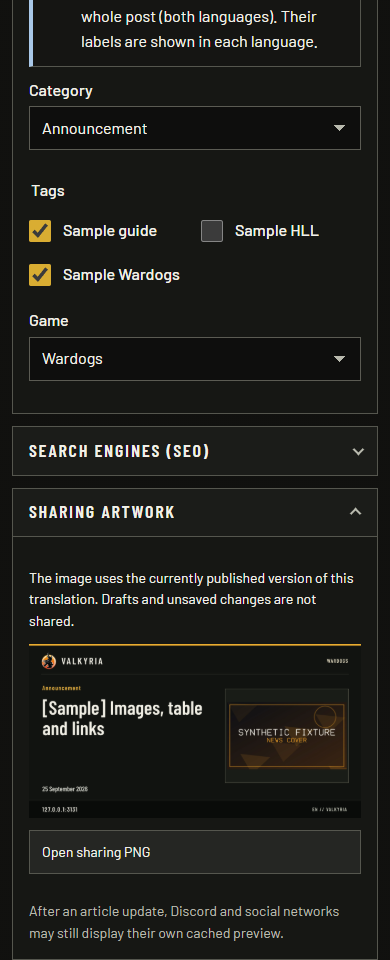

# SEO and editorial sharing evidence — 2026-09-26

Actual local Next.js standalone production build, Node 24.21.0, Windows PostgreSQL
18.4 and Edge 154.0.4258.37. All content and identities are synthetic. Editor sessions
use the existing local Discord REST fixture. No live Discord requests/posts, crawler
unfurl or production deployment were performed.

Source: issue #29/#31 patch over `507e704d288cd93d7baa0d1ab22ba8347fd67b0a`.
[Normalized source fingerprints](provenance.json) identify the uncommitted source
used locally; exact-head Linux CI is a separate gate. [Captions](captions.json)
record capture time, browser and routes. PNG hashes/dimensions are registered in
the root asset manifest. The loopback host in the image footer intentionally shows
the actual test configuration; production uses the configured `APP_URL` host.

## Observed checks

| Criterion | Command / scenario | Result |
| --- | --- | --- |
| Build and quality | Frozen install, `pnpm lint`, `pnpm typecheck`, `pnpm build`, foundation | Passed |
| Card/metadata contract | `vitest run --project unit src/modules/social/social.test.ts` | 5 passed; actual PNG dimensions, Latin/Czech rendering, no external font/image fetch, escaped published JSON-LD, honest unknown scores |
| Publication boundaries | `vitest run --project integration tests/integration/social-images.test.ts` | 2 passed with real PostgreSQL and actual route handler: draft/wrong locale hidden; cached image becomes 404 after unpublish; draft edit does not alter live pixels |
| Browser regressions | `playwright test e2e/social-seo.spec.ts e2e/public-news.spec.ts e2e/public-matches.spec.ts --project chromium` | 26 passed; both canonicals, reciprocal hreflang/x-default, metadata/JSON-LD image consistency, real PNGs, published-only routes and existing public journeys |
| Capture | `CAPTURE_EVIDENCE=1 ... playwright test e2e/visual-social.spec.ts --project chromium` | 1 passed; eight real PNG outputs and four real editor screenshots; 390px and 1440px views have no horizontal overflow |
| Long text and scores | 120-character wide-glyph opponent, long Czech competition, maximum supported score | Actual route PNG visually inspected: ellipsis contains title/detail, score/status/date remain visible |

The full Windows unit run recorded 370 passed / 4 failed: three existing presskit
path-separator assertions and an existing symlink privilege error (`EPERM`). The
full PostgreSQL integration run recorded 227 passed / 2 failed plus cleanup error:
the portable database's `C` locale does not case-fold Czech `ILIKE`, and Windows
retained a sharp fixture-file handle (`EBUSY`). These are not relabeled passes or
worked around by weakening tests. The exact PR head must pass the full Linux suite.
Redirect-related early stream closure diagnostics occurred during otherwise passing
browser journeys; no test failure was suppressed.

## Inspectable outputs

Each PNG below is generated by the implemented public route, not a design mockup.
All are 1200 × 630. Complete covers/presskit scenes are contained in their panel.

Czech default site image: clan crest, localized introduction and visible presskit
illustration attribution. [English equivalent](site-en.png) uses the same template.

Published article: current title/category/date/cover; no unpublished revision text.
[English article](news-en.png) proves translation-specific facts.

Published Wardogs story without a cover: reused Flying artwork is explicitly an
illustration. HLL content instead selects clan artwork (unit contract).

Known score and verification label; this synthetic fixture is not a real clan result.

No score is invented when the result is unknown.

Worst-case title/competition and large score remain contained. Text is truncated only
in this graphic; public article/match metadata retains its original content.

## Editor previews

Real `/cs/admin/news/<fixture-id>?lang=cs` and corresponding `/en/...?...=en` editor.
The sidebar is scrolled to the expanded sharing section. These are full viewport
captures at 390 × 960 and 1440 × 960, reduced motion; no redaction or compositing.
The blank left area on desktop is the editor column above the viewport, not missing
page content. The preview loads the actual public PNG (natural width asserted 1200).

[Czech desktop capture](editor-cs-1440.png) and [English desktop capture](editor-en-1440.png)
show the same section in the wide sidebar. Both languages explain published-only
behavior and external preview caching and provide a working PNG link.

## Remaining acceptance

Review exact-head CI, including its actual standalone container. Issue #29 stays
open until an authorized deployment and fresh public HTTP check prove both live
canonicals. Preserve the historical 29/31 deployment report. Third-party Discord/X
preview rendering, platform caches and search indexing/ranking are not established
by local tests. No migration, dependency or production configuration change is needed
for these templates; the existing `APP_URL` must identify the intended public origin.
