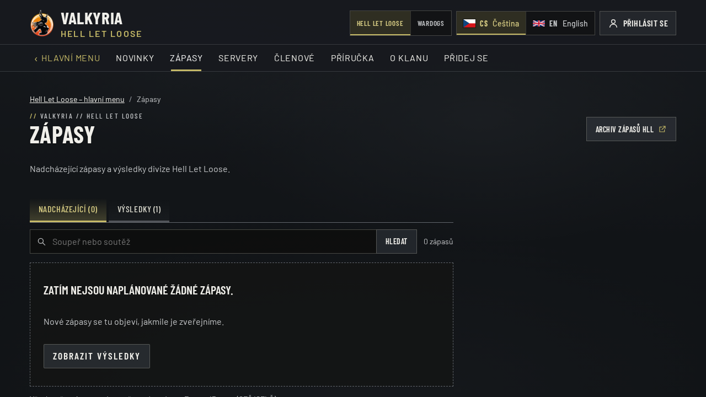
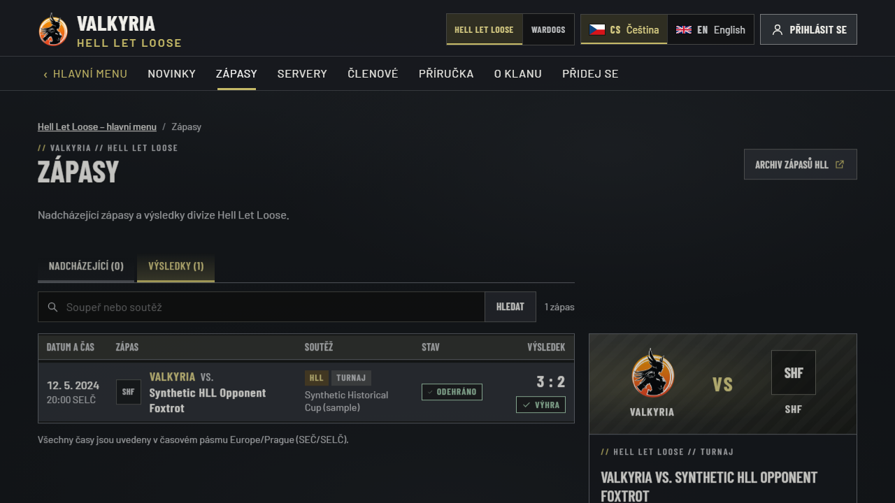

# Query preservation while switches initialize

Issue [#49](https://github.com/ValkyriaWDG/www/issues/49). The repaired game and
language switches distinguish an unknown query from a valid empty query. While the
query is unknown, they preserve the current choice and layout but expose the other
choice as disabled text without an actionable URL or tab stop. Once ready, the
existing query-aware links and unsaved-change guards take over.

If JavaScript remains unavailable, these two switches remain unavailable. Other
ordinary navigation is unchanged. This bounded repair does not claim full no-JavaScript
operation of the interactive application.

## Original publication failure

Publication run [36469751788](https://github.com/ValkyriaWDG/www/actions/runs/36469751788)
tested source `40da3df1d2bee5ad4e99f8d09d590c7b9ada42a9` and stopped before
registry login or publication. The game-switch browser test expected
`/cs/hll/matches?view=results` after leaving the Wardogs results list, but reached
`/cs/hll/matches` and selected Upcoming.

The recorded trace contains a visible, actionable query-less anchor and a correct
query-preserving anchor in a hidden streamed segment. The click resolved the visible
anchor. This is a progressive-rendering defect; adding a test delay would mask it.

The image is the original, unedited synthetic CI screenshot. It shows the wrong
selected tab; query-string loss is proved by the timestamped trace observations in
[publisher-failure.json](publisher-failure.json), not by an address bar in this image.
The JSON preserves the source revision, exact results and original artifact hashes.
Mobile budgets and publication did not run after this failure. No retry or waiver
was used to obtain this evidence. Fix acceptance and deployment remain separate.

## Regression method

`apps/web/e2e/switch-query-hydration.spec.ts` observes the actual server-rendered
fallback in a JavaScript-disabled browser context, then uses a separate normal
context for real game/language navigation. It requires the `view=results` URL and
selected Results tab after navigation. The existing immediate-click platform test
also remains unchanged.

The separate contexts are deliberate: delaying only external script requests does
not stop Next.js inline streamed reveal scripts, so it cannot reliably freeze the
fallback. The regression uses no sleeps, retries, application test flags or DOM mocks.
Synthetic test data stays in a disposable local database; these captures are not
production acceptance or proof of configured Discord/Logi connections.

## Local repair verification

The final regression failed **2/2** on the unchanged `40da3df` production build,
then passed **2/2** on the repaired production build, with zero skips or retries.
Four existing navigation/filter cases and the existing unsaved-editor language guard
also passed. Targeted ESLint, 29 related unit tests and `pnpm --filter @valkyria/web
typecheck` passed. Exact build IDs, file hashes, commands and environment are recorded
in [local-red-green.json](local-red-green.json). Full Linux CI acceptance is a
separate gate; local verification alone does not authorize promotion.

Both captures below are original local Chrome for Testing captures at 1280 × 720,
with synthetic fixtures. Their source and screenshot hashes are recorded in the JSON.
The state bug is independent of viewport; these targeted desktop reproductions do not
replace the existing responsive suite or later production mobile verification.

From `/cs/wardogs/matches?view=results`, selecting Hell Let Loose now opens
`/cs/hll/matches?view=results`. The highlighted Results tab and synthetic 3:2 result
show the expected destination state.

From `/en/hll/matches?view=results`, selecting Czech now opens
`/cs/hll/matches?view=results`, retaining both the HLL section and Results tab.
