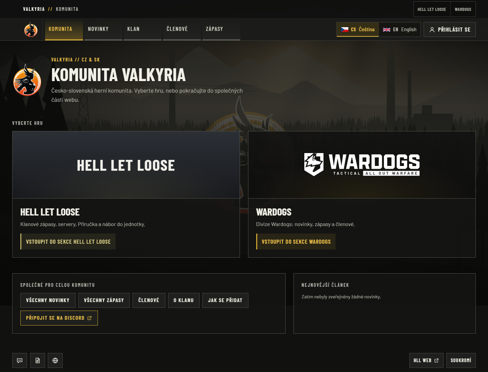
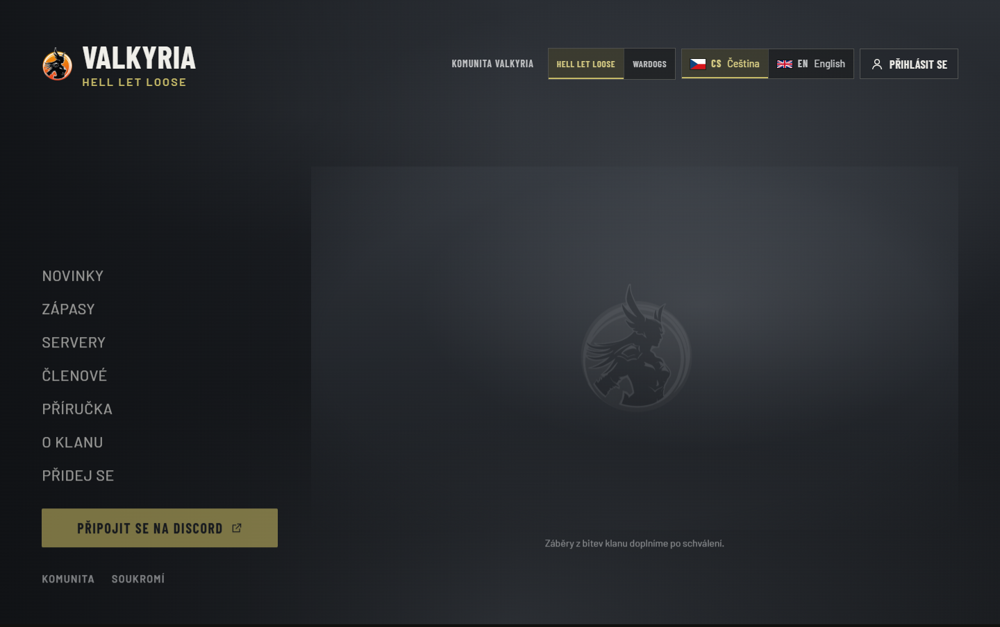
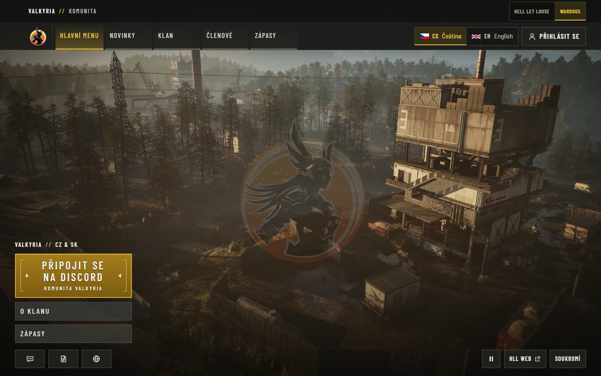
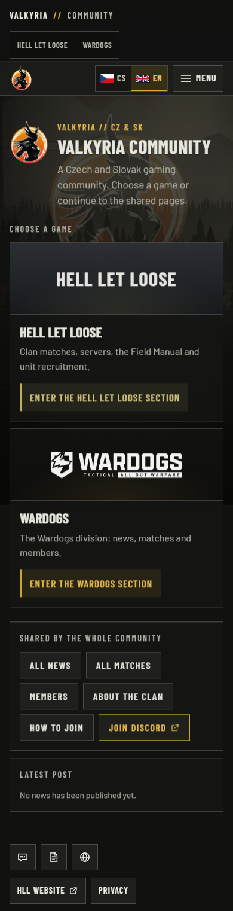
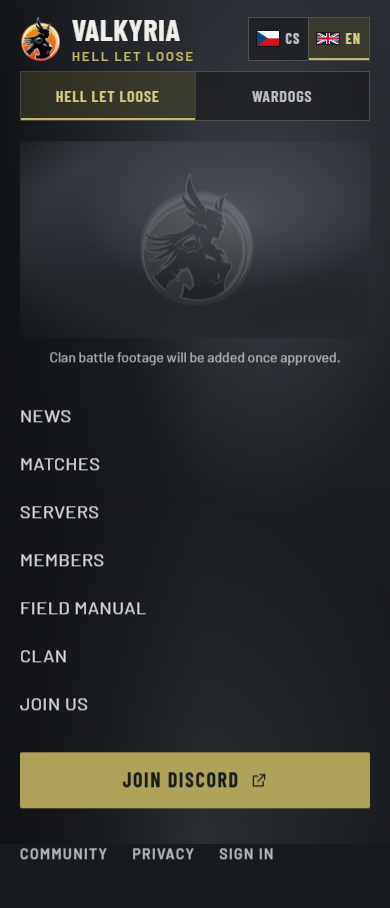
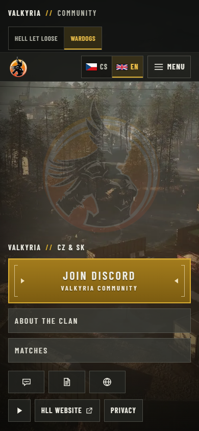

# Unified Valkyria production cutover

On 2026-09-28, the unified community hub, HLL section and preserved Wardogs section
were promoted to **https://valkyria.cz**. The accepted second deployment attempt
completed at **20:37:55 UTC**. Independent public verification remains **partially
failed**: HTTP **54/55** and browser **9/10**. The robots origin defect and the
non-prefetch RSC cancellations below are not waived by healthy runtime checks.

- Source at this cutover: `5e83abc91560480e21b60c4a2638c0b52b0e1720`.
- Image at this cutover: `majorluk/valkyria-www@sha256:79bf4ea15dd185f0618775fee2a794f2e5d024a116943224a1a4a1dcb7afef48`.
- Canonical origin: `https://valkyria.cz`; `www` redirects to the apex. Legacy Wardogs
  domains redirect permanently to the canonical site. `valkyriahll.cz` is unchanged.
- Authentication is disabled. HLL uses its honest no-footage fallback and unavailable
  server-provider state; hosted Logi, legacy content import and live SSO are not enabled.

## Source and publication history

| Gate | Source and observation | Durable evidence |
| --- | --- | --- |
| First candidate PR | PR [#37](https://github.com/ValkyriaWDG/www/pull/37), head `4daac1c`, base `03b12bc`, tested merge `c6dcdca`; CI [36466026870](https://github.com/ValkyriaWDG/www/actions/runs/36466026870) passed | [Original PR record](first-candidate-pr-ci.json) |
| First candidate main | Exact source `40da3df`; CI [36468033696](https://github.com/ValkyriaWDG/www/actions/runs/36468033696) passed | [Original main record](first-candidate-main-ci.json), [original registry check](first-candidate-registry-before-publish.json) |
| First publication attempt | Run [36469751788](https://github.com/ValkyriaWDG/www/actions/runs/36469751788) failed on query loss before registry access, image push or deployment | [Preserved failure](../switch-query-hydration-2026-09-28/publisher-failure.json), [trace and repair](../switch-query-hydration-2026-09-28/README.md) |
| Switch repair PR | PR [#51](https://github.com/ValkyriaWDG/www/pull/51), head `244d2d9`, base `40da3df`, tested merge `e9bb781`; CI [36472898629](https://github.com/ValkyriaWDG/www/actions/runs/36472898629) passed | [Switch-fix PR record](switch-fix-pr-ci.json) |
| Deployed source main | Exact source `5e83abc`; CI [36474517364](https://github.com/ValkyriaWDG/www/actions/runs/36474517364) passed | [Main record](main-ci.json) |
| Accepted publication | Run [36476285050](https://github.com/ValkyriaWDG/www/actions/runs/36476285050) passed verification and protected publication; immutable image and OCI revision matched | [Publication record](publisher-qualification.json), [fresh registry check](registry-before-publish.json) |

The first publication exposed a query-less Suspense fallback before the query-aware
link became visible. Game switching lost `view=results`; the language switch shared
that pattern. Pending choices now remain non-navigable until their complete destination
is known. Two deterministic browser regressions failed on the original build and passed
after repair; neighboring routing and unsaved-editor checks also passed. This repair
does not resolve the separate public-browser network investigation in #46.

Both the switch-fix PR and exact-main CI passed all required jobs: **439 unit, 272
database, 143 browser, 126 tooling, 13 encrypted-recovery and 6 real restore tests**.
There were **98 skipped opt-in browser capture cases**, not additional passes. The
linked records retain full head/base/tested-merge revisions and artifact fingerprints.

PostgreSQL 17.11 CI verified 27 table fingerprints in populated and empty restorations,
6 assets/12 variants, public delivery/private denial and owned-resource cleanup. All
12 image rehearsal stages passed against the actual previous `cab323 / 9a8729` image.
All **15 cold-mobile samples** passed, maximum CLS **0.0402942**; this synthetic budget
profile uses a CSS fallback and excludes delivered game video/poster. Generated CI SBOM
output is the only dirty path in budget provenance. The scan reports **0 fixable
HIGH/CRITICAL findings and 43 unfixed findings**, not zero vulnerabilities. The
CycloneDX 1.6 SBOM contains 114 components.

The separate protected publication repeated qualification, rebuilt the image from the
same source and verified the pulled immutable digest and OCI revision. Independent
anonymous registry reads matched index, amd64 manifest/config byte digests and revision.
No mutable production alias was published. CI runtime/rollback tests exercised the CI
candidate; registry identity is a separate proof, not an assertion of identical CI image
bits. The [prose concurrency regression](prose-scope/README.md) remains intact.
Draft PR [#50](https://github.com/ValkyriaWDG/www/pull/50), including CRCON/statistics and
migration 0002, is outside this deployed source.

## Two deployment attempts, preserved separately

The [first attempt](failed-deployment-01.json) failed at public health JSON parsing
at 20:22:19 UTC. It had already completed a real semantic restore of the fresh paired
backup into a new disposable database: all **25 tables** matched. Migration then
reported **1 applied / 1 already applied / 2 total**, followed by **0 / 2 / 2**.
Automatic rollback restored the previous image and original configuration; the expanded
database remained intact. There was no live database restore or destructive downgrade.
Both timers resumed, and the original DNS/tunnel/proxy state was restored by 20:24:40.

The original failing response headers/body were not retained. The matched proxy request
reached the application with upstream/downstream HTTP 200; subsequent successful probes
cannot establish that response's contents. **The original JSON error's cause remains
unproven**, documented in [#52](https://github.com/ValkyriaWDG/www/issues/52).

The [second attempt](deployment-record.json) used the exact two-migration baseline
left by that expansion. Publication/backup activity and the web process were quiesced
before a new paired backup. Its real restore matched **27 table fingerprints, one
sequence and all editorial media bytes**; there were zero editorial files. Approved
background media are separate and were independently verified. A uniquely created
disposable database was dropped only after its ownership was checked. The frozen source
remained unchanged. Both migration invocations reported **0 / 2 / 2**, with complete
pre-existing table/journal/sequence fingerprints unchanged. No production fixtures or
legacy content were imported.

Before its single complete smoke pass, attempt 02 required two coherent rounds of the
canonical page, liveness JSON and all four readiness checks, at least five seconds apart.
There were **23 pending rounds**. Six liveness responses contained byte-identical Active24
parking HTML while other requests reached the new application. [Read-only proxy
corroboration](routing-convergence.json) found no matching health request at the new
proxy before its first successful liveness request, while six canonical-page requests
did arrive. This supports mixed external destinations **during attempt 02**. Correlation
uses the helper's User-Agent, path and time; the exact Cloudflare/DNS mechanism is not
established. It does not explain attempt 01's unrecorded body. The convergence gate is
additional observation and diagnostics, not proof that the first failure's cause was fixed.

Attempt 02's final 13 page/health/range smoke checks passed and both timers resumed.
[Runtime readback before independent public checks](runtime-before-public-checks.json)
and the [later readback](runtime-after.json) bind source/image, all four named readiness
checks, uid 10001, read-only root, dropped capabilities, no published ports, disabled
Watchtower and disabled authentication. All four approved background files retained
their complete hashes and byte counts; effective URLs use the canonical origin.
The publication service also completed a natural pass. This does not prove alert delivery
or overdue-content monitoring.

The original runtime readback is from **20:38:54 UTC**, before public verification at
20:40. The later `runtime-after.json` is from **20:42:06 UTC** and corroborates the same
identity afterward. Public HTTP/browser reports reference that filename but cannot
independently read OCI labels; the later observation is not claimed to precede them.

[Routing readback](routing-after.json) records canonical apex/`www`, the two added tunnel
hostnames with all previous ingress entries preserved, and HTTP 308 Wardogs redirects.
Old Czech/English Wardogs landing URLs map to `/cs/wardogs` and `/en/wardogs`; other paths
and queries are preserved. Unrelated records and the legacy HLL site were not changed.

## Independent public observations: both overall gates failed

The immutable [HTTP report](http-after-01.json) passed **54/55** checks. Canonicals,
alternates, redirect paths/queries, six fully decoded 1200×630 social PNGs, sitemap
privacy, anonymous access boundaries and approved media headers/ranges passed.
**`/robots.txt` still advertised the old `valkyriawdg.cz` Host/Sitemap origin.** The
[#53 runtime-origin repair](https://github.com/ValkyriaWDG/www/issues/53) must obtain
its own source/publication/runtime proof; this report
will not be overwritten after that fix.

The immutable [browser report](browser-after-01.json) passed **9/10** checks. All nine
functional/playback/navigation scenarios passed; the tenth network gate failed on **five
non-prefetch RSC fetch `net::ERR_ABORTED` events**. No HTTP ≥400 response, page exception,
external-origin request, write attempt or WebSocket attempt was recorded. The exact
same-origin GET/fetch RSC-prefetch cancellation predicate remains narrow and negatively
tested; it does not exclude these five failures. [#46](https://github.com/ValkyriaWDG/www/issues/46)
remains open. The earlier WDG refresh's failed 5/6 and 6/7 reports also remain unchanged.

Native Wardogs WebM playback exposed a **192.466-second** sequence; the short observation
sample recorded **82 frames, zero dropped**. This is not a new full-loop or cross-codec
qualification. Mobile emulation retained the poster with empty `currentSrc`, time zero,
zero source elements and no media requests through capture. HLL correctly displayed its
no-footage fallback and unconfigured server source. No invented live server data was used.

Reports identify the deployed revision separately from the local harness checkout.
The HTTP report SHA-256 is `d8e53e965682faad37274be8932ed6e363cd73d909f15b3caa1d91dd44212f1b`;
the browser report is `75b0637633385560b3ecf91cbef639928a5538aa134149a14d180693ede9e737`.
[Artifact fingerprints](artifact-index.json) cover public records, harnesses and captures.
[Reproduction and limits](public-verification.md) describe the exact retained harness.

## Inspected production captures

These are actual anonymous production captures from **20:40 UTC**, source `5e83abc`,
Chrome for Testing **154.0.8037.57**. The capture author and integrating reviewer inspected
all six. Desktop viewport: **1440×900**; mobile/touch emulation: **390×844**. Full-page
image heights vary. Captures prove the displayed state, not passage of the network gate.
They are registered as evidence-only assets, not application content.

`/cs`, desktop: community hub with HLL/Wardogs selection and current Czech language.

`/cs/hll`, desktop: game-menu composition and explicit unavailable battle-footage state.

`/cs/wardogs`, desktop: preserved Wardogs menu with actual approved native video.

`/en`, mobile emulation: stacked hub choices, English selected, no horizontal overflow.

`/en/hll`, mobile emulation: readable navigation and honest static stage.

`/en/wardogs`, mobile emulation: approved poster; no video source/request through capture.

## Remaining acceptance boundaries

- Repair and separately qualify the robots runtime-origin defect. Preserve the failed
  HTTP report and require a new report ID for a genuinely new observation.
- #46 retains non-prefetch RSC abort diagnosis; passing rendered UI is not a network-gate pass.
- Discord/recovery login, hosted Logi/SSO, membership freshness/role removal and provider
  callback registration remain deferred. No live auth acceptance is claimed.
- Approved HLL footage, legacy guide text/images and real operational provider inputs remain
  pending. Legacy `valkyriahll.cz` stays available and unchanged.
- Fresh on-host semantic restoration does not establish encrypted off-host retention,
  scheduled recovery, monitoring/alert delivery or recovery objectives (#23).
- #25 retains Safari, retail Firefox, physical-device and media-performance qualification.
- #52 retains the original health-response cause limitation; second-attempt observations
  are not retrospective evidence of the first response's body.

Private configurations, infrastructure addresses, temporary database identifiers,
credentials and private configuration fingerprints remain outside Git. The sanitized
operator records and public reports retain their original failed/passed outcomes.
