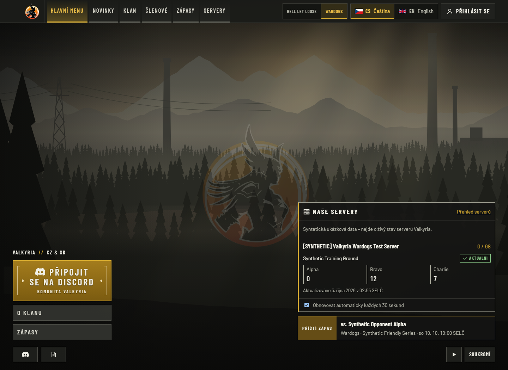
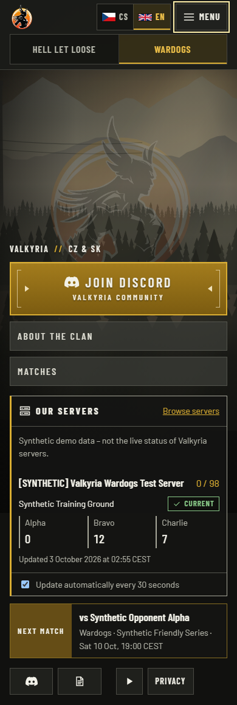
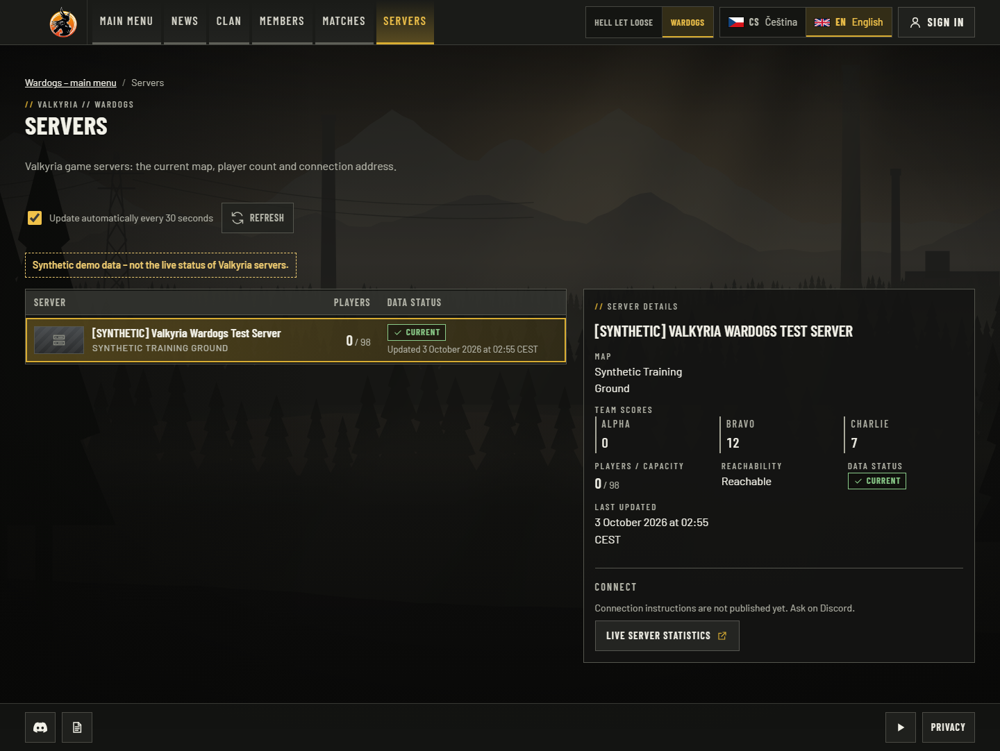
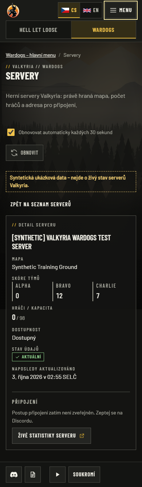
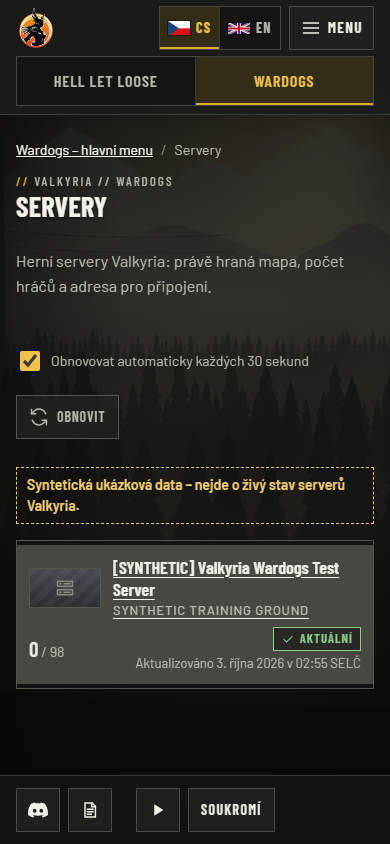
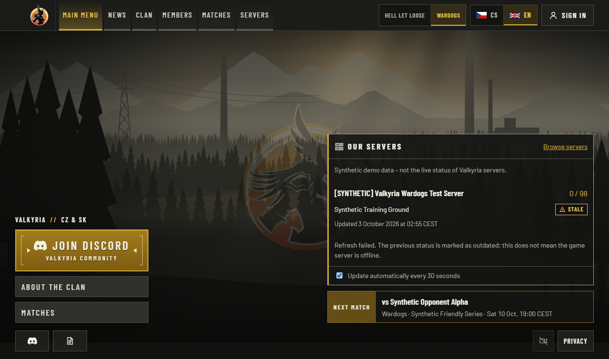
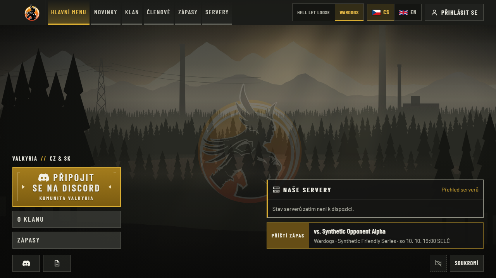

# Wardogs servers: local acceptance evidence

Wardogs now has a reachable Servers menu entry, a homepage overview and a public
list/detail. The website preserves named three-team scores from Logi and can select
Logi for Wardogs while HLL keeps CRCON. The data, approval and activation boundaries
are documented in the [operator notes](../../integrations/logi/wardogs-servers.md).

## Tested source and environment

- Runtime: `b91136c7aa1f9d5a6562af2b206c03cd7d19021d`, following the existing people
  delivery `f0ba0962d2a42e357bff62cd027a306baad277da` in the same PR.
- Optimized Next.js build: `beGPyg0YqIrP5fRRPtqZQ`.
- Windows x64, Node 24.21.0, Playwright 1.63.0 / Chromium 153.0.8010.12;
  disposable PostgreSQL 18.4 with ICU cs-CZ. Tests completed on 3 October 2026,
  Europe/Prague; machine-readable timestamps are UTC.
- Every server, population, score and external destination in these captures is an
  explicitly labelled synthetic fixture. No live Warcon/CRCON request, production
  database, Discord mutation, deployment or hosted SSO probe was performed.
- [Source manifest](source-manifest.json) verifies all 81 changed app/package files
  covered by the current integration checks. Each test verified stable source bytes.
  It records both tested and committed hashes: two locale JSON files differ only by
  Git's CRLF-to-LF normalization, verified byte-for-byte after normalization.

## Acceptance results

| Criterion / reproduction | Expected and observed | Proof |
| --- | --- | --- |
| Open Wardogs home in CS/EN, desktop and phone; follow the server link | Visible synthetic 0/98, Alpha 0 / Bravo 12 / Charlie 7, correct localized selected URL; passed | `wardogs-servers.spec.ts`, captures below |
| Use desktop/mobile navigation | Servers appears and becomes the active page; game switching keeps the servers section but drops the foreign selection; passed | Wardogs, platform and shell E2E |
| Inspect server details | Three named teams, approved statistics link, no fabricated HLL sides/mode or individual Wardogs player table; passed | Mapping unit tests and browser assertions |
| Poll fails, recovers, or is paused | Failed poll hides scores and labels retained population stale; successful poll updates population to 21; pause makes no requests and still ages scores; passed | Clock-driven E2E waits for post-hydration readiness |
| No configured source | Honest unavailable copy, no invented servers/counts/scores; passed | E2E and unit tests |
| Scope/publication/freshness boundary | Exact configured game/connection, explicit publication, named scores including null/zero, stale/future/expired score removal; passed | `logi/mapping.test.ts`, `servers/provider.test.ts`, `servers/view.test.ts` |
| HLL source isolation | Wardogs Logi override does not replace the HLL source; HLL list/detail/player-table regressions pass | Provider unit and HLL browser specs |
| Responsive/accessibility | No horizontal overflow at 390 px; header links remain within their column at 768/1024/1152/1280/1366/1440/1536/1920 px; short score labels do not break; axe finds zero violations in tested home panel/main detail | 4 locale/viewport journeys and header containment test |
| Full local regression | Lint, typecheck, build passed; **897 unit, 476 PostgreSQL, 208 browser tests passed**, 124 unrelated opt-in visual captures skipped | [Checks](checks.json) |
| Focused navigation, polling, HLL regression and screenshot run | **47 passed**, including nine new Wardogs tests | [Checks](checks.json), [capture record](captures.json) |

The new provider-selection test replaces only the Logi database reader with a local
test double. Actual wire mapping is checked against the existing Logi contract fixture.
These screenshots use `synthetic-fixture`, not an active production Logi consumer. The
preceding [people/paired-runtime proof](../logi-people-2026-10-03/README.md) remains a
separate historical acceptance record; it is not relabelled as a new live server test.
Current exact-head CI and its tested merge revision are recorded in the PR discussion.

## Inspected UI captures

All are actual Chromium full-page captures of the optimized build above, without
redaction or image editing. Viewport differs from full-page image height on phones.
[Capture metadata](captures.json) records each route, locale, viewport and digest.

CS home, `/cs/wardogs`, 1440×1050: the open game scene and actions remain, with a
server overview, named scores, pause control and next-match strip.



EN home, `/en/wardogs`, 390×844: the overview stacks below the actions and remains
readable without horizontal scrolling.



EN detail, `/en/wardogs/servers?server=synthetic-wardogs`, 1440×1050: selected
server and its full-width score group, population, observation and statistics link.



CS detail, `/cs/wardogs/servers?server=synthetic-wardogs`, 390×844: the selected
detail replaces the list, with a working Back link.



CS list, `/cs/wardogs/servers`, 390×844: Back returns to a compact, selectable row
with population and freshness, without a fictitious HLL mode column.



EN stale home, `/en/wardogs`, 1280×720: a simulated failed refresh hides scores,
retains the explicitly stale population and explains the failed update.



CS unconfigured home, `/cs/wardogs`, 1280×720: a simulated unconfigured response
removes all server rows and renders honest unavailable copy.



## Review and reproduction

A separate read-only reviewer checked game scope, publication, freshness and UI.
Two findings were repaired: the real Wardogs nav list was separate from the game
registry, and the home overview needed a polling pause control. Review of the fixes
found no further actionable issue. Inspection of screenshots then caught team labels
breaking inside a narrow metadata cell and header overlap. The score group now spans
the detail grid; compact navigation fits its column. A new containment regression
initially reproduced the overlap at 1440 px and passes after the correction. The
reviewer also inspected the final desktop home/detail and mobile-list screenshots.
The reviewer did not independently rerun the tests; results above are the integrator's.

From this revision, install the frozen lockfile and provide only isolated local
`DATABASE_URL` and test `BETTER_AUTH_SECRET`, with loopback `APP_URL`/`BETTER_AUTH_URL`,
as described in the [verification workflow](../../engineering/verification-workflow.md). The E2E runner creates a
disposable database ending in `_e2e`; never give it a production DSN. Then run:

```sh
pnpm lint
pnpm typecheck
pnpm test:unit
pnpm test:integration
pnpm build
CAPTURE_EVIDENCE=1 pnpm test:e2e e2e/wardogs-servers.spec.ts e2e/platform.spec.ts e2e/server-live-players.spec.ts e2e/shell.spec.ts
pnpm test:e2e
node scripts/check-foundation.mjs
```

The committed E2E server configuration selects labelled local server fixtures and
loopback mocks. Captures are written to `.local/evidence/wardogs-servers`. Public
evidence hashes are in [artifact-manifest.json](artifact-manifest.json), and the
seven selected images are registered as verification-only assets.

## Remaining acceptance

Qualify the deployed Logi producer, restricted Wardogs data grant, approved public
connection/scoreboard URL and running website sync schedule before activation. This
slice does not establish a live end-to-end Warcon-to-production-website path. It does
not import individual live Wardogs player rows; those remain on the external
scoreboard. Member statistics are verified collected sessions, not all players or
career totals. No merge/deployment or Discord command redesign is included.
